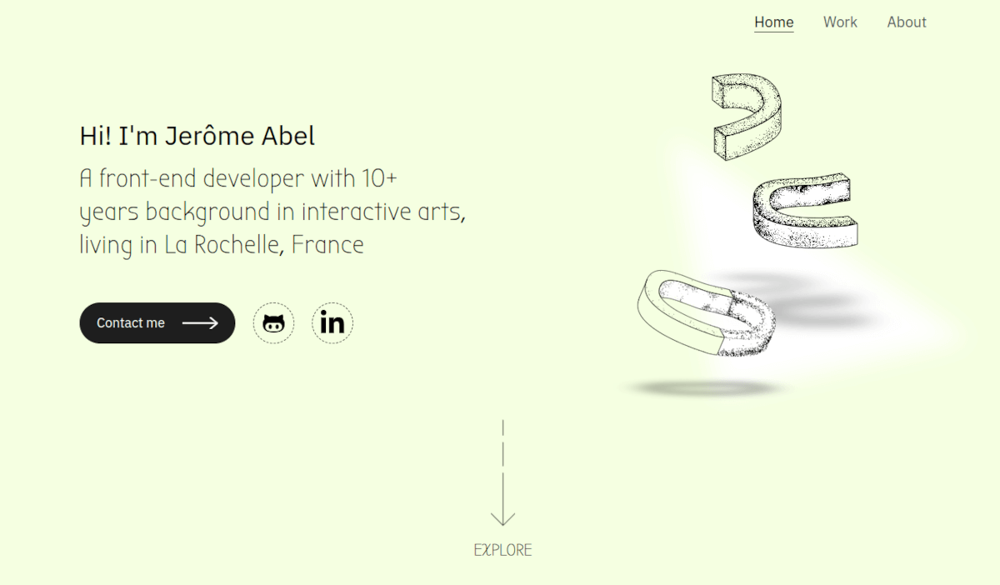
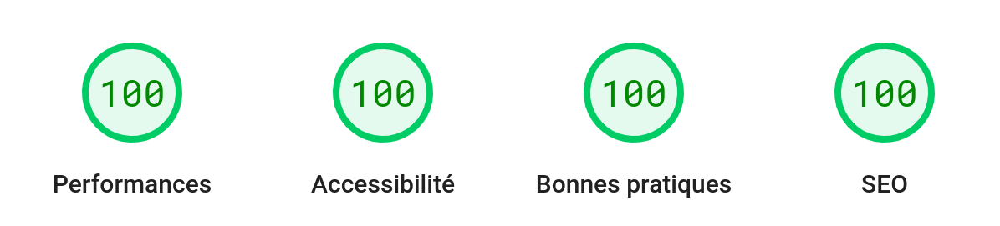

# My Web Dev Portfolio

[](https://astro.build/)
[](https://www.typescriptlang.org/)
[](https://tailwindcss.com/)

As a front-end developer, I designed and created this portfolio site to provide a great user experience and showcase my ability to build high-quality websites.

## ✨ Live

👉 https://dev.jeromeabel.net



## 🚨 Prerequisites

You will need:

- [NodeJS](https://nodejs.org/)
- [Git](https://git-scm.com/)
- [Pnpm](https://pnpm.io/)
- A terminal to run commands

## 🛠️ Installation

```sh
git clone git@github.com:jeromeabel/jeromeabel.github.io.git
cd jeromeabel.github.io
pnpm i
```

## 🚀 Utilisation

```sh
npm run dev
```

Open the browser at the address: http://localhost:4321/

## 📝 Documentation

See more infos on this page: https://dev.jeromeabel.net/work/portfolio/

## 🎉 Results



## 👤 Author

- [@jeromeabel](https://github.com/jeromeabel)

## 📷 Images Credits

- Jérôme Abel
