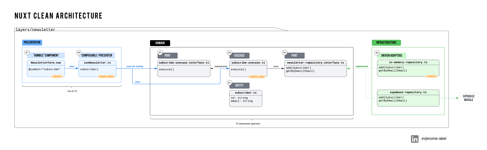

I've been experimenting with Clean Architecture in Nuxt, and I'm excited to share the results with a practical example of a newsletter subscription feature!

🔹 Key Highlights:

- Presentation Layer: A lightweight, “Humble” Vue component that delegates all logic to a composable.
- Domain Layer: Core business logic and domain entities that are framework-agnostic, ensuring stability and easy testing.
- Infrastructure Layer: Adapters for various data sources, including Supabase and an in-memory repository for testing flexibility.

🔹 Key Benefits:

- Separation of Concerns: Each layer handles distinct responsibilities, so changes in one part don’t impact others.
- Enhanced Testability: With Dependency Inversion, we can use an in-memory repository for isolated, reliable testing.
- Easy Evolution: The design allows for seamless switching of newsletter providers if requirements change.

Second episode! Taking a closer look at my implementation of Clean Architecture in Nuxt.

Here’s how I approached a Newsletter Subscription feature to keep everything modular, testable, and future-proof!

- 🌐 Layers: Presentation, Domain & Infrastructure
- 📚 Key Terminology: Adapters & Ports, Use Case
- 🛠 Languages: How the domain became framework agnostic.
- ✅ Order of Implementation: use case, repository, composable, component
- 🔍 Testing Approach: Units, Components, E2E tests

🔗 Check it out here in this GitHub repo: https://github.com/jeromeabel/nuxt-clean-architecture

### 🌐 **Layers**:

1. **Presentation**: User interface (UI components and composables).
2. **Domain**: Framework-agnostic business logic, use cases, and entities.
3. **Infrastructure**: Adapters for data sources, e.g., Supabase, in-memory repositories.

### 📚 **Terminology**:

- **Primary Adapter**: UI handling.
- **Driver Port**: Use case interface.
- **Driven Port**: Repository interface.
- **Secondary Adapter**: Data source implementations (e.g., Supabase).

### 🛠 **Languages**:

- **Presentation/Infrastructure**: Vue & TypeScript.
- **Domain**: TypeScript only, to stay independent of any framework.

### ✅ **Order of Implementation**:

1. Define the **UI** in `NewsletterForm.vue`.
2. Create the **Composable** with `useNewsletter`.
3. Develop the **Use Case** (`subscribe-use-case.ts`).
4. Set up **Repository Interfaces** and **Factories**.
5. Implement **Repository** (Supabase/in-memory).

### ✉️ **Newsletter Example**:

- The form calls `useNewsletter` for state.
- **Use Case** executes the subscription logic.
- Repository (Supabase or in-memory) stores subscription.

### 🔍 **Testing Approach**:

- **Unit Tests**: Cover validations, repository methods, and individual UI elements.
- **E2E Tests**: Ensure successful subscription flow, error handling, and navigation.
