Code: [VersionBanner01.vue](https://github.com/jeromeabel/nuxt-clean-architecture/blob/feat/version-banner/layers/version-01/components/VersionBanner01.vue)

## Version 1: Initial Implementation

```vue
<script lang="ts" setup>
// File: layers/version-01/components/VersionBanner01.vue
const VERSION_KEY = "app-version";
const isVisible = ref(false);
// INFOS: useRuntimeConfig() retrieve variables from the config file nuxt.config.ts
const version = useRuntimeConfig().public.version;

const close = () => {
  isVisible.value = false;
  localStorage.setItem(VERSION_KEY, version);
};

onMounted(() => {
  if (localStorage.getItem(VERSION_KEY) !== version) {
    isVisible.value = true;
  }
});
</script>

<template>
  <div v-if="isVisible">
    New Version {{ version }}
    <button @click="close">Close</button>
  </div>
</template>
```

## Issues with this Implementation

- **Difficult to test:**
  - **Too many concerns:** The component handles state, lifecycle hooks (`onMounted()`), business logic, dependencies ( `useRuntimeConfig`, `localStorage`), and UI.
  - **Implicit Type Assumption**: There's no explicit type check or validation. If `version` is `undefined` or an unexpected type, it could cause unintended behavior.

## Specifications v2.1

Let's add the new specifications to have a better design:

- (v1) The application’s version is defined in `package.json`.
- (v1) The component displays the current version.
- (v1) The banner remains hidden if the version is already stored in local storage.
- (v1) The user can dismiss the banner.
- (v2.1) The component should only care about the UI behavior
- (v2.1) The Version should be wrapped in an Entity

## Next Step

What are your thoughts on this implementation? Does this structure seem sufficient, or do you see areas for improvement?

## Decision Map

```mermaid
graph TB;

    %% Start %%
    A((🏁 Start Feature:<br> <b>Version Banner</b>)):::start

    %% Spec v1 Checklist %%
    B[📋 Specification v1]:::checklist

    %% Development Process %%
    C([👨‍💻 All-In-One Component]):::impl
    D{{🧪👁️ Visual Tests}}:::test
    E{Confidence Enough?}:::decision
    F((👋 Exit)):::exit

    %% Issues %%
    G[/⚠️ Difficult to Test/]:::issue
    G1[/⚠️ <b>Type Assumptions</b>/]:::issue
    G2[/⚠️ <b>Too Many Concerns</b>:<br>UI, State, Lifecycle, Dependencies/]:::issue

    %% Spec v2 Checklist %%
    H1["🎯 Version Handling ➜ Entity & Validation"]:::checklist
    H2["🎯 Component ➜ UI Only"]:::checklist
    I[📋 Specification v2.1]:::checklist
    J((v2.1)):::start

    %% Connections %%
    A --> |"★ Guided By YAGNI"| B
    B --> |First Implementation| C
    C --> D
    D --> E
    E --> |Yes| F
    E --> |No| G

    G -->|"★ Guided By Primitive Obsession"| G1
    G -->|"★ Guided By Separation of Concerns (SoC)"| G2
    G1 --> H1
    G2 --> H2
    H1 --> I
    H2 --> I
    I --> J

    %% Define Styles %%
    classDef start fill:#fff,color:#000,stroke:#000,stroke-width:2;
    classDef impl fill:#000,color:#fff,stroke:#fff,stroke-width:0;
    classDef issue fill:#f48c06,color:#000,stroke:#333,stroke-width:0;
    classDef decision fill:#FEE420,color:#000,stroke:#4F4400,stroke-width:0;
    classDef test fill:#264653,color:#fff,stroke:#060600,stroke-width:0;
    classDef exit fill:#ff0044,color:#fff,stroke-width:0;
    classDef checklist fill:#E1F5FE,stroke:#000000,color:#000000;
```


