Code: [version-banner-2-1.unit.spec.ts](https://github.com/jeromeabel/nuxt-clean-architecture/blob/feat/version-banner/layers/version-02/__tests__/version-banner-2-1.unit.spec.ts)

## Initial Tests

We'll start by implementing two types of tests:

- The banner should be hidden by default.
- The banner should be displayed when no version is stored.

```ts
// File: layers/version-02/__tests__/version-banner.spec.ts
// @vitest-environment nuxt
// Set the Vitest environment to Nuxt since we use Nuxt's useRuntimeConfig (happy-dom isn’t sufficient)
import { describe, it, expect, beforeEach } from "vitest";
import { mount, VueWrapper } from "@vue/test-utils";
import pkg from "@@/package.json"; // We use the version from package.json
import VersionBanner from "../components/VersionBanner02.vue";

describe("VersionBanner", () => {
  let wrapper: VueWrapper;

  it("should hide the banner at initial state", () => {
    wrapper = mount(VersionBanner);
    expect(wrapper.isVisible()).toBe(false);
  });

  describe("when there is no version stored", () => {
    beforeEach(() => {
      localStorage.clear();
      wrapper = mount(VersionBanner);
    });

    it("should show the banner", () => {
      expect(wrapper.isVisible()).toBe(true);
    });

    it("should display the current version", () => {
      expect(wrapper.text()).toContain(pkg.version); // e.g., "version": "0.0.2"
    });
  });
});
```

### Test Failures

The tests currently fail with these errors:

- AssertionError: expected false to be true
- AssertionError: expected '' to contain '0.0.2'

### Why the Tests Fail?

The failures occur because the `<div>` controlled by `v-if="isVisible"` does not render when `isVisible` is false by default. Although the composable’s `onMounted` hook sets `isVisible` to true under the right conditions, this update is asynchronous and does not immediately reflect in the component's rendered output.

To diagnose this issue, you can inspect the rendered HTML with `console.log(wrapper.html())`. The solution is to wait for the DOM to update using `nextTick()` before making assertions.

For example:

```ts
it("should display the version", async () => {
  const wrapper = mount(VersionBanner);
  await nextTick();
  expect(wrapper.text()).toContain(pkg.version);
});
```

## Completing the Tests with `nextTick`

Here’s the updated test suite with `nextTick()` to ensure the UI has updated:

```ts
// File: layers/version-02/__tests__/version-banner.spec.ts
// @vitest-environment nuxt
import { describe, it, expect, beforeEach } from "vitest";
import { mount, VueWrapper, nextTick } from "@vue/test-utils";
import pkg from "@@/package.json";
import VersionBanner from "../components/VersionBanner02.vue";

describe("VersionBanner", () => {
  let wrapper: VueWrapper;

  it("should hide the banner at initial state", () => {
    wrapper = mount(VersionBanner);
    expect(wrapper.isVisible()).toBe(false);
  });

  describe("when there is no version stored", () => {
    beforeEach(() => {
      localStorage.clear();
      wrapper = mount(VersionBanner);
    });

    // Without nextTick(), this test fails: expected false to be true.
    it("should show the banner", async () => {
      await nextTick();
      expect(wrapper.isVisible()).toBe(true);
    });

    // Without nextTick(), this test fails: expected '' to contain '0.0.2'
    it("should display the current version", async () => {
      await nextTick();
      expect(wrapper.text()).toContain(pkg.version); // e.g., "0.0.2"
    });
  });

  describe("when the same version is stored", () => {
    // Without nextTick(), we might get a false positive because the default state is still rendered.
    it("should hide the banner", async () => {
      localStorage.setItem("app-version", pkg.version);
      wrapper = mount(VersionBanner);
      await nextTick();
      expect(wrapper.isVisible()).toBe(false);
    });
  });

  describe("when a different version is stored", () => {
    // Without nextTick(), this test fails: expected false to be true.
    it("should show the banner", async () => {
      localStorage.setItem("app-version", "1.0.0");
      wrapper = mount(VersionBanner);
      await nextTick();
      expect(wrapper.isVisible()).toBe(true);
    });
  });
});
```

## Issues With This Test

Although all tests now pass, there’s an underlying issue: testing this UI component has become somewhat ambiguous. You might already know that there are two main types of component tests:

- **Component Test In Small (CTIS):** These are unit tests that focus solely on the component in isolation.
- **Component Test In Large (CTIL):** These are integration tests that evaluate the interactions between the component and its dependencies.

In our case, the tests are leaning towards the integration side (CTIL) because they rely on several internal aspects of the composable:

- The Nuxt environment, as the composable uses `useRuntimeConfig()`.
- The `onMounted` lifecycle hook that updates the UI.
- The usage of `localStorage` to manage state.
- The hardcoded `"app-version"` key used within the composable.

This means that rather than testing only the UI component, our tests are also validating the interactions between the component, the composable, and external dependencies like `useRuntimeConfig()` and `localStorage`.

## Next Step

Looking ahead, here are three potential approaches to improve our testing strategy:

1. **Move the `onMounted` Hook Out of the Composable:** (optional)
   This would simplify the test by making the UI update logic more explicit within the component.
2. **Mock the `useVersion()` Composable:**
   By mocking the composable, you can create a true unit test for the component that doesn’t depend on the composable’s implementation details.
3. **Refactor the Component to Accept Only Props & Events:**
   Instead of directly relying on the composable, passing data as props could decouple the component from its dependencies. This approach is appealing, but further exploration is needed to fully understand its benefits.

It’s similar to a choose-your-own-adventure story: deciding the next step depends on the challenges ahead. In this context, a common next move would be to convert this integration test into a true unit test by mocking the composable.

Which path will you take?

## Specifications v2.2

Let's add the new specifications to have a better design:

- (v1) The application’s version is defined in `package.json`.
- (v1) The component displays the current version.
- (v1) The banner remains hidden if the version is already stored in local storage.
- (v1) The user can dismiss the banner.
- (v2.1) The component should only care about the UI behavior + v(2.2) only Props & Events
- (v2.1) The version should be wrapped in an Entity
- (v2.2) The banner should be hidden by default.
- (v2.2) The banner should be displayed when no version is stored.
- (v2.2) Mock the `useVersion()` Composable to isolate the component under test (CUT)
- (v2.2) Test the composable
- (v2.2) Move `onMounted` (optional)

## Decision Map

```mermaid
graph TB

    %% Start
    A((🏁 Start v2.1>)):::start

    %% Spec v2 Checklist
    B[📋 Specification v2.1]:::checklist

    %% Development Process
    C2(["👨‍💻 Component (Humble)"]):::impl
    C1(["👨‍💻 Composable (Presenter)"]):::impl

    D{{🧪👁️ Visual Test}}:::test
    E{Confidence <br>Enough?}:::decision
    F((👋 Exit)):::exit

    %% Test
    G{{🧪 Automated Test}}:::test

    %% Issues
    H[/⚠️ Integration Test/]:::issue
    I{Confidence <br>Enough?}:::decision
    J[/⚠️ Issues/]:::issue
    K1[/"⚠️ <b>Dependencies:</b><br>useRuntimeConfig & localStorage"/]:::issue
    K2[/"⚠️ <b>Hardcoded:</b><br>'app-version'"/]:::issue
    K3[/"⚠️ <b>Lifecycle:</b><br>onMounted"/]:::issue

    L1[🎯 Mock the comosable]:::checklist
    L2[🎯 Test the composable]:::checklist
    L3[🎯 Move onMounted]:::checklist

    M[📋 Specification v2.2]:::checklist
    N((v2.2))

    %% Connections
    A --> B
    B --> | Refactor | C2
    B --> | Refactor: Extract Logic | C1
    C1 & C2 --> D
    D --> E
    E --> |Yes| F
    E --> |No| G
    %%G --- |"Refactor: add nextTick"| G
    G --- H
    H --- I
    I --- |yes| F
    I --- |no| J --- K1 & K2 & K3
    K1 --- |"★ Guided By SRP & <br>Don't test implementation details"|L1
    K2 --- |★ Guided By SRP & <br>Avoid magic values|L2
    K3 --- |"★ Guided By Make the test simpler"|L3
    L1 & L2 --- M
    L3 -.- |optional|M
    M --- N

    %% Define Styles %%
    classDef start fill:#fff,color:#000,stroke:#000,stroke-width:2;
    classDef impl fill:#000,color:#fff,stroke:#fff,stroke-width:0;
    classDef issue fill:#f48c06,color:#000,stroke:#333,stroke-width:0;
    classDef decision fill:#FEE420,color:#000,stroke:#4F4400,stroke-width:0;
    classDef test fill:#264653,color:#fff,stroke:#060600,stroke-width:0;
    classDef exit fill:#ff0044,color:#fff,stroke-width:0;
    classDef checklist fill:#E1F5FE,stroke:#000000,color:#000000;
```


