As we saw earlier, we gonnna mock the composable. It will help us isolate the component test without relying on Nuxt's real interactions or localStorage behavior.

## Component Reminder: VersionBanner02.vue

Code: [VersionBanner02.vue](https://github.com/jeromeabel/nuxt-clean-architecture/blob/feat/version-banner/layers/version-02/components/VersionBanner02.vue)

```vue
<script lang="ts" setup>
// File: layers/version-02/components/VersionBanner02.vue
import { useVersion } from "../composables/useVersion";
const { isVisible, version, close } = useVersion();
</script>

<template>
  <div v-if="isVisible">
    (02) New Version {{ version }}
    <button @click="close">Close</button>
  </div>
</template>
```

## First Mock (v2-2)

Code: [version-banner-2-2.unit.spec.ts](https://github.com/jeromeabel/nuxt-clean-architecture/blob/feat/version-banner/layers/version-02/__tests__/version-banner-2-2.unit.spec.ts)

```ts
// File: layers/version-02/__tests__/version-banner.spec.ts
// @vitest-environment happy-dom
import { describe, it, expect, vi } from "vitest";
import { shallowMount } from "@vue/test-utils";
import VersionBanner02 from "../components/VersionBanner02.vue";

// Mock the useVersion module.
vi.mock("../composables/useVersion", () => ({
  useVersion: () => ({
    isVisible: true, // Forces the banner to display and pass the test.
    version: "0.0.1",
    close: () => {},
  }),
}));

describe("VersionBanner", () => {
  it("should display the version", () => {
    const wrapper = shallowMount(VersionBanner02);
    expect(wrapper.text()).toContain("0.0.1");
  });
});
```

**Note:**
The `vi.mock` function instructs Vitest to mock the `../composables/useVersion` module. Vitest intercepts the import and replaces the real module with our mock version.

## Benefits of This Approach

- **Isolated Testing:** We don’t rely on the composable's internal processes. Everything is under control for the Component Under Test (CUT).
- **Simplified Environment:** No need for a Nuxt environment—the "happy-dom" is sufficient.
- **No External Dependencies:** We don’t need to import package.json or deal with lifecycle mechanisms.
- **Simpler Mounting:** Using `shallowMount` is enough.

We have successfully isolated the component from the composable's interactions with runtimeConfig and localStorage.

## Complete Component Test With Composable Mocking (v2-3)

Code: [VersionBanner02.vue](https://github.com/jeromeabel/nuxt-clean-architecture/blob/feat/version-banner/layers/version-02/components/VersionBanner02.vue)

First, let’s add `data-testid` attributes to the component. This common technique lets us select elements without being affected by changes in the internal HTML layout.

```vue
<template>
  <div v-if="isVisible" data-testid="version-banner">
    New Version {{ version }}
    <button @click="close" data-testid="version-close">Close</button>
  </div>
</template>
```

Now, we refactor the test to eliminate redundancy and add mocks for the functions we want to track (like `close()`).

> **Note:** The expectations have changed. We are not testing the logic that compares localStorage with package.json—this logic should be covered in tests dedicated to the composable. Here, we focus on verifying that the component correctly connects to the composable, handles UI conditional rendering, and displays the proper HTML.

Code: [version-banner-2-3.unit.spec.ts](https://github.com/jeromeabel/nuxt-clean-architecture/blob/feat/version-banner/layers/version-02/__tests__/version-banner-2-3.unit.spec.ts)

```ts
// @vitest-environment happy-dom
import { describe, it, expect, vi, beforeEach } from "vitest";
import { shallowMount, VueWrapper } from "@vue/test-utils";
import VersionBanner02 from "../components/VersionBanner02.vue";
import { useVersion } from "../composables/useVersion"; // Not needed in Nuxt

vi.mock("../composables/useVersion", () => ({
  useVersion: vi.fn(),
}));

describe("VersionBanner", () => {
  let wrapper: VueWrapper;

  // Default mock return value
  const mockVersionData: ReturnType<typeof useVersion> = {
    isVisible: ref(true),
    version: "0.0.1",
    close: vi.fn(), // Tracking the close function
  };

  beforeEach(() => {
    vi.mocked(useVersion).mockReturnValue(mockVersionData);
    wrapper = shallowMount(VersionBanner02);
  });

  // Helper functions to access elements in the wrapper.
  const getBanner = () => wrapper.find('[data-testid="version-banner"]');
  const getCloseButton = () => wrapper.find('[data-testid="version-close"]');

  it("should display the version", () => {
    expect(getBanner().text()).toContain(mockVersionData.version);
  });

  it("should display the version banner when isVisible is true", () => {
    expect(getBanner().exists()).toBe(true);
  });

  it("should have a close button", () => {
    expect(getCloseButton().exists()).toBe(true);
  });

  it("should not display the version banner when isVisible is false", () => {
    // Adjusting the mock to set isVisible to false.
    vi.mocked(useVersion).mockReturnValue({
      ...mockVersionData,
      isVisible: ref(false),
    });

    wrapper = shallowMount(VersionBanner02);
    expect(getBanner().exists()).toBe(false);
  });

  // We don't test the hiding logic here—this behavior is defined in the composable.
  it("should call close() when the close button is clicked", async () => {
    await getCloseButton().trigger("click");
    expect(mockVersionData.close).toHaveBeenCalledOnce();
  });
});
```

In these tests, we're verifying that:

- The component renders the correct version.
- Conditional rendering works based on the `isVisible` flag.
- The close button is present and triggers the `close` function.

## Benefits

By refactoring, we have improved the test structure in several ways:

- **Centralized Mounting:** A helper function consistently mounts the component.
- **Unified Mock Data:** A single place defines and manages mock return values.
- **Reduced Repetition:** The `beforeEach` hook ensures consistent setup.
- **Declarative Queries:** Using `data-testid` attributes and helper functions makes element selection clear.

## The Problem With Mocking Composables

There is a downside to this approach:

- We must know too many internal details about the composable:
  - Its import path.
  - Its function signature.
  - Its internal shape, such as `isVisible` being a `ref`.
- This approach **couples the test to implementation details**, making future refactors more challenging.
- It also shifts focus away from the component's primary responsibility: rendering the UI and responding to user interactions.

## Should We Avoid Mocks?

There’s an ongoing debate in testing:

- **White-box (Structural) Testing:** Using mocks isolates the component but increases coupling.
- **Black-box (Behavioral) Testing:** Avoids mocks and focuses only on the component’s public API (props/events), resulting in more robust but sometimes more verbose tests.

For example, checking that `mockVersionData.close` has been called is a white-box approach—do we really want the component to care about the composable’s implementation? It might be clearer to test that the button emits a certain event.

## Next Step

To simplify the tests further, we might consider completely isolating the component from the composable by wrapping it in a parent component. This change would help focus tests solely on the component's behavior rather than the inner workings of its dependencies.

What do you think? Should we continue refining our testing strategy further?

## Specifications v3

- (v1) The application’s version is defined in `package.json`.
- (v1) The component displays the current version.
- (v1) The banner remains hidden if the version is already stored in local storage.
- (v1) The user can dismiss the banner.
- (v2.1) The component should only care about the UI behavior + v(2.2) only Props & Events
- (v2.1) The version should be wrapped in an Entity
- (v2.2) The banner should be hidden by default.
- (v2.2) The banner should be displayed when no version is stored.
- [x] (v2.2) Mock the `useVersion()` Composable to isolate the component under test (CUT)
- (v2.2) Test the composable
- (v2.2) Move `onMounted` (optional)

## Decision Map

```mermaid
graph TB

    %% Start
    A((🏁 Start v2.2)):::start

    %% Specification v2 Checklist
    B[📋 Specification v2.2]:::checklist

    %% Development Process
    C(["👨‍💻 <b>Component</b>:<br>VersionBanner02.vue"]):::impl

        %% Test
    D{{🧪 Automated Test}}:::test

    E([✅ Isolated Unit Test]):::success
    F{Confident Enough?}:::decision
    G((👋 Exit)):::exit

    %% Issues
    H[/⚠️ The component is tightly coupled to the composable/]:::issue
    I[🎯 The component should expose only props and events]:::checklist

    J[📋 Specification v3]:::checklist
    K((v3)):::start

    %% Connections
    A --> B
    B --> | Refactor: add data-testid | C
    C --> | Mock the composable | D
    C --- | Refactor: Follow DRY Principle| D
    D --> E
    E --- F
    F --> |Yes, white-box testing is OK| G
    F --> |No, I prefer black-box testing| H
    H --> |Guided by 'Don't test internal details' and 'Minimize coupling'| I
    I --- J --- K

    %% Define Styles %%
    classDef start fill:#fff,color:#000,stroke:#000,stroke-width:2;
    classDef impl fill:#000,color:#fff,stroke:#fff,stroke-width:0;
    classDef issue fill:#f48c06,color:#000,stroke:#333,stroke-width:0;
    classDef decision fill:#FEE420,color:#000,stroke:#4F4400,stroke-width:0;
    classDef test fill:#264653,color:#fff,stroke:#060600,stroke-width:0;
    classDef exit fill:#ff0044,color:#fff,stroke-width:0;
    classDef checklist fill:#E1F5FE,stroke:#000000,color:#000000;
    classDef success fill:#4CAF50,color:#fff,stroke:#fff,stroke-width:0;
```


