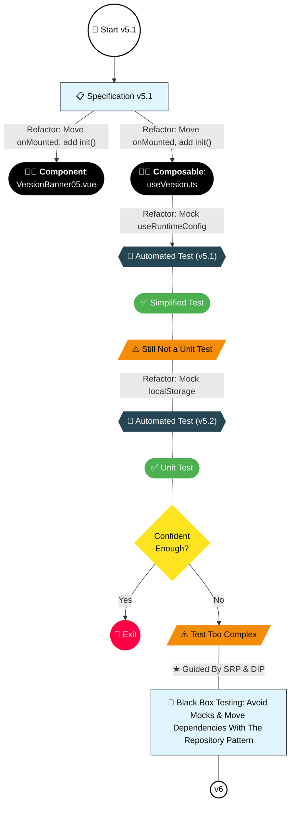

## Refactor: Replace onMounted with an "init" Method in the Composable

Instead of using `onMounted` directly inside the composable, we now expose an `init` function. This change allows tests to control when the initialization logic runs.

Code: [useVersion.ts](https://github.com/jeromeabel/nuxt-clean-architecture/blob/feat/version-banner/layers/version-05/composables/useVersion.ts)

```ts
export const useVersion = () => {
  // ...
  const init = () => {
    if (localStorage.getItem(VERSION_KEY) !== version) {
      isVisible.value = true;
    }
  };

  return {
    // ...
    init,
  };
};
```

We also update the test to call `init` explicitly:

```ts
it("when version differs from localStorage", async () => {
  localStorage.setItem("app-version", "0.0.1");
  const [result] = withSetup(() => useVersion());
  result.init();
  expect(result.isVisible.value).toBe(true);
});
```

Now, the first test will pass.

We should also update the parent component to call the `init` function:

Code: [VersionBanner05.vue](https://github.com/jeromeabel/nuxt-clean-architecture/blob/feat/version-banner/layers/version-05/components/VersionBanner05.vue)

```vue
<script lang="ts" setup>
import { useVersion } from "../composables/useVersion";
const { isVisible, version, init, close } = useVersion();
onMounted(() => {
  init();
});
</script>
```

## Mocking useRuntimeConfig (v5-1)

We can now mock `useRuntimeConfig` and centralize our test variables, eliminating the need for the `withSetup` utility function. This approach tests the composable directly.

Code: [use-version-5-1.unit.spec.ts](https://github.com/jeromeabel/nuxt-clean-architecture/blob/feat/version-banner/layers/version-05/__tests__/use-version-5-1.unit.spec.ts)

```ts
// @vitest-environment happy-dom
import { describe, it, expect, beforeEach } from "vitest";
import { useVersion } from "../composables/useVersion";
// We no longer need the actual value from package.json.
import { mockNuxtImport } from "@nuxt/test-utils/runtime";

const VERSION_KEY = "app-version";
const CURRENT_VERSION = "0.0.8";
const STORED_VERSION = "0.0.7";

// Mock useRuntimeConfig from Nuxt
mockNuxtImport("useRuntimeConfig", () => {
  return () => ({
    public: {
      version: CURRENT_VERSION,
    },
  });
});

describe("useVersion", () => {
  beforeEach(() => {
    localStorage.removeItem(VERSION_KEY);
  });

  it("should return the correct initial state", () => {
    const { version, isVisible } = useVersion();
    expect(version).toBe(CURRENT_VERSION);
    expect(isVisible.value).toBe(false);
  });

  describe("should show the banner", () => {
    it("when no version is stored", () => {
      const { init, isVisible } = useVersion();
      init();
      expect(isVisible.value).toBe(true);
    });

    it("when the version in localStorage differs", async () => {
      localStorage.setItem(VERSION_KEY, STORED_VERSION);
      const { init, isVisible } = useVersion();
      init();
      expect(isVisible.value).toBe(true);
    });
  });

  describe("should hide the banner", () => {
    it("when the same version is stored", () => {
      localStorage.setItem(VERSION_KEY, CURRENT_VERSION);
      const { init, isVisible } = useVersion();
      init();
      expect(isVisible.value).toBe(false);
    });

    it("and update localStorage on closeBanner", () => {
      const { init, close, isVisible } = useVersion();
      init();
      close();
      expect(isVisible.value).toBe(false);
      expect(localStorage.getItem(VERSION_KEY)).toBe(CURRENT_VERSION);
    });
  });
});
```

**Benefits of This Refactoring:**

- **No Nuxt Environment Needed:** We mock `useRuntimeConfig` using `mockNuxtImport`.
- **No Dependency on package.json:** We use centralized test variables.
- **Simplified Setup:** The `withSetup` utility is no longer required because `onMounted` is moved to the parent component.
- **Centralized Shared Variables:** Consistent test values for version keys.
- **Clean LocalStorage:** We clear localStorage before each test.

_Note:_ This is still an integration test because it relies on localStorage.

## Mocking localStorage (v5-2)

Code: [use-version-5-2.unit.spec.ts](https://github.com/jeromeabel/nuxt-clean-architecture/blob/feat/version-banner/layers/version-05/__tests__/use-version-5-2.unit.spec.ts)

To further isolate our test and transform it into a true unit test, we can also mock localStorage:

```ts
// @vitest-environment happy-dom
import { describe, it, expect, beforeEach, vi } from "vitest";
import type { App } from "vue";
import { createApp } from "vue";
import { useVersion } from "../composables/useVersion";

// Mock localStorage
const mockLocalStorage = (() => {
  let store: Record<string, string> = {};
  return {
    getItem: vi.fn((key: string) => store[key] || null),
    setItem: vi.fn((key: string, value: string) => {
      store[key] = value.toString();
    }),
    removeItem: vi.fn((key: string) => {
      delete store[key];
    }),
  };
})();

// Replace the global localStorage with our mock.
Object.defineProperty(window, "localStorage", {
  value: mockLocalStorage,
});

const VERSION_KEY = "app-version";
const CURRENT_VERSION = "0.0.8";
const STORED_VERSION = "0.0.7";

// Mock useRuntimeConfig from Nuxt using a different technique to avoid errors.
vi.mock("#app/nuxt", () => ({
  useRuntimeConfig: () => ({
    public: {
      version: CURRENT_VERSION,
    },
  }),
}));

describe("useVersion", () => {
  beforeEach(() => {
    mockLocalStorage.removeItem(VERSION_KEY);
    vi.clearAllMocks();
  });

  it("should return the correct initial state", () => {
    const { version, isVisible } = useVersion();
    expect(version).toBe(CURRENT_VERSION);
    expect(isVisible.value).toBe(false);
    expect(mockLocalStorage.getItem).not.toHaveBeenCalled();
  });

  describe("should show the banner", () => {
    it("when no version is stored", () => {
      const { init, isVisible } = useVersion();
      init();
      expect(isVisible.value).toBe(true);
      expect(mockLocalStorage.getItem).toHaveBeenCalledWith(VERSION_KEY);
    });

    it("when the version in localStorage differs", () => {
      mockLocalStorage.getItem.mockReturnValueOnce(STORED_VERSION);
      const { init, isVisible } = useVersion();
      init();
      expect(isVisible.value).toBe(true);
      expect(mockLocalStorage.getItem).toHaveBeenCalledWith(VERSION_KEY);
    });
  });

  describe("should hide the banner", () => {
    it("when the same version is stored", () => {
      mockLocalStorage.getItem.mockReturnValueOnce(CURRENT_VERSION);
      const { init, isVisible } = useVersion();
      init();
      expect(isVisible.value).toBe(false);
      expect(mockLocalStorage.getItem).toHaveBeenCalledWith(VERSION_KEY);
    });

    it("and update localStorage on closeBanner", () => {
      const { init, isVisible, close } = useVersion();
      init();
      close();
      expect(isVisible.value).toBe(false);
      expect(mockLocalStorage.setItem).toHaveBeenCalledWith(
        VERSION_KEY,
        CURRENT_VERSION,
      );
    });
  });
});
```

_Note:_ We encountered an error when mocking the Nuxt import:

> "Error: [vitest] There was an error when mocking a module... Caused by: TypeError: Cannot read properties of undefined (reading '#app/nuxt')"

This error suggests that multiple mocks may conflict. We need to adjust our approach to mock `#app/nuxt` so that it works together with our localStorage mock.

## What's Wrong?

The final result is a true unit test, where we test the composable in isolation. However, there are some concerns:

- **Complexity:** It feels overly complicated to mock all dependencies.
- **Test Heaviness:** The test setup is much heavier than the code it tests.
- **Maintenance:** The test might become more difficult to maintain than the composable itself.

## Next Step

We consistently face the same issue: Is it the composable's responsibility to import dependencies like localStorage and runtimeConfig? Would it be better to add another layer of encapsulation by injecting these dependencies as parameters? That way, the composable focuses solely on business logic, and our tests become simpler and more focused.

What do you think?

## Decision Map


