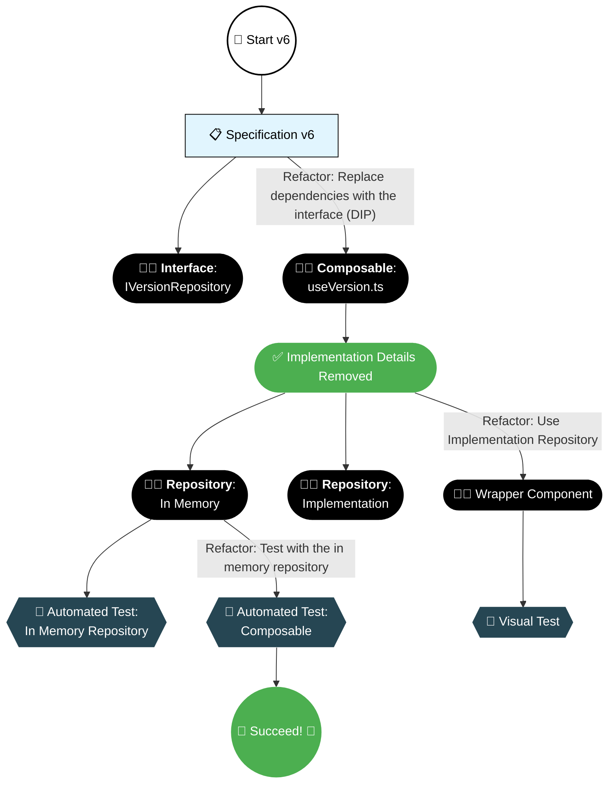

## Refactor to Avoid Real Dependencies

Instead of directly using external dependencies, we can define an API (or interface) that describes what we need. This lets us focus on business logic inside the composable while handling I/O externally.

### Repository Interface

Define an interface that abstracts the operations we need. Rather than directly using `useRuntimeConfig().public.version` and localStorage methods, we create an interface with a domain-friendly API:

- **getCurrentVersion()** instead of `useRuntimeConfig().public.version`
- **storeVersion()** instead of `localStorage.setItem()`
- **getStoredVersion()** instead of `localStorage.getItem()`
- **clear()** instead of `localStorage.removeItem()`

Code: [version-repository.ts](https://github.com/jeromeabel/nuxt-clean-architecture/blob/feat/version-banner/layers/version-06/repositories/version-repository.ts)

```ts
// File: layers/version-06/repositories/version-repository.ts
export interface IVersionRepository {
  getCurrentVersion: () => string | undefined;
  getStoredVersion: () => string | undefined;
  storeVersion: (version: string) => void;
  clear: () => void;
}
```

### Refactor the Composable with the Interface

Code: [useVersion.ts](https://github.com/jeromeabel/nuxt-clean-architecture/blob/feat/version-banner/layers/version-06/composables/useVersion.ts)

Next, modify the composable so that it receives an `IVersionRepository` instance. This way, all I/O details are moved outside the composable:

```ts
// File: layers/version-06/composables/use-version.ts
import type { IVersionRepository } from "../repositories/version-repository";

export const useVersion = (repository: IVersionRepository) => {
  const isVisible = ref(false);
  // You might want to check if version is undefined and handle it as an error.
  const version = repository.getCurrentVersion();

  const close = () => {
    isVisible.value = false;
    if (version) {
      repository.storeVersion(version);
    }
  };

  const init = () => {
    if (repository.getStoredVersion() !== version) {
      isVisible.value = true;
    }
  };

  return {
    close,
    version,
    isVisible,
    init,
  };
};
```

This refactoring improves our code by:

- Focusing on business logic
- Allowing TypeScript to warn us if we try to store an undefined version
- Removing implementation details about how versions are obtained or stored

## In-Memory Repository

Code: [version-repository.ts](https://github.com/jeromeabel/nuxt-clean-architecture/blob/feat/version-banner/layers/version-06/repositories/version-repository.ts)

For unit testing, we can implement a simple in-memory repository. This implementation mimics the real repository but keeps data only in RAM:

```ts
// File: layers/version-06/repositories/version-repository.ts

export const createInMemoryVersionRepository = (
  initialVersion: string | undefined,
): IVersionRepository => {
  let store: string | undefined = undefined;

  const getCurrentVersion = () => {
    console.log("initialVersion", initialVersion);
    return initialVersion;
  };

  const getStoredVersion = () => store;

  const storeVersion = (version: string) => {
    store = version;
  };

  const clear = () => {
    store = undefined;
  };

  return {
    getCurrentVersion,
    getStoredVersion,
    storeVersion,
    clear,
  };
};
```

## Testing the Composable with the In-Memory Repository

Code: [use-version.unit.spec.ts](https://github.com/jeromeabel/nuxt-clean-architecture/blob/feat/version-banner/layers/version-06/__tests__/unit/use-version.unit.spec.ts)

With this design, our tests become simple and focused on the composable's behavior—not its implementation details:

```ts
// @vitest-environment node
import { describe, it, expect, beforeEach } from "vitest";
import { useVersion } from "../composables/useVersion";
import { createInMemoryVersionRepository } from "../repositories/version-repository";

const CURRENT_VERSION = "0.0.8";
const STORED_VERSION = "0.0.7";

describe("useVersion", () => {
  const repository = createInMemoryVersionRepository(CURRENT_VERSION);

  beforeEach(() => {
    repository.clear();
  });

  it("should return the correct initial state", () => {
    const { version, isVisible } = useVersion(repository);
    expect(version).toBe(CURRENT_VERSION);
    expect(isVisible.value).toBe(false);
  });

  describe("should show the banner", () => {
    it("when no version is stored", () => {
      const { init, isVisible } = useVersion(repository);
      init();
      expect(isVisible.value).toBe(true);
    });

    it("when the stored version differs from the current version", () => {
      repository.storeVersion(STORED_VERSION);
      const { init, isVisible } = useVersion(repository);
      init();
      expect(isVisible.value).toBe(true);
    });
  });

  describe("should hide the banner", () => {
    it("when the same version is stored", () => {
      repository.storeVersion(CURRENT_VERSION);
      const { init, isVisible } = useVersion(repository);
      init();
      expect(isVisible.value).toBe(false);
    });

    it("and update storage on close", () => {
      const { init, isVisible, close } = useVersion(repository);
      init();
      close();
      expect(isVisible.value).toBe(false);
    });
  });
});
```

_Observation:_
The tests are now straightforward. They focus on the behavior of the composable rather than its underlying implementation.

## Dealing with Real Dependencies

While the in-memory repository simplifies unit testing, real applications require handling external dependencies. By leveraging dependency injection via `IVersionRepository`, we can easily swap implementations between tests and production. Next, let’s see how we test the repository itself and implement the real version.

## Testing the In Memory Repository

Code: [in-memory-version-repository.unit.spec.ts](https://github.com/jeromeabel/nuxt-clean-architecture/blob/feat/version-banner/layers/version-06/__tests__/unit/in-memory-version-repository.unit.spec.ts)

First, we complete unit tests for our in-memory repository:

```ts
// @vitest-environment node
import { describe, it, expect, beforeEach } from "vitest";
import { createInMemoryVersionRepository } from "../repositories/version-repository";

const CURRENT_VERSION = "0.0.1";
const OTHER_VERSION = "0.0.2";

describe("InMemoryVersionRepository", () => {
  let repository = createInMemoryVersionRepository(CURRENT_VERSION);

  beforeEach(() => {
    repository = createInMemoryVersionRepository(CURRENT_VERSION);
    repository.clear();
  });

  it("should return the configured current version", () => {
    expect(repository.getCurrentVersion()).toBe(CURRENT_VERSION);
  });

  it("should return undefined if no current version is configured", () => {
    repository = createInMemoryVersionRepository(undefined);
    expect(repository.getCurrentVersion()).toBeUndefined();
  });

  it("should return undefined for stored version when not set", () => {
    expect(repository.getStoredVersion()).toBeUndefined();
  });

  it("should save and retrieve the stored version", () => {
    repository.storeVersion(OTHER_VERSION);
    expect(repository.getStoredVersion()).toBe(OTHER_VERSION);
  });

  it("should clear the stored version", () => {
    repository.storeVersion(OTHER_VERSION);
    repository.clear();
    expect(repository.getStoredVersion()).toBeUndefined();
  });
});
```

## Implementation Repository: Real Version

Implement the real repository that uses Nuxt’s runtime configuration and localStorage:

```ts
// File: layers/version-06/repositories/version-repository.ts
export const createLocalStorageVersionRepository = (): IVersionRepository => {
  const VERSION_KEY = "app-version";

  const getCurrentVersion = () => {
    const version = useRuntimeConfig().public.version;
    if (!version) {
      console.warn(
        "[VersionRepository] No valid current version found in config.",
      );
      return undefined;
    }
    return version as string;
  };

  const getStoredVersion = () => localStorage.getItem(VERSION_KEY) ?? undefined;

  const storeVersion = (version: string) => {
    localStorage.setItem(VERSION_KEY, version);
  };

  const clear = () => {
    localStorage.removeItem(VERSION_KEY);
  };

  return {
    getCurrentVersion,
    getStoredVersion,
    storeVersion,
    clear,
  };
};
```

## Refactor the Wrapper Component

Now update the wrapper component to use the real repository:

```vue
<script lang="ts" setup>
// File: layers/version-06/components/VersionBanner06.vue
import { onMounted } from "vue";
import { useVersion } from "../composables/useVersion";
import { createLocalStorageVersionRepository } from "../repositories/version-repository";
import VersionBannerUI from "./VersionBannerUI.vue";

const repository = createLocalStorageVersionRepository();
const { isVisible, version, init, close } = useVersion(repository);

onMounted(() => {
  init();
});
</script>

<template>
  <VersionBannerUI :is-visible="isVisible" :version="version" @close="close" />
</template>
```

## Conclusion

We have:

- Defined a clear repository interface.
- Moved I/O dependencies outside of the composable.
- Used dependency injection to switch between an in-memory repository for testing and a real implementation for production.
- Simplified tests by focusing on business logic rather than implementation details.

This approach also promotes better decoupling (SRP) and makes our code more maintainable.

## Next

If you want to continue, you could try to fullfill these two missing specifications:

- (v1) The application’s version is defined in `package.json`.
- Use app.config instead of runtimeConfig as the version doesn't need to be used on client context
- (v2.1) The version should be wrapped in an Entity
- Complete testing suite with integration tests

## Decision Map


