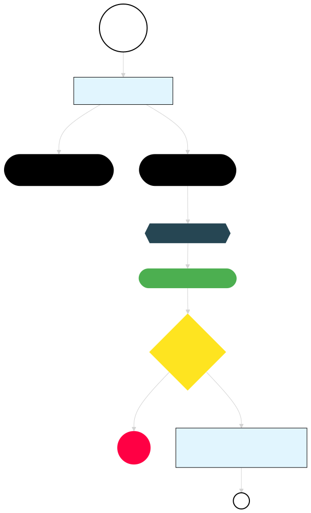

(v3)

## Refactor to a Component Wrapper

What if we make the component **dumber** by exposing only an API through props and events? A parent component (the **wrapper**) can then inject the composable as a dependency provider. This approach:

- **Enables full black-box testing:** The component is now isolated and easier to test.
- **Shifts responsibility:** The component is only in charge of rendering and emitting events, while the wrapper handles interactions.

I’m not sure if "Component Wrapper" is an established term. It isn’t exactly the "Container-Presentational Pattern" (Smart & Dumb Components) because the parent—our wrapper—is not particularly "smart." It simply glues the composable to the child component and may inject real dependencies, much like a Higher-Order Component (HOC) in React.

## Component Wrapper

Code: [VersionBanner03.vue](https://github.com/jeromeabel/nuxt-clean-architecture/blob/feat/version-banner/layers/version-03/components/VersionBanner03.vue)

```vue
<script lang="ts" setup>
// File: layers/version-03/components/VersionBanner03.vue
const { isVisible, version, close } = useVersion();
</script>

<template>
  <VersionBannerUI :is-visible="isVisible" :version="version" @close="close" />
</template>
```

## Dumb & Dumber UI Component

Code: [VersionBannerUI.vue](https://github.com/jeromeabel/nuxt-clean-architecture/blob/feat/version-banner/layers/version-03/components/VersionBannerUI.vue)

This child component handles only props and events:

```vue
<script lang="ts" setup>
// File: layers/version-03/components/VersionBannerUI.vue
defineProps<{ isVisible: boolean; version: string }>();
const emit = defineEmits(["close"]);
</script>

<template>
  <div v-if="isVisible" data-testid="version-banner">
    (03) New Version {{ version }}
    <button data-testid="version-close" @click="emit('close')">Close</button>
  </div>
</template>
```

## Test

We can now refactor our tests without needing to mock the composable. Instead, we simply mount the component with different properties and track emitted events.

Code: [version-banner.unit.spec.ts](https://github.com/jeromeabel/nuxt-clean-architecture/blob/feat/version-banner/layers/version-03/__tests__/version-banner.unit.spec.ts)

```ts
// File: layers/version-03/__tests__/version-banner.spec.ts
// @vitest-environment happy-dom
import { describe, it, expect, beforeEach } from "vitest";
import { shallowMount, VueWrapper } from "@vue/test-utils";
import VersionBannerUI from "../components/VersionBannerUI.vue";

describe("VersionBannerUI", () => {
  let wrapper: VueWrapper;

  // Helper function to set up the component and allow dynamic prop changes.
  const createWrapper = (props = {}) => {
    return shallowMount(VersionBannerUI, {
      props: {
        isVisible: true,
        version: "0.0.1",
        ...props, // Allows overriding props dynamically.
      },
    });
  };

  beforeEach(() => {
    wrapper = createWrapper();
  });

  // Helper selectors.
  const getBanner = () => wrapper.find('[data-testid="version-banner"]');
  const getCloseButton = () => wrapper.find('[data-testid="version-close"]');

  it("should display the version", () => {
    expect(getBanner().text()).toContain("0.0.1");
  });

  it("should display the version banner when isVisible is true", () => {
    expect(getBanner().exists()).toBe(true);
  });

  it("should have a close button", () => {
    expect(getCloseButton().exists()).toBe(true);
  });

  it("should not display the version banner when isVisible is false", () => {
    wrapper = createWrapper({ isVisible: false }); // Dynamically change the prop value.
    expect(getBanner().exists()).toBe(false);
  });

  it("should emit a close event when the close button is clicked", () => {
    getCloseButton().trigger("click");
    expect(wrapper.emitted()).toHaveProperty("close");
    expect(wrapper.emitted("close")).toBeTruthy();
  });
});
```

## Benefits

With this approach, we've simplified component testing by isolating the UI component from the composable. We don’t need to know anything about the composable’s internal workings, which keeps our tests focused, clear, and robust.

**Component testing: Done!** This separation of concerns gives us confidence in our component's behavior.

## Next Step

The journey isn’t over yet. Now that the component no longer depends directly on the composable, we can focus on specifying and testing the composable itself. What should we explore next?

## Specifications v4

- (v1) The application’s version is defined in `package.json`.
- [x] (v1) The component displays the current version.
- [x] (v1) The banner remains hidden if the version is already stored in local storage.
- [x] (v1) The user can dismiss the banner.
- [x] (v2.1) The component should only care about the UI behavior + v(2.2) only Props & Events
- (v2.1) The version should be wrapped in an Entity
- [x] (v2.2) The banner should be hidden by default.
- [x] (v2.2) The banner should be displayed when no version is stored.
- [x] (v2.2) Mock the `useVersion()` Composable to isolate the component under test (CUT)
- (v2.2) Test the composable
- (v2.2) Move `onMounted` (optional)

## Decision Map


