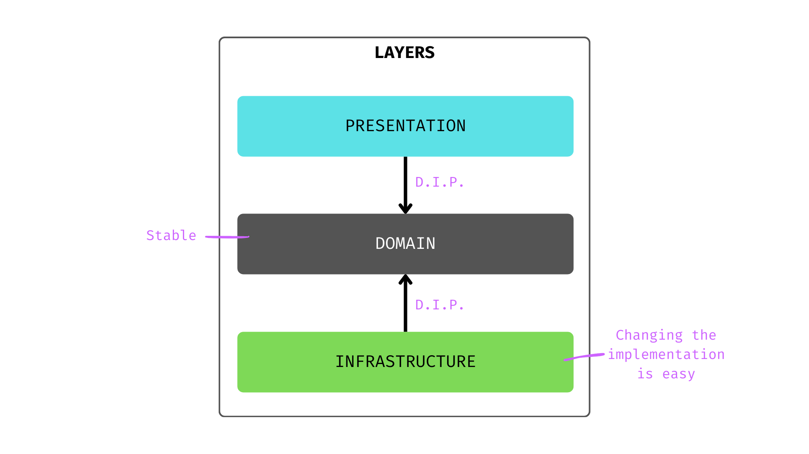
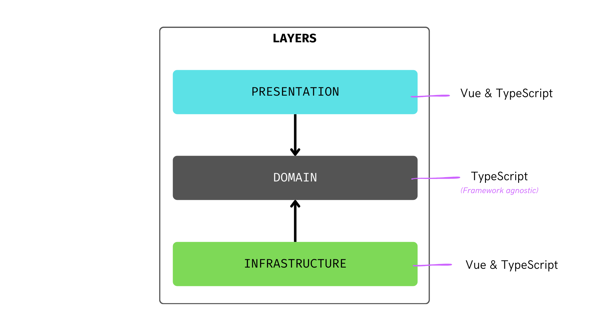
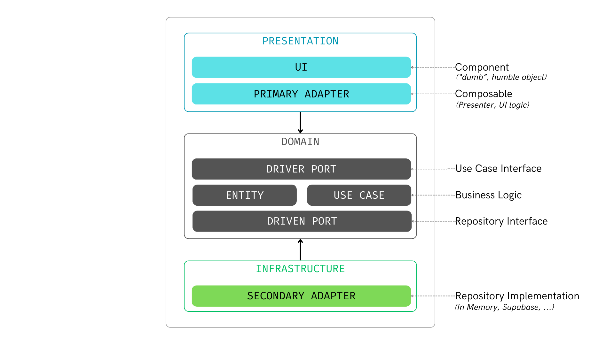
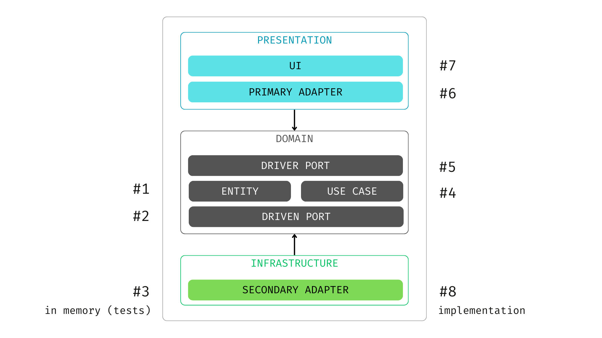
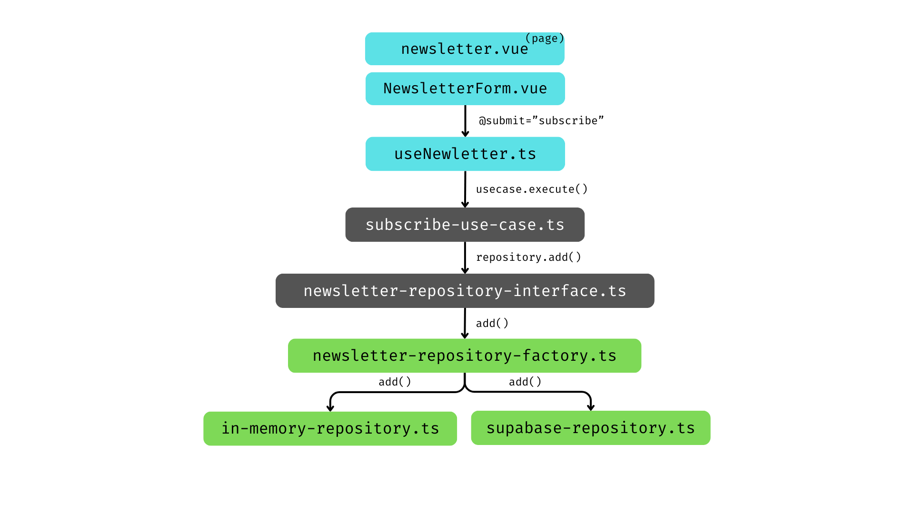
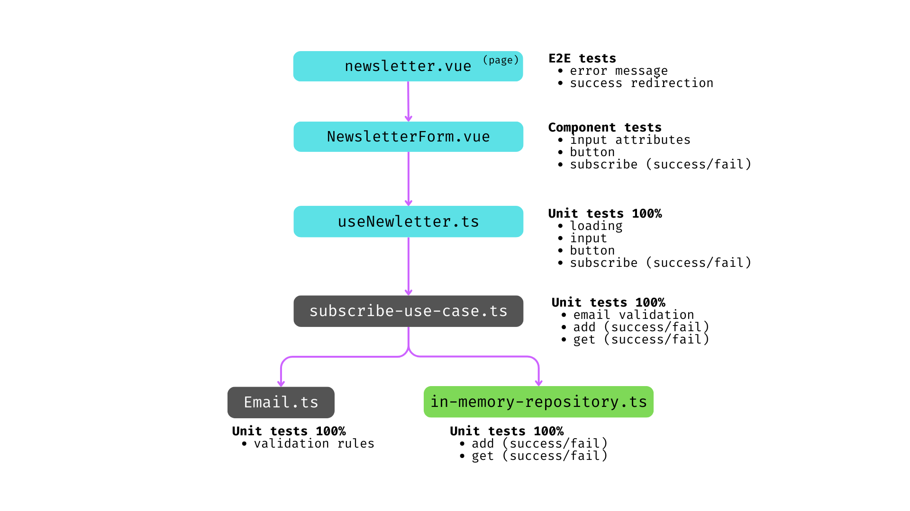

Clean Architecture is a powerful approach to structuring applications, ensuring maintainability, scalability, and testability. In this article, I share my experience applying Clean Architecture principles to a Nuxt project with a real-world example: a newsletter subscription feature

👉 Code: https://github.com/jeromeabel/nuxt-clean-architecture

## 🌱 Disclaimer

I'm new to both Clean Architecture and Nuxt, and this project is a hands-on experiment to better understand how these principles can be applied in practice. My goal is to document my learning process, share insights, and start discussions on how to refine this approach. Feedback and improvements are always welcome!

## Key Architectural Highlights

This implementation follows a layered architecture, dividing concerns into distinct modules:

- **Presentation Layer**: A minimalistic Vue component that delegates all logic to a composable, keeping the UI layer clean and focused on rendering.
- **Domain Layer**: Encapsulates core business rules and domain entities, ensuring they remain independent of any framework.
- **Infrastructure Layer**: Provides adapters for various data sources, including Supabase for persistence and an in-memory repository for flexible testing.

## Core Benefits of This Approach

By structuring the project with Clean Architecture principles, we achieve several advantages:

- **Separation of Concerns**: Each layer has a clearly defined responsibility, reducing dependencies and improving maintainability.
- **Improved Testability**: Dependency Inversion allows us to substitute infrastructure components easily, making unit and integration testing more reliable.
- **Future-Proof Design**: The architecture facilitates easy modifications, such as switching newsletter providers, without requiring significant changes to the business logic.

## Layered Structure Overview

1. **Presentation**: Contains UI components and composables that handle user interactions.
2. **Domain**: Houses business logic, use cases, and entities, remaining framework-agnostic.
3. **Infrastructure**: Implements repository adapters for data persistence, such as Supabase and in-memory storage.

## Technology Stack

- **Presentation & Infrastructure**: Vue & TypeScript for flexibility and robustness.
- **Domain**: Pure TypeScript to maintain framework independence and ensure portability.

## Understanding Adapters & Ports

The project adheres to the Ports and Adapters (Hexagonal) architecture pattern:

- **Primary Adapter**: The UI, responsible for handling user interactions.
- **Driver Port**: Defines interfaces for business use cases.
- **Driven Port**: Represents the contract for repositories, ensuring flexibility in data persistence.
- **Secondary Adapter**: Implements concrete data sources, such as Supabase.

## Step-by-Step Implementation

To build this feature in a structured manner, the following order of implementation is followed:

1. Define the **UI** in `NewsletterForm.vue`, ensuring a clean and declarative structure.
2. Create the **Composable** (`useNewsletter`) to manage state and encapsulate logic.
3. Develop the **Use Case** (`subscribe-use-case.ts`) that implements subscription logic.
4. Establish **Repository Interfaces** and **Factories** to enable dependency injection.
5. Implement **Repositories**, using Supabase for production and an in-memory store for testing.

## Newsletter Subscription Flow

The implemented solution follows a structured data flow:

1. The form component calls `useNewsletter` to retrieve state and manage user inputs.
2. The **Use Case** executes the subscription logic, abstracting business rules from the UI.
3. The selected repository (Supabase or in-memory) persists the subscription data.

## Testing Strategy

To ensure robustness, the project includes a comprehensive testing approach:

- **Unit Tests**: Cover validation logic, repository methods, and isolated UI elements.
- **Integration Tests**: Verify interactions between components, composables, and use cases.
- **End-to-End (E2E) Tests**: Ensure a seamless subscription experience, validating success scenarios and error handling.

## Conclusion

By applying Clean Architecture principles, this project demonstrates how to create modular, maintainable, and testable applications in Nuxt. The structured layering ensures separation of concerns, making the codebase adaptable to future requirements with minimal refactoring.

If you're interested in exploring this implementation further, check out the GitHub repository and feel free to contribute or share your thoughts!
