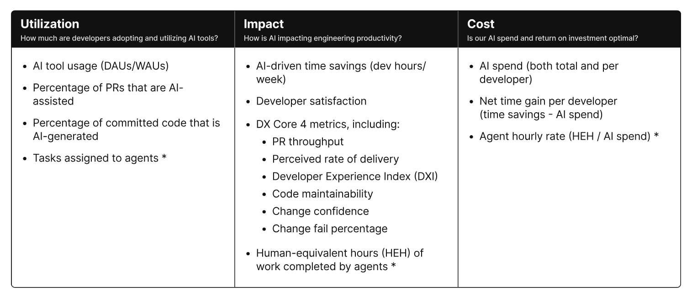
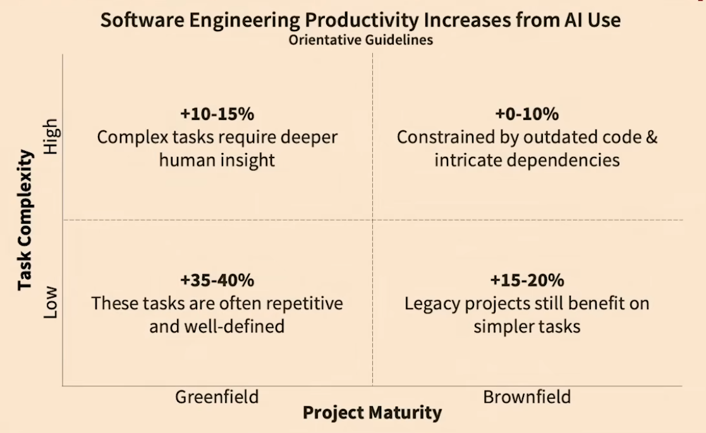
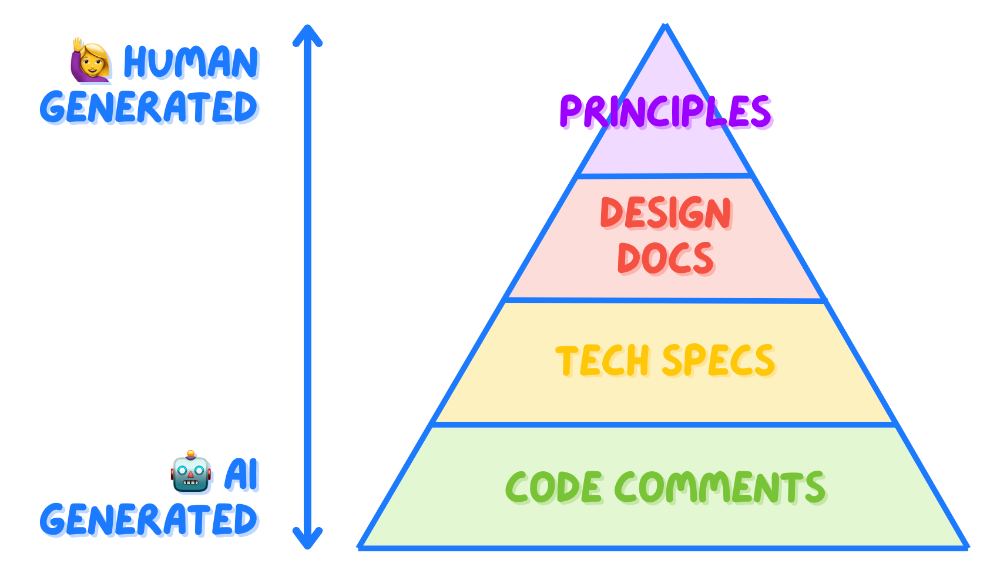
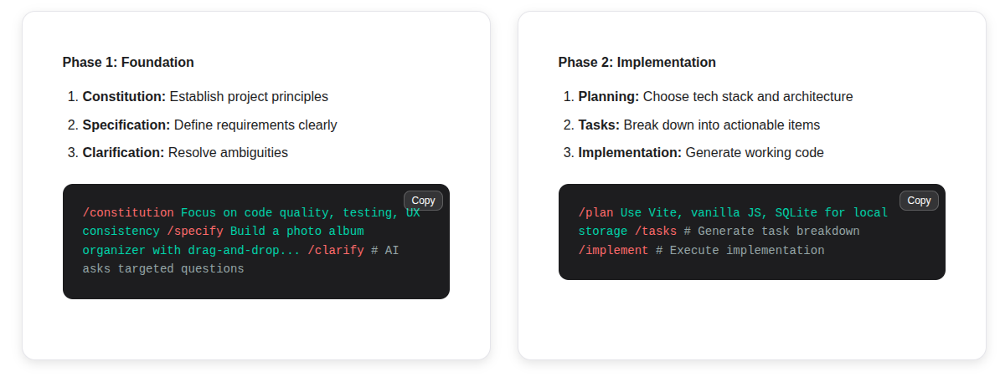
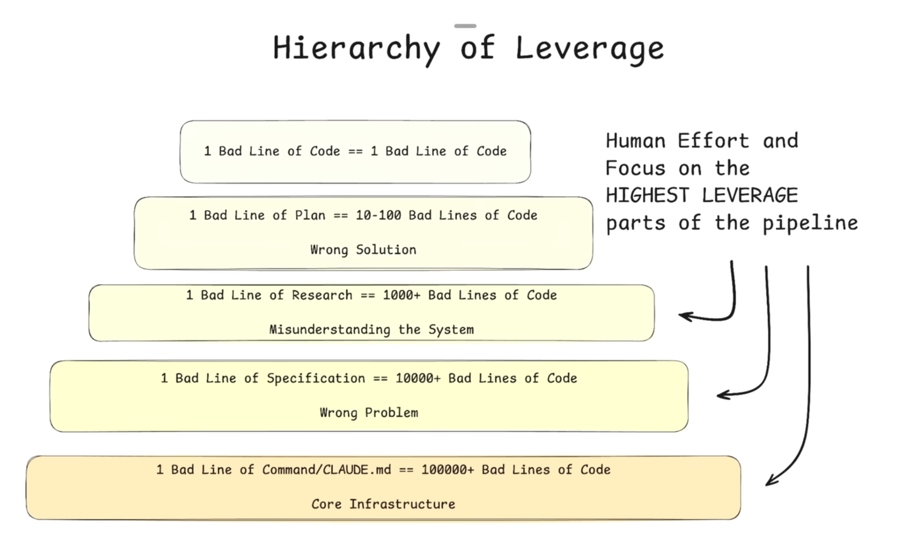

## 1. The "Big Shift": Cutting Through the Fog

The hype around JavaScript frameworks has finally quieted down. Since Angular arrived in 2012, we’ve seen at least 15 major frontend frameworks. Now, looking at the volume of AI models & tools released in the last three years, we’ve traded JavaScript fatigue for full-blown **AI fatigue**...

As a newer engineer, this pace feels unsettling. Knowing which skills will matter in five years is nearly impossible, creating a sense of professional vertigo. Morten Rand-Hendriksen captures this in "Everybody Else Is Doing It, So Why Can't I?" which looks at **F.O.M.O.** [^1] in an era of constant change.

### Perspective from the Veterans

To see through the fog, I looked to those who have lived through previous industry shifts.

When **Martin Fowler** and **Gergely Orosz** discussed this, they didn't just nod at the hype; they acknowledged this as the **biggest technology shift of their careers** [^2]. That’s a relief. It confirms the current confusion isn’t just a "junior" problem—it’s an industry-wide transformation. **The ground is moving for everyone**.

### Why This Feels Different

Once you accept the collective struggle, you can evaluate the shift for what it actually is.

**1. The Paradigm Shift: Non-Determinism**
Software engineering is traditionally a deterministic process. You translate requirements into functions and classes with expected behaviors. Even complex bugs remain traceable.

> Because if you've ever looked at chaos theory, you understand that even very simple functions can yield very extreme results depending on the variability in the inputs. (Michelle Rush [^3])

The new world introduces non-deterministic assistants. We now spend our energy fighting to provide enough context to keep "Black Box" LLMs from drifting—a challenge that scales poorly at the team level. It changes our relationship with code, requiring new skills, new tools and logging strategies.

**2. The "Intelligence" Trap**
Morten Rand-Hendriksen argues that "Intelligence" is a loaded term that gives these tools too much credit; we should view them as **Assisted Technologies** [^4]. Terms like *learning* or *reasoning* are human metaphors that trigger our bias to anthropomorphize machines.

> We want to understand these things as people... We can’t help it; humans are hopeless anthropomorphizers. (Adam Mastroianni [^5])

This is similar to **Pareidolia**—the same instinct that makes us see faces in clouds. Our brains find patterns and project intent where there is only mathematics. As Rand-Hendriksen notes, when the line between human and artificial becomes blurred, it generates deep-seated anxiety.

**3. The Irony of Automation**
If using AI feels exhausting, there is a technical reason for it. Michelle Rush refers to this as the **Irony of Automation**: partial automation often makes the remaining manual tasks harder.

> When you automate the easy parts, what’s left are the hard judgments, debugging edge cases, and maintenance. (Michelle Rush [^3])

* The AI handles the "low-hanging fruit": boilerplate, syntax, and common patterns.
* The human is left with the high-complexity tasks: judgment, edge cases, and debugging failures.
* **The Result:** Your "typing" time decreases, but your **thinking intensity** skyrockets.

**4. The Foundation Still Holds**

> Almost everything that makes someone a senior engineer is what now yields the best outcomes with AI. (Simon Willison [^6])

This leads to a vital reassurance: **the fundamentals haven’t changed**. Engineering foundations are more critical now than ever. If your foundations are weak, AI just helps you build a flawed system faster. If your foundations are strong, AI becomes a powerful lever.

---

## 2. The Promise of Productivity

We’ve all seen the demos: a developer builds a full-stack app in 20 minutes using nothing but natural language prompts. It’s a compelling sell for the "10x Developer" myth. But when you try to apply that same logic to a five-year-old codebase filled with legacy dependencies, the magic usually dissolves into a frustrating game of "spot the hallucination." These demos conveniently ignore the "pre-work"—the hours spent writing, testing, and refining the specification files that actually drive the generation.

### How to Measure It

If productivity is the goal, we need a better way to define "winning" than just lines of code.

AI forces us to re-evaluate how we measure value. To cut through the noise, industry reports and tech radars have become essential for understanding what is actually happening on the ground. Measuring impact is complex and evolving.

> AI impact must be measured across multiple dimensions. [...] It requires looking at a set of metrics across multiple dimensions—quality, effectiveness, speed—as opposed to relying on a single metric. (DX [^7])

DX proposes this AI Measurement Framework which focus on three key dimensions: utilization, impact, and cost. [^8]

### The Context Reality: One Size Fits None

A study of 100,000 developers by Yegor Denisov-Blanch [^9] highlights what’s often missing from the conversation. It confirms that counting commits is a useless metric because AI often generates "noisy" code—large chunks of rewrites that may introduce as many bugs as they solve. The results of this study are fairly consistent with what a developer might think on a daily basis. Sometimes it boosts our productivity, sometimes it doesn't.

(Greenfield projects gain 30-35% on simple task, and 10-15% on complex ones, versus 15-20% and 5-10% in brownfield projects - Yegor Denisov-Blanch)

The data suggests several technical constraints that dictate whether an AI tool is a lever or a weight:

* **Language Popularity:** Models struggle with niche languages where training data is scarce.
* **Context Length:** Even as context windows expand, the risk of "disalignment" increases. The more context you provide to explain a legacy system, the more likely the LLM is to lose the thread.
* **Task Complexity:** AI handles isolated tasks—like writing a single utility function or a unit test—fairly well. However, complex refactoring across multiple files requires so much manual oversight that it can often become a net time-sink.
* **Codebase Maturity:** This is the "Greenfield vs. Brownfield" divide. AI excels in new projects where there is no technical debt to navigate (the "YouTube Demo" mode). In Brownfield projects, where old patterns clash with new dependencies, productivity gains drop significantly.
* **Codebase Size:** As the repository grows, the model's ability to understand the codebase and maintain architectural consistency diminishes.

I’d also add **"AI Literacy"** to this list—knowing how to feed the model the right documentation, setting environment rules, and knowing when to ignore the suggestion entirely.

These parameters explain quite well, why I can feel like a "5x developer" on Tuesday when I'm prototyping in "YOLO mode," only to become a "-5% developer" on Wednesday when I try to rework an existing module the AI simply can't grasp.

---

## 3. The Dehumanization Trap

To get better at using AI, we have to look objectively at the friction it creates. While the speed of LLMs is impressive, their verbosity creates a set of technical and psychological side effects that can actually degrade the quality of our work and our well-being.

### The "Average" Factory

In his piece "AI Makes Everyone Average" [^10], Steve Huynh highlights a risk often called "skills atrophy". If you rely entirely on AI, you stop engaging with the "boring" but essential parts of the job—raw documentation, source code, and RFCs. You begin to live in a "Summary Layer": a crowded space where everyone uses AI to generate the same B+ explanations and generic components.

The real technical edge in engineering comes from the nuance found in the raw source material. When we stop digging deeper, our solutions regress to the mean. This can lead to a dangerous "de-responsibilization," where critical thinking is replaced by a confirmation bias—assuming the LLM is correct simply because its output looks authoritative or confirms our initial hypothesis.

### The Context-Switching Tax

Context switching is the enemy of engineering flow. Moving between tasks can cost as much as 40 percent of a person's productive time. AI tools introduce a new, unpredictable form of this interruption.

> Even brief mental blocks created by shifting between tasks can cost as much as 40 percent of someone's productive time (American Psychological Association [^11])

When working with AI, feedback loops can range from five seconds to several minutes. For simple tasks, the wait is predictable; for complex research or multi-file edits, it’s a black hole. While many tools now show "steps" or intermediate results to keep you engaged, the "thinking gap" often breaks your concentration. 

I’ve tried managing two user stories across two IDEs—launching an AI task in one and switching to the other while it runs. To be honest, in most cases, it fries my brain. It only feels manageable when the projects are homogeneous—similar in both timeframe and scope. But the question remains: what kind of AI task can you launch without breaking your flow? Usually, if a task is going to take a while, it’s better to launch it before a coffee break rather than trying to multi-task through the wait.

### The Joy of Crafting

For many of us, the joy of coding comes from the "cognitive battle"—the stimulating effort of solving a problem ourselves. Failure is a vital part of that learning process; it teaches us why certain paths were wrong and what trade-offs were made. AI shifts the developer’s role from a "creator" to an "orchestrator" or "compliance officer".

I’ve noticed that dealing with specification files creates a clear divide in how developers work. Some of us prefer to code first and let the specs evolve organically as we build. Forcing a complete specification upfront feels like a return to the Waterfall model—it’s bureaucratic and disengaging. We are being pushed into the drudgery of prompt engineering, where the "make it work" joy of hacking is being replaced by a "specify it correctly" mindset that turns our craft into a compliance task.

> Lawmakers as programmers?! (Sean Grove [^12])

We are entering a paradox of Spec-Driven Development. I find myself writing more documentation than ever, but I'm not writing it for my team—I'm writing it to constrain the LLM’s search space. This results in two sets of documentation: one for humans and a verbose, counter-intuitive set for the machine, filled with capital letters and "DO/DON'T" instructions specifically designed to prevent the model from hallucinating. 

The weirdest part is that you eventually end up asking the LLM to write instructions for itself based on its own previous failures. In this workflow, you aren't the builder anymore; you’ve become a "human gateway" between the specification and the code.

### The Team Dynamic

As Martin Fowler notes [^2]:, we are still learning how to operate with AI in a team environment. It requires a shift in organizational culture and a healthy data ecosystem.

> Successful AI adoption requires more than just tools. Our new DORA AI Capabilities Model identifies seven foundational practices—including a clear AI policy, a healthy data ecosystem, and a user-centric focus—that are proven to amplify the positive impact of AI on organizational performance. (DORA Report [^13])

AI creates a "problem of more". AI allows us to generate more code, which leads to more PRs, more branches, and more feedback cycles—yet we have the same number of people to do the actual reviewing. We’re creating a massive bottleneck where code sits in waiting, reliant on human validation that hasn't scaled alongside the AI's output.

There is also a deeper problem with empathy. It’s tempting to give an LLM more confidence than your own teammates. When you stop trusting the humans on your team and defer to the model, you lose the shared responsibility that actually makes a team functional.

---

## 4. The Opportunities

Let’s look at where this actually gets interesting.

### Prototyping in YOLO Mode

Vibe-coding gets a bad rap, but "YOLO mode"—accepting AI output just because it looks "okay"—has actual utility when you're just exploring.

* **UI/UX Exploration:** Using tools like Figma Make to spin up five variations of a feature in an hour. It’s a "variations" app with a toggle. It’s not production-ready, but it’s a tangible prototype to show the team before anyone touches the real codebase.
* **Contextual Specs:** I’ve started adding "orchestrator" features directly in preview branches just to see them run. Testing a feature in its real environment helps me write better specs later. Once the experiment works, I ask for an implementation plan, tweak it to keep my core logic, and then rebuild properly. The "optimization" phase is much faster because the plan is already battle-tested.
* **The Ubiquitous Language:** This is huge for non-devs. When business stakeholders can turn an idea into a functional (if messy) internal tool or report, they start to understand the friction of software. Seeing "Spec to Code" in real-time is a learning loop. It forces everyone to be explicit, which is hard.

### The Continuous Workflow Audit

AI adoption forces you to audit your habits. To figure out where an LLM actually fits, you have to break your day into micro-tasks and identify which ones are implicit or just "organic" noise.

I’ve started thinking of my workflow like Martin Fowler’s *Refactoring* book—where every move has a name. It’s like sports: once you name the movement, you can optimize the sequence. This consistent introspection creates a loop of small, compounding improvements to how you and your team actually interact.

### Living Documentation

> In my experience, docs have three main failure modes: They don't exist, They can't be trusted, They can't be found. — Luca Rossi & Dennis Pilarinos [^14]

We all know the drill: documentation is painful, it’s usually obsolete by the time it’s read, and developers would rather just "read the code." We treat docs like noise because they often are.

AI changes the math. Generating docstrings or Mermaid diagrams to map how functions communicate is now a low-effort task. It provides a map of the codebase before you start digging.

The debate over "too much documentation" is still there, but the cost of keeping it updated has plummeted. Because AI agents *need* this context to be useful, documentation has become a "living" requirement. It’s no longer just for onboarding; it’s the source of truth that keeps the LLM from hallucinating.

### Specs as the Fundamental Unit

Our roles are shifting toward "orchestrator", managing coding agents. You’re a Product Manager for your own code. In this world, the **specification file** is the most important asset you own.

Starting with a "plan" file is now standard practice. A single feature might involve two or three files: the User Story, the Brainstorming Plan, and the Implementation Tasks. This creates a paper trail that keeps the LLM on track even when you have to clear the context or pick up work the next day.

Some frameworks, like spec-kit, take this further, producing four or more files to make every detail explicit for the LLM. [^16]

It’s a bit ironic if the future of high-end engineering might just be managing a bunch of Markdown files

> - Specifications, not prompts or code, are becoming the fundamental unit of programming. (The New Code — Sean Grove, OpenAI [^12])
> - Coding is an incredible skill an asset. But it's not the end goal. Engineering is the precise exploration (by humans) of software solutions to humans problems. 
> - The Code is 10-20% of your impact; The other 80-90% is the structured communication (talk, understand, distill, ideate, plan, share, translate, test, verify)
> - A written specification is what **enables** you to **align humans** - it's the artifact that you discuss, debate, refer to, and sync on.

When we start a feature by talking about implementation details, we lose the "Why." AI forces us back to the high-level analysis. If you can’t explain it clearly in a spec, the agent will fail.

As Vishal Kapour noted [^17], agents expose how "underbaked" your thinking actually is. If the agent does something stupid, it’s usually because you didn’t actually know what you wanted.

Because AI is an amplifier, the leverage is at the start of the chain. As Dexter Horthy points out: one bad line in a plan can result in 100 lines of garbage code. [^18]

### Redefining Interactions

AI reshapes how we interact with our tools. The shift isn't just technical; it’s relational. We’re talking to machines—through text, voice, and images—and conversation has become the work.

This feels natural. Humans need communication, and describing intent in plain language is easier than speaking in rigid commands.

For developers — especially when working solo — this creates a new mirror for thinking, feedback, and brainstorming.

The real challenge now is control: quality, reliability, and intentional use. But it is also about freedom — how far we let these systems influence our creative process. As always, it is a matter of balance, and a choice that individuals and society will have to consciously make.

---

## 5. Conclusion

> The **Jevons Paradox** says that as we use large language models to build more software, we're going to create demand for more engineers.

As the "Big Shift" continues, engineering excellence is being redefined. Here is what will matter in the next era:

**1. Engineering Leadership: Moving Beyond the Fog**

We need nuanced feedback from senior developers who can see through the marketing fog. Successful AI adoption requires investing in mentoring and creating deliberate space to learn (Michelle Rush)

**2. Deliberate Learning**

Those who benefit most from AI aren't casual users; they are deliberate learners. Much like learning an instrument, progress comes from intentional practice—experimenting, failing, and refining mental models rather than expecting perfect answers on the first try.

> In the circles around me, the people who are getting the most out of AI have put in deliberate, intentional practice. They don't just pick up a guitar, experience failure, and then go, "Well, it got the answer wildly wrong," and then move on and assume that that will be their repeated experience. (Geoffrey Huntley [^19])

**3. A Curriculum for Foundation Skills**

In a world that feels increasingly chaotic, foundations become the anchor. The how is getting cheaper; the why — architecture, system boundaries, user intent — is becoming the real asset. For Michelle Rush, Systems thinking, reliability engineering, and comfort with complexity are no longer optional.

> The new scarce skill is writing specs that fully capture intent and values (Sean Grove, OpenAI)

**4. Reclaiming the Joy of Craft**

Embracing AI shouldn't mean surrendering agency. Keeping a "human in the loop" is about more than just control; it’s about maintaining our ability to learn.

Sometimes, the right move is to "code naked"—turning the AI off to write a module from scratch. We don't do this for speed, but because writing code remains one of the most effective ways we have to think.

In a future post, I’ll explore this further through **"Teacher Mode"**: a shift in perspective where we treat AI not as a shortcut, but as a collaborative partner for deeper exploration and

---

[^1]: [Everybody Else Is Doing It, So Why Can't I?](https://www.linkedin.com/pulse/fear-learning-vancouver-clarifying-journey-realities-rand-hendriksen-xzsbc/), Morten Rand-Hendriksen.

[^2]: [How AI will change software engineering – with Martin Fowler, Gergely Orosz](https://newsletter.pragmaticengineer.com/p/martin-fowler), The Pragmatic Engineer.

[^3]: [Humans in the Loop: Engineering Leadership in a Chaotic Industry](https://www.infoq.com/presentations/ai-ml-jobs/), Michelle Rush.

[^4]: [Why we're giving AI too much credit](https://www.youtube.com/watch?v=yjLsHD9IzIA), Morten Rand-Hendriksen, TEDxSurrey.

[^5]: [Bag of words, have mercy on us](https://www.experimental-history.com/p/bag-of-words-have-mercy-on-us), Adam Mastroianni.

[^6]: [Using LLMs for code](https://simonwillison.net/2025/Mar/11/using-llms-for-code/), Simon Willison.

[^7]: [AI and productivity: Year-in-review with Microsoft, Google, and GitHub researchers](https://getdx.com/blog/year-in-review-with-microsoft-google-and-github-researchers/), DX.

[^8]: [Measuring AI code assistants and agents](https://getdx.com/research/measuring-ai-code-assistants-and-agents/), DX.

[^9]: [Does AI Actually Boost Developer Productivity? (100k Devs Study)](https://youtu.be/tbDDYKRFjhk), Yegor Denisov-Blanch, Stanford.

[^10]: Steve Huynh, [AI Makes Everyone Average](https://alifeengineered.substack.com/p/ai-makes-everyone-average-here-is)

[^11]: American Psychological Association, [Multitasking: Switching costs](https://www.apa.org/topics/research/multitasking)

[^12]: Sean Grove, [The New Code](https://youtu.be/8rABwKRsec4), OpenAI

[^13]: DORA, [The State of AI-assisted Software Development report (2025)](https://dora.dev/research/2025/dora-report/)

[^14]: Luca Rossi & Dennis Pilarinos, [How AI is Changing Engineering Docs](https://refactoring.fm/p/how-engineering-docs-change-with).

[^15]: Luca Rossi, [The pyramid of docs](https://refactoring.fm/p/how-engineering-teams-use-ai).

[^16]: [speckit.org](https://speckit.org/), GitHub.

[^17]: Vishal Kapour [@figelwump] on X: ["One thing coding with agents does is it exposes how underbaked your thinking on the details of a product really are."](https://x.com/figelwump)

[^18]: Dexter Horthy, [Advanced Context Engineering for Agents](https://youtu.be/IS_y40zY-hc), YouTube.

[^19]: Geoffrey Huntley, [deliberate intentional practice](https://ghuntley.com/play/)
