## Introduction

When developing frontend features, it’s easy to create components that mix UI, business logic, data retrieval, and state management. While this might work initially, it quickly becomes untestable and difficult to maintain.

If you're new to testing, join me on this journey—I believe it will help you navigate similar situations. If you're experienced with testing, I welcome your feedback to improve this .

## Code

👉 [feat/version-banner](https://github.com/jeromeabel/nuxt-clean-architecture/tree/feat/version-banner)

## What’s the Best Way to Learn Testing?

A common belief is that the best way to learn is through practice and sharing.

Sharing, however, can take many forms. One approach I’d like to explore with you is sharing the step-by-step development flow. I believe one of the best ways to discuss development is by breaking it down into incremental steps, highlighting key questions, challenges, and decisions along the way. The goal is to follow a natural thought process, allowing ideas to emerge organically while balancing structured planning before each step in an iterative and minimalistic manner—planning and emergence.

I will progress from the outside in, starting with the UI, as that was the natural order in which I tackled this feature. It makes sense to begin with the user interface—the part users see first.

## Guidelines

As I reflect on my decision-making process, I realize I follow certain principles. Here are some that will guide me:

- **YAGNI (You Aren’t Gonna Need It)** – Build just enough without over-planning.
- **DRY (Don't Repeat Yoursel)**.
- **Domain Primitive** pattern, sometimes also called **Primitive Obsession** (when referring to the anti-pattern it solves).
- **Separation of Concern (SoC)**.
- **Single Responsibility Principle (SRP)** – Separate concerns to maintain clarity.
- **Test input and output, not implementation details**.
- **Avoid mocks when possible**.
- **Minimize tight coupling** – using Dependency Injection (DIP).
- **Avoid magic values**.
- **Iterate in small steps**.

Some decisions might seem like over-engineering. Balancing pragmatism and perfectionism is tricky. A useful criterion is asking, _What value does this decision bring?_ The value I seek is confidence—I want to **build confidence** in my code.

## Feature Overview: Specifications v1

We will implement a version banner in a Nuxt application:

- The application’s version is defined in `package.json`.
- The component displays the current version.
- The banner remains hidden if the version is already stored in local storage.
- The user can dismiss the banner.

Specifications will evolve throughout development, just as they do in real projects. This is a solid starting point. Though simple, I believe this feature provides valuable learning opportunities.

## Decision Map Overview

Let's take a look at the final map of this journey:

```mermaid
graph TD;
    %% Class Definitions
    classDef start fill:#fff,color:#000,stroke:#000,stroke-width:2;
    classDef impl fill:#000,color:#fff,stroke:#fff,stroke-width:0;
    classDef issue fill:#f48c06,color:#000,stroke:#333,stroke-width:0;
    classDef decision fill:#FEE420,color:#000,stroke:#4F4400,stroke-width:0;
    classDef test fill:#264653,color:#fff,stroke:#060600,stroke-width:0;
    classDef exit fill:#ff0044,color:#fff,stroke-width:0;
    classDef success fill:#4CAF50,color:#fff,stroke:#fff,stroke-width:0;

    %% Start Node
    START(("🏁 Start Feature:<br> <b>Version Banner</b>")):::start

    %% v1: Initial Implementation
    IMPL1([👨‍💻 All-In-One Component]):::impl
    TEST1{{🧪👁️ Visual Tests}}:::test
    DECISION1{Confidence<br>Enough?}:::decision
    EXIT((👋 Exit)):::exit
    ISSUE1[/"⚠️ <b>Too Many Concerns</b>:<br>UI, State, Lifecycle, Dependencies"/]:::issue

    %% Connections v1
    START --> IMPL1 --> TEST1 --> DECISION1
    DECISION1 -->|Yes| EXIT
    DECISION1 -->|No| ISSUE1

    %% v2: Humble/Presenter Pattern
    IMPL2A(["👨‍💻 <b>Component</b> (Humble):<br> VersionBanner.vue"]):::impl
    IMPL2B(["👨‍💻 Composable (Presenter):<br> useVersion.ts"]):::impl
    TEST2A{{🧪 Automated Test}}:::test

    ISSUE2A[/"⚠️ <b>Integration Test</b>,<br> I prefer unit test"/]:::issue
    ISSUE2B[/"⚠️ <b>White-Box Testing</b>,<br> I prefer Black-Box Testing"/]:::issue

    %% Connections v2
    ISSUE1 -->|"Refactor:<br> Humble/Presenter Pattern"| IMPL2A & IMPL2B
    IMPL2A --> TEST2A --> |1| ISSUE2A
    ISSUE2A -->|"2/ Refactor:<br> Mock the Composable"| TEST2A --> |3| ISSUE2B

    IMPL2B --> |"with Setup"| TEST4A

    %% v3: Wrapper Component Pattern
    IMPL3A(["👨‍💻 <b>Wrapper Component</b>:<br> VersionBanner.vue"]):::impl
    IMPL3B(["👨‍💻 <b>Child Component</b>: VersionBannerUI.vue"]):::impl
    TEST3{{🧪 Automated Test}}:::test
    SUCCESS1((✅ Done!)):::success

    %% Connections v3
    ISSUE2B -->|"Refactor: Wrapper Component Pattern"| IMPL3A & IMPL3B
    IMPL3B --> TEST3 --> SUCCESS1

    %% v4: Composable Testing & Repository Pattern
    TEST4A{{🧪 Automated Test}}:::test
    ISSUE4B[/"⚠️ <b>Integration Test</b>,<br> I prefer unit test"/]:::issue
    ISSUE4C[/"⚠️ <b>White-Box Testing</b>,<br> I prefer Black-Box Testing"/]:::issue

    IMPL4A(["👨‍💻 <b>Interface</b>:<br> IVersionRepository"]):::impl
    IMPL4B(["👨‍💻 <b>Repository</b>:<br> In Memory"]):::impl
    IMPL4C(["👨‍💻 <b>Repository</b>:<br> Implementation"]):::impl
    IMPL5A(["👨‍💻 <b>Composable</b> (v2)"]):::impl
    TEST5A{{🧪 Automated Test}}:::test
    TEST5B{{🧪 Automated Test}}:::test
    SUCCESS2((✅ Done!)):::success

    %% Connections v4
    TEST4A ---|1| ISSUE4B
    ISSUE4B --> |2/ Refactor:<br>Mock Dependencies| TEST4A --> |3| ISSUE4C
    ISSUE4C --> |Refactor:<br>Repository Pattern| IMPL4A & IMPL4B & IMPL4C
    IMPL4A --> |Refactor:<br> Dependency Inversion| IMPL5A --- TEST5A
    IMPL4B --> TEST5A & TEST5B --- SUCCESS2
```

