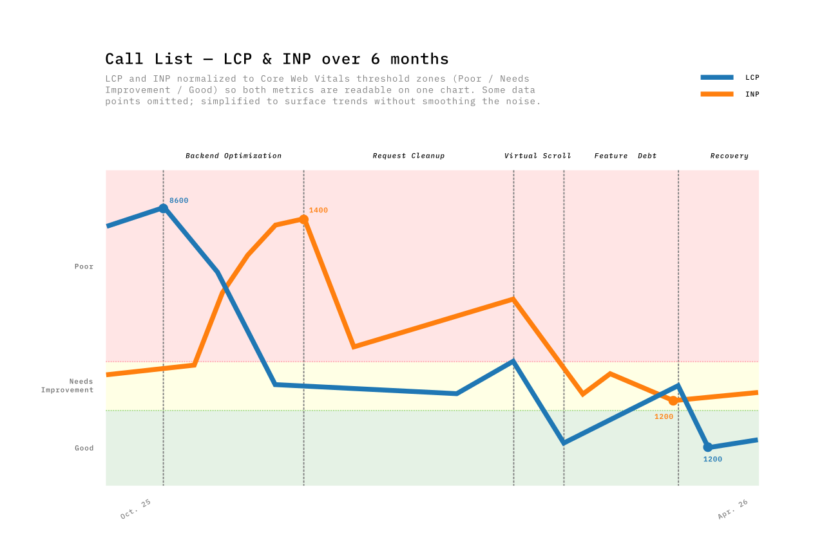
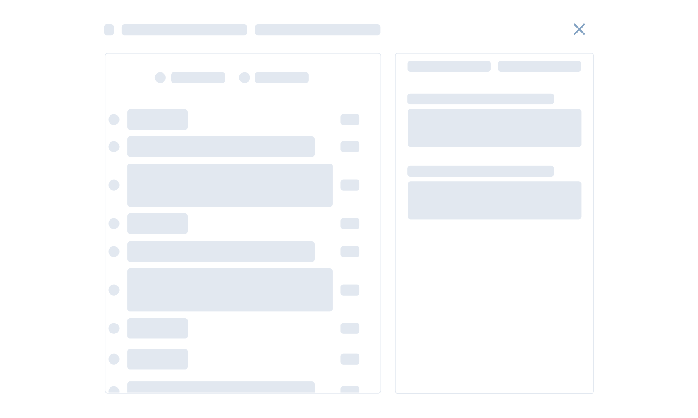
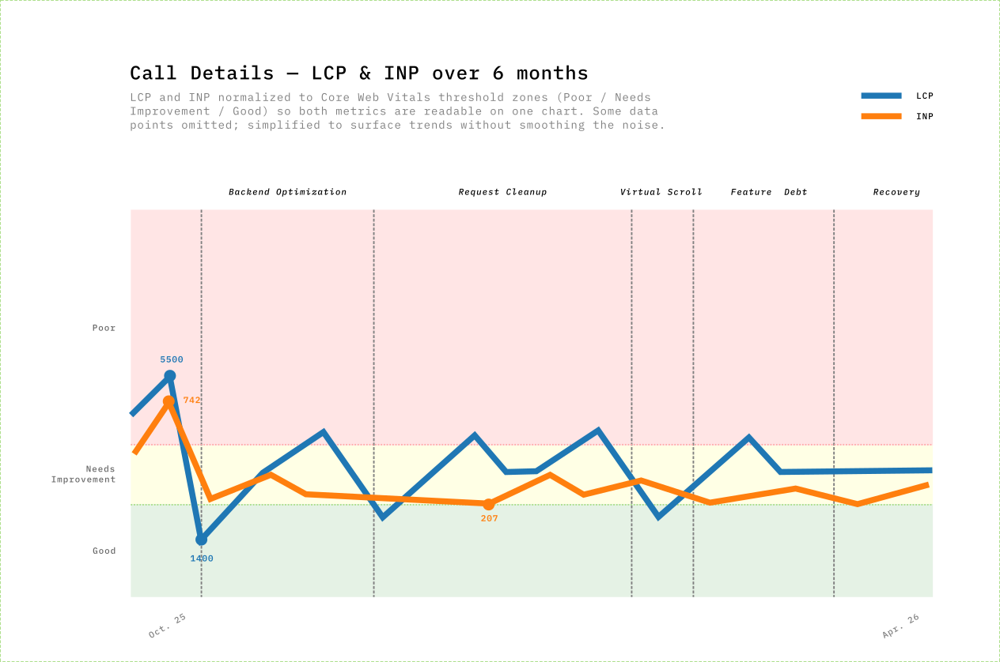

I work on a speech analytics web app built with Vue.js at [Uhlive](https://uh.live/). Customer analysts use it to search, filter, and review recorded calls — transcripts, tags, metrics. To get a sense of scale, some customers have over 800,000 calls.

Our performance was bad. Loading times reached 6–8 seconds. Users told us: *"it's a bit long"*, *"it grinds"*. That feedback hurt more than any dashboard number — we had to act. Removing user friction and earning back a feeling of quality mattered more than hitting a metric target.

I wanted to take a data-driven approach with our team — identify what matters, avoid guessing, prove each change with numbers. Sometimes it was obvious. Sometimes the results were unexpected, often in the wrong direction, and sometimes decoupled from the actual experience improvements.

---

## Field Data to Find the Problem

We gathered data from two main Real User Metrics (RUM) tools: [New Relic](https://newrelic.com/) for backend and frontend metrics and [Amplitude](https://amplitude.com/) for product analytics — user journeys, sessions, actions. We had a few months of baseline before starting — enough to see impact over 2+ weeks.

### What the Data Pointed To

New Relic ranked every page by LCP, giving us a clear picture of the worst performers. Three pages stood out — the three pages our customers use most. We scoped the work there and set a target: move their p75 LCP from "poor" (above 4s) to "good" (under 2.5s).

Amplitude's behavioral data revealed a clear correlation: **worst LCP = worst bounce rate.** During a 7-day snapshot a page showed a 50% bounce rate, compared to 18% on the other main page. The most telling signal: that same page had a **650-second average time spent per session** (time on page before navigating away or ending the session). Users were doing real work — they wanted to stay. But 50% still bounced. High time spent plus high bounce means users tried to use the page and gave up in frustration.

On the same page, when INP (Interaction to Next Paint — how fast the page responds to clicks) exceeded 400ms, Amplitude showed a 42% drop in search-to-action completions — users who searched but didn't open any results.

### Who We Were Optimizing For

We knew our users, but we needed to sharpen that picture — validate our assumptions and make sure we weren't hiding anything interesting. The user base splits into two distinct profiles:

- **Supervisors** check in periodically — reviewing analytics dashboards, monitoring data quality, browsing the call list to spot trends. Shorter sessions, more page-hopping. A supervisor "bouncing" from Call Details may just be checking one call and moving on — not a performance problem.
- **Analysts** work for hours — picking calls from the list, opening each one, reviewing transcripts and tags. Long sessions on Call Details, high page views on Call List. These are the users who felt the pain of 6-second LCP most acutely.

The great majority of our users work on desktop or laptop, recent Chrome-based browsers, small to HD screens, on Windows. No mobile, no old browsers.

We didn't have real data on their CPU power or device capabilities. But 25% of users had small desktop screens (under 1366px), which hinted that a significant portion could be on 4-year-old office laptops. Those machines — with background processes, distant servers, and average network quality — could explain the extreme worst results, even if they don't fully account for the p75 numbers. That's why we used CPU throttling in Lighthouse and the Performance tab to stay closer to their reality during development.

---

## The Call List Journey in Five Phases

Performance optimizations don't happen in a vacuum. The product can't be paused — new features ship alongside performance work, sometimes competing with it. That tension shaped every phase. We tracked our progress over six months, and the results weren't always linear as you can see in this graph.

| Phase | Period | Main Driver | LCP Impact | INP Impact |
|-------|--------|-------------|-----------|-----------|
| **1. Backend optimization** | Oct–Nov | Query optimizations + pagination | **−52%** | +202% (tradeoff) |
| **2. Request cleanup** | Nov–Dec | Dead code removal, reduced polling | −22% | **−57%** |
| **3. Virtual scrolling** | Jan–Feb | TanStack Virtual replacing PrimeVue DataTable | **−67%** | **−65%** |
| **4. Feature debt** | Feb–Mar | Adding features, global router growth | +156% | −22% |
| **5. Earning it back** | Mar–Apr | Endpoint migration, filter rewrite | **−63%** | +35% |

### Phase 1 — The backend win (and its tradeoff)

The first big change came from the backend team. They replaced a heavy endpoint with two specialized ones. On the frontend, we added pagination — no more loading all results at once — and refactored the store to consume the new endpoints. Call List LCP dropped from 8600ms to 4000ms — **the single biggest win in the whole journey.**

But something I didn't expect happened. INP spiked from 420ms to 1360ms. It took me a while to understand why — I only pieced it together months later, when preparing the data for this post. The page now loaded faster, delivering more interactive data sooner. The JavaScript tasks that process incoming data competed more aggressively for the main thread. **Faster load meant more data to interact with, which meant worse responsiveness.**

### Phase 2 — Cleaning up requests

Removing dead code paths, deleting deprecated API calls (useless since using the new endpoints) & fields, reducing polling frequency. Nothing exciting. INP dropped 57%. Removing dead code and useless API calls freed the main thread for user interactions.

### Phase 3 — Virtual scrolling breaks the tradeoff

Users wanted to see 100 rows by default instead of 20. We tried PrimeVue DataTable's built-in virtual scroller, but hit a known bug with row expansion — we use row expansion to show call details inline, and virtual scroll made it flicker and break ([PrimeVue Issue #3491](https://github.com/primefaces/primevue/issues/3491)). After documented attempts, we replaced PrimeVue entirely with TanStack Table & Virtual.

TanStack's headless approach solved both the performance problem and the UX issue: row expansion worked reliably, scroll behavior was consistent, and column widths stayed stable. The LCP gain came from rendering only visible rows instead of 100 DOM nodes. The INP gain from less DOM to interact with.

LCP: −67%. INP: −65%. This was the only phase that improved both metrics simultaneously, because virtualization decouples rendered DOM from data size. The browser no longer cares whether the list has 100 or 800,000 items — and neither should users. Having a consistent load time regardless of dataset size is as much a UX win as a performance one.

### Phase 4 — Feature Debt: Performance is a budget (and we spent it)

The most uncomfortable phase to write about. Over 5 weeks, Call List LCP crept from 1328ms back to 3406ms — **+156%**. Nobody noticed in real-time.

We were shipping features and every PR added a small cost. A new blocking API call on every page load, an eager watcher with localStorage for every user, and 53 restructured files adding parse-time overhead. Plus 13 PRs touching global router files, and three new runtime libraries (~45KB combined) landing silently.

The metaphor I keep coming back to is a budget. Performance is a budget, and every feature spends from it. The uncomfortable truth about Phase 4 is that nothing went *wrong* — we were doing normal product work, shipping things users needed. Each PR added a small cost. None had a compensating optimization. The budget was gone.

### Phase 5 — Earning it back

Targeted fixes reversed the Phase 4 costs directly: migrated a blocking API call to a lighter, dedicated endpoint, rewrote the filters to centralize definitions and shrink the module graph, and removed feature-gating logic that was still being evaluated at runtime for every user. LCP dropped from 3406ms to 1266ms — **back below the Phase 3 best.**

The mild INP regression (+35%) echoed Phase 1's pattern, but TanStack Virtual capped its magnitude. The DOM ceiling prevents exponential INP growth.

---

## Ship Perception While You Fix Architecture

The virtualization and payload reduction work took sprints. We couldn't ask users to wait that long without doing something visible. So we shipped a perception layer in parallel — small changes that didn't reduce load time but changed how the wait felt.

- **Skeleton screens** instead of blank pages. A 3-second load with a skeleton felt faster than a 2-second load with a white screen — users started scanning the layout before data arrived.
- **Disabled interactions during loading.** We'd seen users click buttons that weren't ready yet and get no response. Locking the UI with a visible loading state removed that "nothing happened" moment.
- **Optimistic UI** for high-confidence actions. We showed the result immediately and reconciled after the server responded. For actions that almost never fail, the delay was invisible.

Skeletons and loading states are a small investment, but "it looks nicer" isn't enough to get them prioritized. What helped was framing it in terms of the feedback we were getting — users saying "I clicked and nothing happened," "it looks broken." Those aren't performance complaints, they're trust complaints. The perception layer was our answer to those while the structural work continued.

Trust in a tool is asymmetric: it builds slowly through repeated success and drops fast on failure. An analyst opening 30 calls a day adjusts by day 3 — two fast sessions set an expectation; one regression confirms a fear. A skeleton screen doesn't change load time, but it signals that something is happening — that the tool is working for the user, not against them. Perception fixes buy time while the team works on structural changes.

---

## Call Details: the Page Under the Radar

The Call List story is clean: 8600ms → 1500ms, the data proves it. The Call Details story is less straightforward — the RUM numbers never told the improvement story well.

### Discovering the invisible problem

Call Details was part of our performance goals, but it wasn't in the weekly data report before October 2025. Then we looked at New Relic's worst-pages ranking: **over 70% of the worst 20 LCP spikes came from Call Details URLs.** No baseline, nothing to trend against.

So the first step wasn't fixing anything. It was adding New Relic instrumentation to Call Details so we could see what was actually happening. Once we had records, the picture was clear: some calls loaded in 1–2 seconds, others took 7, even 12 seconds. Long calls with thousands of transcript segments were the worst — a 45-minute call with dense transcripts and dozens of tags loaded completely differently from a short, clean one. The variance was enormous, and the p75 averaged it all into a number that looked manageable.

It wasn't.

### Lab Data Was the Only Way Forward

For Call List, I could make a change, wait two weeks, and see the impact in the RUM trends. For Call Details, that wasn't possible. There was no historical baseline to compare against, and the variance between calls made week-over-week trends meaningless.

I needed per-PR feedback. Chrome DevTools performance traces and Lighthouse reports were the only reliable signal — I could run them before and after each change on the same call, on the same machine, and see exactly what moved.

I wrote Python scripts with Claude Code that parsed the trace's `CrRendererMain` thread events and extracted a diagnostic chain — each metric pointing toward the next root cause:

| Layer | Before | After | Root cause | Fix |
|-------|-------:|------:|-----------|-----|
| **FPS** | 45 fps | 50 fps | Frame cost 22.8ms (budget: 16.67ms) | — |
| **Rendering** | 185 ms/s | 135 ms/s | 6,797 DOM nodes; 329 segment components | Virtual scroll — render ~20 visible segments |
| **Scripting** | 807 ms/s | 671 ms/s | `FireAnimationFrame` × 60/s × 329 segments = 20K comparisons/s | O(1) active index; watch transitions (~30×/10s) not timecodes (~600×/10s) |
| **Longest task** | 115 ms | 76 ms | `analyze_longest_task` traced child calls to source | Rewrote the composable |

*Lighthouse before: 33/100 · TBT: 600ms+ · TTI: 28s*

Each number was a clue. Lighthouse confirmed the structural problems — too many nodes, too much blocking script — but the traces told us *where to cut*. We parallelized API calls (5 sequential → 3 parallel), virtualized the transcript (−73% DOM nodes, −94% segment nodes), and optimized the layout. The lab data proved every change worked.

### The Graph That Didn't Move

Months later, here's what the RUM data showed. Call Details LCP bounced between 1400ms and 4600ms across the whole period with no clear trend. The majority of worst-page spikes still came from Call Details, but with fewer extreme values — the 12-second loads were gone.

The p75 still sits around 3000ms, fluctuating week to week. For Call Details, the gap between lab and field measurements was too wide to trust either one alone. The sample size is smaller, the usage patterns are more varied, and the improvements were spread across multiple interaction moments rather than concentrated in a single LCP event.

If I'd only had the graph, I would have concluded the work was a wash.

### What Users Said

And then users told us:

> I thought I had changed my hardware!
> We forget how long it used to take to open a call — now it's under 2 seconds

No Core Web Vital captures "I thought I had changed my hardware." The transcript virtualization made scrolling smooth. The parallel API calls removed the sequential wait. The skeleton screens made the remaining wait feel purposeful. None of this registered clearly in our RUM data — but it registered with the people using the tool every day.

This sprint started because a user said the app felt slow. The proof it worked was someone thinking they got new hardware.

---

## What Data Can't Prove

**Correlation is not causation.** Slow pages might be slow because they're complex, and complex pages might have higher bounce rates for reasons unrelated to performance. The signal was strong enough to act on — especially when users described the experience as "slow" — but I can't prove the causal link from metrics alone.

**Improving one metric can worsen another.** The LCP/INP tradeoff showed up three times during this journey. When data arrives faster, the JavaScript that processes it competes harder for the main thread. I didn't expect the metrics to be connected this tightly — it only became obvious once we were deep in it.

**Not every PR moves the dashboard.** Some improvements were real but too small for field data to register. Others only mattered on the slowest devices. I still think avoiding unnecessary reactive operations on 1,000+ items is a gain, at least for older hardware. But I couldn't always prove it with a graph.

**Rolling windows blend context away.** New Relic's weekly p75 blends data from the entire period. Our best week (1328ms) likely included some pre-optimization data that made it look better than reality. Our worst-to-best recovery (3406 → 1266ms) was partly the old data aging out. I learned to be careful with these — dramatic week-over-week changes were often the window shifting composition, not just new code.

---

## The Business Impact

Performance improved and users said it felt faster. We wanted to know if usage data agreed.

We compared two standalone 12-week windows in Amplitude's Page Engagement report — one ending before optimizations started (Aug–Oct 2025), one covering the post-optimization period (Jan–Apr 2026). Raw visitor counts dropped ~47% across all pages uniformly.

A caveat on these numbers: we're working with a small user base — around 50–60 weekly active users, roughly 300–550 unique visitors per 12-week window. This is a B2B tool, not a consumer app. With this sample size, a single power user changing their habits can move a metric by a few percent. The trends are directional, not statistically significant in the way a 100K-user A/B test would be.

| Page | Metric | Before (12w) | After (12w) | Change |
|------|--------|-------------:|------------:|-------:|
| **All pages** | Bounce Rate | 17.2% | 14.2% | **−17.4%** |
| **All pages** | Views/Session | 20.0 | 21.1 | +5.5% |
| **All pages** | Time/Session | 392s | 438s | +11.7% |
| **Call List** | Views/Session | 11.7 | 14.3 | **+22.6%** |
| **Call List** | Exit Rate | 17.8% | 13.9% | **−21.7%** |
| **Call List** | Time/Session | 400s | 335s | **−16.2%** |
| **Call Details** | Bounce Rate | 26.5% | 26.3% | −0.7% |
| **Call Details** | Time/Session | 789s | 880s | **+11.5%** |

*Exit rate: the percentage of sessions where a user left the app from a specific page. Bounce rate: the percentage of sessions where that page was the only one visited.*

Three things stand out:

**Call List became a better search tool.** Users browse 22.6% more pages per session while spending 16.2% less time — they find what they need faster. The exit rate dropped 21.7%, meaning users who reach Call List continue deeper into the app instead of leaving. This aligns with what both user types need: supervisors scanning more calls quickly, analysts finding their target calls sooner.

**Call Details held users for real work.** Time spent per session increased 11.5% (789s → 880s) while bounce rate stayed flat. Users who open a call now spend *more* time reviewing transcripts and tags — the work the tool was built for. Before optimization, opening a call was painful (LCP 4–5 seconds, sequential API calls). After parallelizing API calls, virtualizing the transcript, and adding skeletons, the page became usable enough for analysts to settle in and work. (We also added a read/unread indicator per call during this period, which likely contributed to the increased engagement.)

**Overall bounce rate dropped 17.4%.** From 17.2% to 14.2%. Fewer users abandon after the first page. With ~50 weekly users, this represents roughly 1–2 fewer bounces per week — a small absolute change, but a consistent one across the 12-week window.

---

## What I Learned

- **Field data first, lab data second.** RUM told us what was broken. Lighthouse and traces told us why.
- **p75, not average.** Averages hid our worst users. p75 showed the experience that was driving bounce rates.
- **Performance is a budget.** Every feature spends from the same budget — Phase 4 proved you can drain it in 5 weeks without anyone noticing.
- **The LCP/INP tradeoff is real and recurring.** Faster loading means more data competing for the main thread — only virtualization broke this by decoupling DOM size from data size.
- **Business metrics justify the sprint.** "22% more pages per session, 17% fewer bounces" is a business case — "LCP is 8.1s" is not.
- **Perception fixes buy time.** Skeletons shipped in days; virtualization took sprints. Users noticed both.
- **Not every change moves the dashboard.** Some PRs didn't register in the metrics — data tells you where to look, not always whether your fix worked.
- **User feedback is the companion to data.** The clearest signal before: "it grinds." After: "I thought I got new hardware." No dashboard gave us that.
- **Instrument before you optimize.** Call Details was invisible until we added tracking. You can't improve what you're not measuring — but you also can't always trust what you are.

---

## What's Next

I'm building a sandbox with 10,000 items to benchmark three rendering approaches: naive `v-for`, PrimeVue DataTable, and TanStack Virtual. Lighthouse scores the naive table at 100. Users measure 3-second mount times and single-digit FPS. The gap between synthetic scores and real experience is where the interesting engineering happens.
