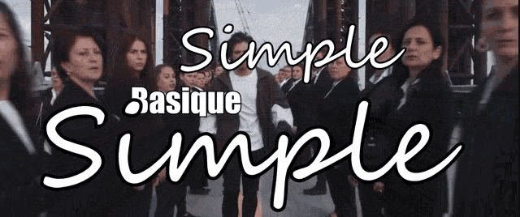
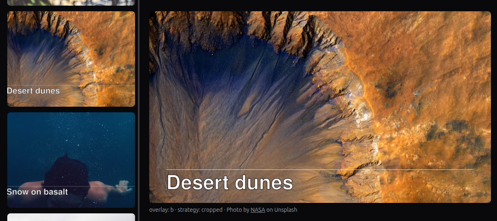
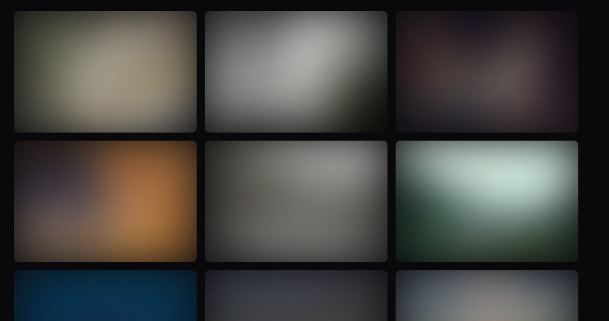
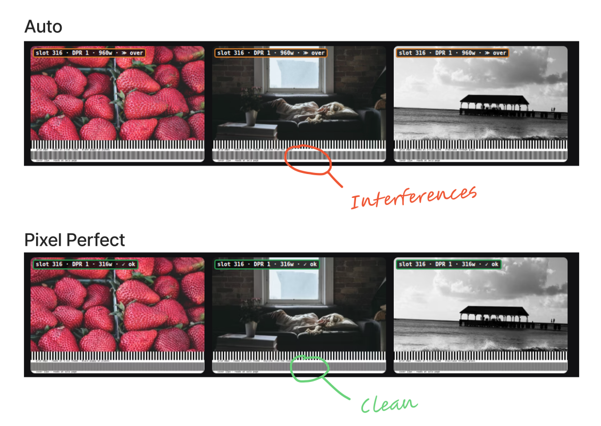
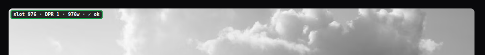

Les images sont souvent l'élément le plus lourd à télécharger pour un navigateur, donc en grande partie responsable des mauvais scores de performance de la métrique LCP (Large Content Paint).

Pour accompagner l'article, des exemples concrets sur le [playground compagnon](https://astro-jeromeabel.netlify.app/optimg).

## Le redimensionnement manuel

On peut très bien se passer de framework pour automatiser la création et l'affichage des images avec des scripts et du CSS. L'idée est la même : afficher les images visibles le plus rapidement possible en s'adaptant aux dimensions de l'écran.

La base, une image fluide en CSS:

```css
img { display: block; max-width: 100%; height: auto; }
```

Une seule version de l'image ne suffit souvent jamais. Il faut pouvoir fournir d'autres tailles de la même image pour s'adapter de façon "responsive" à la largeur de l'écran (viewport), au Device Pixel Ratio (DPR) et aux différents configurations d'affichage de la page (minitiatures, hero, grille, colonnes, etc.). Par exemple pour un emplacement disponible de 1024px, un écran DPR-2 voudra le double, une image de 2048px.

En HTML, les propriétés `srcset` et `sizes` permettent au navigateur de choisir l'image la plus adaptée, la moins lourde à charger. 

```html

```

Notez que `sizes` doit correspondre à votre layout CSS réel, c'est une configuration qui ne peut être déduite automatique par le framework. Dans cet exemple, nous voulons afficher l'image en pleine largeur (100vw) en dessous de 1024px, et seulement la moitié (50vw) pour un écran plus grand qui correspondra dans notre mise en page à un affichage en deux colonnes, et sans dépasser 768px. Un `sizes` incorrect et le navigateur télécharge le mauvais fichier, surchargeant inutilement le chargement de la page/

Exemple de script basique pour générer une version de l'image flou avec ImageMagick :

```bash
for SIZE in "${SIZES[@]}"; do
  convert "$FILENAME" -resize $SIZE "out/${NAME}_$SIZE.$EXT"
  if [ "$SIZE" == "640x" ]; then
    convert "out/${NAME}_$SIZE.$EXT" -blur 0x8 "out/${NAME}_$SIZE-blur.$EXT"
  fi
done
```

## Plus simple avec Astro

Le composant `<Picture>` fournit par Astro simplifie en grande partie le travail précédent. Il génère un élément `<picture>` avec une `<source>` par format moderne et un fallback ``. 

```astro
---
import { Picture } from "astro:assets";
import hero from "./hero.png"; // 1600x900
---
<Picture 
  src={hero} 
  formats={["avif", "webp"]} 
  layout="constrained"
  width={800} 
  height={600} 
  alt="…" 
/>
```

Il suffit de lister les formats du plus moderne au plus ancien — l'ordre est la priorité d'affichage. La propriété `layout` va permettre de générer `srcset` et `sizes`:

```html

```

La paire `width`/`height` est automatiquement définit pour réserver l'espace nécessaire avant que l'image se charge. Ce qui **prévient le Cumulative Layout Shift** (CLS).

### On Build, On Demand

Par défaut, la création des images ne nécessite pas de serveur. Au moment du build `astro:assets` crée les fichiers statiques "hachés" dans `/_astro/`: `hero.hash.webp` et ses variantes. Ce qui permet un déploiement partout: GitHub Pages, S3, une clé USB.

Avec les adaptateurs, on peut aller plus loin. Ici, j'utilise l'adaptateur `@astrojs/netlify`, ce qui permet de bénéficier du **Netlify Image CDN**. Le redimensionnement se fait alors à la demande. Pour un site avec des centaines d'images le temps de build n'est donc pas impacté, et le CDN met en cache les fichiers. D'autres services sont possibles : Cloudinary, Imgix et d'autres ont des intégrations.

Mais cette commodité a un coût caché, et c'est exactement ce que le benchmark plus bas va révéler. Il y a deux *moments* d'optimisation. Le build génère les fichiers : le travail se fait deux fois, au moment du build et pour transférer les fichiers vers l'espace d'hébergement mais chaque visiteur reçoit un fichier déjà prêt. Le CDN à la demande, lui, diffère le travail à la première requête : sur un cache froid, le serveur doit récupérer la source, la décoder, la redimensionner, la ré-encoder en AVIF, puis répondre — du calcul serveur qui s'ajoute au TTFB, payé par image et par cycle de cache. Une fois le fichier en cache, c'est directement accessible ; mais le tout premier visiteur — et chaque run de benchmark à froid — paie la transformation.


### Petit piège avec Tailwind

Si vous avez l'habitude d'utiliser Tailwind il se peut que vous rencontriez un problème avec la façon dont Astro gère les images "responsive". Pour utiliser les images responsive dans Astro, il faut ajouter au fichier de configuration ([doc](https://docs.astro.build/en/guides/images/#responsive-image-styles)):

```js
// astro.config.mjs
image: { responsiveStyles: true }, // par défaut false
```

Cela injecte des règles CSS globales délibérément faibles en spécificité via `:where([data-astro-image])` qui l'emportent sur les classes Tailwind. À savoir avant de passer dix minutes à comprendre pourquoi `object-cover` ne fait rien. La solution est d'utiliser les props `fit` et `position` qui se branchent directement dans ces mêmes styles responsives :

```astro
<Picture src={img} layout="constrained" fit="cover" position="top" alt="…" />
```

Désactiver `responsiveStyles` et prendre en charge entièrement le CSS est l'autre option valide. Les props deviennent importantes dès que vous voulez la même image source recadrée différemment selon le contexte — une miniature carrée sur la grille, une large couverture paysage sur la page de détail. Un seul import, des props différentes par usage ; Astro génère des fichiers de sortie séparés pour chaque combinaison au moment du build :

```astro
{/* grille : recadrage carré */}
<Picture src={img} layout="constrained" width={400} height={400} fit="cover" alt="…" />

{/* couverture détail : paysage, focus en haut */}
<Picture src={img} layout="full-width" width={1200} height={600} fit="cover" position="top" alt="…" />
```

Une seule image source en entrée, deux images générées et recadrées en sortie, sans script. Depuis Astro 6, les styles responsives sont émis sous forme de classe hachée plus des attributs `data-astro-fit` / `data-astro-pos`. 

## Benchmark de sept stratégies

Le [projet "optimg"](https://astro-jeromeabel.netlify.app/optimg) accompagne cette article pour présenter sept stratégies, de la plus naïve à la plus sophistiquée. Un premier benchmark en local a été réalisé avec lighthouse en prenant la médiane de 3 itérations pour comparer leurs performances.

| Stratégie | LCP (ms) | CLS | Transfert (KB) | Description |
| --- | --- | --- | --- | --- |
| [naive](https://astro-jeromeabel.netlify.app/optimg/naive) | 4876 | 0.011 | 9400 | Sans `srcset`, `width`, `height` |
| [manual](https://astro-jeromeabel.netlify.app/optimg/manual) | 749 | 0.000 | 962 | JPEG ré-encodés par sharp (qualité 78), 3 largeurs + un fallback flou, servis en statique depuis `/public/` |
| [auto](https://astro-jeromeabel.netlify.app/optimg/auto) | 1529 | 0.000 | 523 | `<Picture>` basique, plusieurs tailles et formats AVIF/WebP transformés à la demande par le CDN Netlify |
| [pixel-perfect](https://astro-jeromeabel.netlify.app/optimg/pixel-perfect) | 1001 | 0.000 | 236 | `<Picture>` avec optimisation des tailles au pixel près |
| [lqip](https://astro-jeromeabel.netlify.app/optimg/lqip) | 1254 | 0.000 | 541 | Une image floue de basse qualité (LQIP) s'affiche au plus vite en attendant le chargement de `<Picture>` |
| [cropped](https://astro-jeromeabel.netlify.app/optimg/cropped) | 1600 | 0.000 | 559 | `<Picture>` basique avec découpage de l'image |
| [final](https://astro-jeromeabel.netlify.app/optimg/final) | 1077 | 0.000 | 254 | Combine `<Picture>`, optimisation des tailles et LQIP |


Une fois les largeurs et hauteurs précisées, plus aucun problème de CLS. Simple. Une seule version par image (`naive`) est un désastre : 4876 ms de LCP et 9400 KB de transfert. Basique.



Le reste du tableau est contre-intuitif. `manual`, en JPEG — format moins optimal qu'AVIF — et deux fois plus lourd qu'`auto` (962 vs 523 KB), obtient un LCP deux fois meilleur. 🙃

Le piège, c'est que ce benchmark mesure deux choses en même temps.

- **La stratégie *et* le pipeline de déploiement.** `manual` est servi en statique depuis le disque ; `auto`, `pixel-perfect` et `final` émettent des URL `/.netlify/images?url=…` et, au premier accès, le serveur doit récupérer la source, la décoder, la redimensionner, la ré-encoder en AVIF, puis répondre — du calcul qui s'ajoute au TTFB. Or `netlify serve` vide son cache à chaque lancement : la mesure est toujours froide, donc cette transformation est toujours payée. Le 2× d'écart, c'est cette taxe, pas le format.
- **L'élément LCP est une miniature de 316 px, servie trop large.** La page est une grille de 21 images ; le LCP est `photo-01`, une miniature de 316 px. À cette taille, JPEG ou AVIF pèsent à peu près pareil (≈ 39 vs 25 KB) — le gain de format est invisible. Pire : le `sizes` de `manual` comme d'`auto` résout ce slot de 316 px par un fichier `w=640`, deux fois trop large. La preuve : `pixel-perfect` (1001 ms) et `final` (1077 ms) utilisent *exactement la même* transformation AVIF qu'`auto` et le battent de ~500 ms, juste en servant la bonne taille.

Bref, ce premier benchmark fournit le pire scénario — un cache vide, comme une première visite — et il confond la stratégie avec le pipeline. J'ai cru mesurer une variable, j'en mesurais deux.


## Comparer proprement : une variable à la fois

La règle tient en une phrase : **figer toutes les variables sauf celle qu'on étudie.** Trois bougent — la stratégie, l'hôte, l'outil de mesure — et mon premier run en confondait deux. Pour lire les stratégies entre elles, il faut donc figer l'hôte et le régime. J'ai re-mesuré **à chaud**, en production, médiane de 3 itérations Lighthouse desktop, sur deux hébergements : un build statique sur un mutualisé OVH (`astro.jeromeabel.net`, où les fichiers sont déjà produits) et le build Netlify avec Image CDN à la demande (`astro-jeromeabel.netlify.app`).

| Stratégie | OVH LCP (ms) | OVH (KB) | Netlify LCP (ms) | Netlify (KB) |
| --- | --- | --- | --- | --- |
| naive | 1292 | 9158 | 615 | 9136 |
| manual | 355 | 903 | 409 | 900 |
| auto | 414 | 373 | 412 | 729 |
| pixel-perfect | **302** | **138** | **336** | 234 |
| lqip | 417 | 383 | 649 | 741 |
| cropped | 392 | 405 | 435 | 797 |
| final | 333 | 148 | 411 | 246 |

Le paradoxe froid a disparu. À chaud, `manual` (355 ms) et `auto` (414 ms) sont quasi à égalité sur OVH, et à égalité stricte sur Netlify (409 vs 412) : le 2× de l'écart froid, c'était la taxe de transformation CDN payée à chaque run, rien d'autre. Une fois cette taxe amortie, le vrai classement apparaît — et il ne tient ni au format ni à l'hôte. `pixel-perfect` gagne partout (302 ms / 138 KB sur OVH), `final` juste derrière. Or `pixel-perfect`, `final` et `auto` utilisent la *même* transformation AVIF ; la seule différence, c'est que les deux premiers servent un fichier à la taille du slot là où `auto` sur-fetch un `w=640` pour 316 px. **Le levier n'a jamais été le format ; c'est le contrat `sizes`.** Et le CLS reste à 0 partout sauf sur `naive` : `width`/`height` suffisent.

### Le déploiement compte moins que le `sizes`

Reste l'hôte. OVH sert du Sharp build-time, Netlify transforme à la demande : comparer une *ligne* du tableau, c'est comparer deux pipelines, pas deux réseaux. Deux cas le démêlent. Sur le payload brut (`naive`, ~9 MB, aucune transformation), seul le transport compte et l'edge Netlify (615 ms) bat l'origine unique OVH (1292 ms) d'un facteur deux — la proximité du POP domine. Sur les assets optimisés, l'inverse : le Sharp build-time produit des fichiers ~2× plus petits que la transformation à la demande (`auto` 373 KB sur OVH contre 729 sur Netlify), et ces octets plus légers servis depuis une origine proche font gagner OVH à chaud en local.

Mais à l'échelle d'une miniature, sous 0,5 s, ces 50–100 ms relèvent surtout du bruit de run, et le classement s'inverserait encore avec une sonde mobile lointaine, qui rendrait l'avantage à l'edge. Le déploiement déplace le résultat à la marge ; le `sizes`, lui, le déplace de 500 ms. L'un est un réglage, l'autre est le levier.

### Le même test, trois instruments

Dernier piège : changez d'outil et le classement rebouge, sans que la page change. Trois instruments répondent à trois questions, et confondre leurs chiffres est la première source de tournis.

| Outil | Où ça tourne | Throttle (défaut) | Cache |
| --- | --- | --- | --- |
| Lighthouse local (`netlify serve`) | ma machine | desktop : 40 ms RTT, 10 Mbps, CPU ×1 | froid |
| Lighthouse DevTools (site live) | ma machine | mobile Slow 4G : 150 ms, 1,6 Mbps, CPU ×4 | froid |
| PageSpeed Insights | serveurs Google | mobile Slow 4G + CPU ×4 | froid |

Trois choses à savoir, vérifiées dans la doc Lighthouse. **Le throttling est simulé** : Lighthouse charge la page une fois sans throttle, puis *calcule* le temps qu'elle aurait pris sous les conditions cibles ([throttling.md](https://github.com/GoogleChrome/lighthouse/blob/main/docs/throttling.md)) — rapide et déterministe, mais c'est un modèle, pas un vrai réseau lent. **Chaque run vide le cache** (`disableStorageReset` vaut `false` par défaut) : la mesure est donc toujours froide, et la transformation CDN toujours payée. **Un run unique ment** : « la médiane de 5 runs est deux fois plus stable qu'un seul run » ([variability.md](https://github.com/GoogleChrome/lighthouse/blob/main/docs/variability.md)) — `final` sur Netlify affichait 2,3 s en un seul run mobile contre 0,8 s ailleurs, du bruit pur.

Le mobile reste le révélateur : il applique un CPU 4× plus lent que mon desktop, le coût que vit un vrai téléphone et que ma machine masque. Mais tout ceci est du labo — ces pages de démo n'ont pas de visiteurs, donc aucune donnée terrain pour trancher. En pratique : le 3-run local à chaud pour **comparer les stratégies** entre elles ; PageSpeed mobile pour **approcher le régime livré** ; le Lighthouse DevTools sur le live seulement comme coup d'œil — ma machine, un seul run, jamais un chiffre de référence.

## Une source, deux recadrages

La stratégie `cropped` est le plus petit ajout possible à `auto` : ajouter `fit="cover"` et une `height` explicite, et Astro génère une variante recadrée au moment du build.

```astro
{/* miniature grille : 4:3 */}
<Picture src={image} layout="constrained" fit="cover"
  width={640} height={480} sizes={autoSizes} alt={alt} />

{/* couverture détail : 16:9 */}
<Picture src={image} layout="constrained" fit="cover"
  width={1280} height={720} sizes={autoSizes} alt={alt} />
```

Les deux lisent le même import `image`. Astro produit deux fichiers de sortie — un recadrage 640×480 et un recadrage 1280×720 — pendant `pnpm build`. Pas de serveur, pas de transformation à l'exécution ; le CDN sert des fichiers statiques. Ce qui change entre la vue grille et la vue détail, c'est le cadre que voit l'utilisateur, pas le moment où la transformation s'exécute.

[](https://astro-jeromeabel.netlify.app/optimg/cropped)
*Placeholder — en attente d'une vraie capture d'écran. **Capturer :** une photo paysage avec overlay `d` (grand titre baked) pour que le recadrage soit évident — ex. `photo-04` (dunes de désert). Placer la miniature grille (4:3, [`/optimg/cropped`](https://astro-jeromeabel.netlify.app/optimg/cropped)) à côté de sa couverture détail (16:9, [`/optimg/cropped/photo-04`](https://astro-jeromeabel.netlify.app/optimg/cropped/photo-04)) ; même source, deux recadrages.*

Dans le benchmark, `cropped` (1600 ms, 559 KB) suit `auto` (1529 ms) de près sur le LCP — la transformation de recadrage CDN n'ajoute qu'une latence marginale ce run — pour ~36 KB de plus. Recadrer change surtout le cadre, à peine les octets. Ce que `cropped` enseigne, c'est qu'une source peut servir plusieurs contextes avec des ratios d'aspect différents sans script, sans route serveur, ni étape de recadrage CMS. Pour les éléments de galerie où `crop: true` est défini, la stratégie `final` étend cela — couvertures 16:9 et miniatures 4:3 combinées avec des largeurs pixel-perfect et le placeholder LQIP.

## La stack finale

`final` combine tout : largeurs pixel-perfect basées sur les tokens sous un placeholder LQIP, avec recadrage optionnel par image. Elle bat `lqip` seul de 177 ms (1077 ms vs 1254 ms) parce que les fichiers plus petits issus du sizing précis compensent largement la surcharge du placeholder.

Le composant ajoute des props pixel-perfect à la structure `lqip` de la section suivante :

```astro
<div class="reveal-img relative overflow-hidden">
  <!-- placeholder flou 32px, correspondant au ratio d'aspect de la vraie image -->
  

  <!-- <Picture> pixel-perfect avec recadrage optionnel par item -->
  <Picture
    src={image} layout="constrained"
    width={ppWidth} widths={ppWidths} sizes={ppSizes}
    height={finalHeight}
    fit={finalCrop ? "cover" : undefined}
    position={finalCrop ? "top" : undefined}
    pictureAttributes={{ style: "opacity:0" }}
    alt={alt} />
</div>
```

`ppWidth`, `ppWidths` et `ppSizes` viennent des tokens de mise en page. `finalHeight` n'est défini que quand `item.crop: true` dans `gallery.json`, ajustant le ratio d'aspect à la fois pour le placeholder (via `getImage`) et pour la vraie image (via `fit="cover"`). Le script de révélation est identique à celui de `lqip` — `img.complete` déclenche un snap sur les images en cache et un fondu de 1,2 s sur un chargement réseau.

[](https://astro-jeromeabel.netlify.app/optimg/final)
*Placeholder — en attente d'une vraie capture d'écran. **Capturer :** [`/optimg/final`](https://astro-jeromeabel.netlify.app/optimg/final), DevTools throttle Slow 3G + cache désactivé, snap en cours de chargement. Mettre en avant une photo avec titre overlay `d` (ex. `photo-01`) pour que la transition placeholder LQIP flou → titre net soit lisible pendant que le vrai fichier stream.*

L'écart de 76 ms entre `pixel-perfect` (1001 ms) et `final` (1077 ms) est la surcharge LQIP : un placeholder WebP 32px décodé et affiché avant que le vrai fichier stream. Sur une connexion rapide le placeholder disparaît avant qu'on le remarque ; sur une connexion lente il remplit le slot immédiatement plutôt qu'un rectangle blanc. Le chiffre Lighthouse bouge à peine ; l'expérience utilisateur, oui.

## La pièce qu'Astro ne vous donne pas

Tout ce qui précède, c'est des octets et de la mise en page. Ce qu'Astro ne fera pas, c'est la performance *perçue* : l'expérience utilisateur entre le premier affichage et le moment où la vraie image est prête. Sur une connexion lente, le délai entre « la page est apparue » et « les images sont chargées » peut durer plusieurs secondes. Sans placeholder, chaque slot d'image est une boîte blanche vide — la page semble cassée. C'est le LQIP — low-quality image placeholder — et c'est le seul composant personnalisé qui vaut encore la peine d'être écrit.

`getImage()` est la trappe de secours côté serveur. Je l'utilise pour rendre un minuscule placeholder flou, dimensionné au ratio d'aspect de la vraie image pour qu'il ne se déforme pas :

```ts
const aspectRatio = img.width / img.height;
const w = aspectRatio >= 1 ? 32 : Math.round(32 * aspectRatio);
const h = aspectRatio >= 1 ? Math.round(32 / aspectRatio) : 32;
const placeholder = await getImage({ src: img, format: "jpg", width: w, height: h });
```

Le placeholder se place derrière la vraie image, flouté ; le vrai `<Picture>` commence invisible. Les props du composant Astro vont vers le `` interne, donc `pictureAttributes` est comment vous accédez à l'élément externe pour le démarrer caché :

```astro
<div class="reveal-img relative overflow-hidden">
  
  <Picture src={img} formats={["avif", "webp"]} sizes={sizes} alt={alt}
    pictureAttributes={{ style: "opacity: 0" }} />
</div>
```

Il y a deux façons de rendre ce placeholder flou, et elles offrent des compromis différents. Vous pouvez cuire le flou dans le fichier — le vieux `-blur 0x8` d'ImageMagick de l'ère manuelle — pour que les octets arrivent déjà doux et que le navigateur ne fasse aucun travail. Ou vous livrez une image nette de 32px et la floutez en CSS (`blur-2xl`, ou un `filter`). Le flou baked coûte zéro à l'exécution mais l'aspect est figé au build ; le flou CSS est un filtre GPU live — une couche de composition supplémentaire — mais le rayon est une classe que vous pouvez ajuster, et sur une image 32×32 le filtre est si bon marché qu'il ne se remarque pas. J'utilise la voie CSS précisément parce que le placeholder est déjà minuscule : il n'y a rien à optimiser, et je préfère changer `blur-2xl` en `blur-xl` en un seul endroit plutôt que relancer un script. Sur un grand placeholder je le cuirais à la place.

Ensuite un petit script fait fondre la vraie image à l'apparition. Le détail qui compte — et le bug que tout le monde rencontre — c'est le garde-cache :

```ts
const showImage = () => {
  picture.style.opacity = "1";
  if (placeholder) placeholder.style.opacity = "0";
};
if (imgElement.complete) showImage();              // en cache → snap, pas d'animation
else {
  picture.style.transition = "opacity 1200ms ease";
  imgElement.addEventListener("load", showImage);  // réseau → fondu
}
```

Si vous animez sans condition, chaque navigation arrière/avant rejoue un fondu de 1,2 s sur des images que le navigateur a déjà, et la page scintille. Vérifier `img.complete` signifie que l'animation ne joue que sur un vrai chargement réseau. Je lance ça sur `astro:page-load` pour que ça survive aux View Transitions, où un listener `DOMContentLoaded` naïf ne se déclencherait qu'une fois et jamais plus.

J'ai écrit ça deux fois, et les deux versions ne s'accordent pas sur les détails — ce qui est la partie utile :

| Aspect | Ce site | Un site de BD que je gère aussi |
|---|---|---|
| Placeholder | `` flou 32px séparé derrière | aucun — le `` réel se floute sur lui-même |
| Transition | opacité, 1200ms | opacité + `filter: blur(10px)→0`, 400ms |
| `sizes` | écrit à la main par type d'image | `widths[]` + `sizes` calculés depuis les tokens de mise en page |
| Garde-cache | `img.complete` | `img.complete && naturalHeight !== 0` (plus robuste) |

Le garde de la deuxième colonne est le meilleur : une image en cache mais cassée rapporte `complete: true` avec `naturalHeight: 0`, et seule la vérification plus stricte saute correctement le fondu. Même idée, apprise deux fois.

La ligne `sizes` est l'autre endroit où le site de BD est plus précis. Plutôt que de taper les breakpoints à la main, il calcule `sizes` depuis les tokens de mise en page réels — max-width de page, padding, gap, la grille à deux colonnes — pour que la largeur de slot déclarée corresponde à ce que l'image occupe vraiment à l'écran :

```astro
const sizesAttr = [
  `(min-width: 768px) calc((min(100vw, ${pageMaxPx}px) - ${chromePx + gapPx}px) / 2)`,
  `calc(100vw - ${mobileChromePx}px)`,
].join(", ");
```

C'est la façon précise de faire `sizes`. Les breakpoints écrits à la main dérivent dès que vous changez une marge ; un `sizes` dérivé des mêmes tokens qui pilotent la mise en page reste honnête, et le navigateur arrête de sur-fetcher pour un slot plus étroit que vous l'aviez estimé. Plus de travail à mettre en place, moins d'octets gâchés pour toujours.

### Quand la précision supplémentaire mérite vraiment son coût

Ce qui soulève la vraie question : pourquoi s'embêter, quand le `layout` auto d'Astro aurait généré un `srcset` parfaitement raisonnable tout seul ? La réponse est le *contenu* de l'image, pas l'image en tant que concept.

Pour une photographie, vous n'avez pas besoin de précision pixel. Le navigateur choisit l'étape `srcset` la plus proche, la met à l'échelle de quelques pourcents pour remplir le slot, et ce scaling est invisible — un arbre flouté de 4 % ressemble à un arbre. Le `layout` auto est exactement le bon choix ici, et calculer les largeurs à la main serait un effort pour rien.

*Le concept de la preuve* est le cas inverse. Les images sont des pages de BD — art linéaire et lettrage. Si le fichier servi est même légèrement plus large ou plus étroit que le slot, le navigateur le rééchantillonne, et rééchantillonner du texte, c'est là que ça se voit : les contours s'adoucissent, les traits fins scintillent, le lettrage semble vaguement hors focus. Il n'y a pas de « suffisamment proche » pour un glyphe comme il y en a pour du feuillage. Donc ce site calcule les largeurs d'affichage exactes depuis sa mise en page et sert un fichier qui atterrit sur le slot sans scaling du tout. Le calcul supplémentaire achète du texte net, qui est tout l'intérêt de la page.

C'est la ligne manuelle-vs-automatique, et elle n'est pas liée à combien vous faites confiance au framework — elle dépend de ce qui est *dans* l'image. Photos, captures d'écran, banners hero : laissez `layout` faire. Texte, art linéaire, diagrammes, tout ce qui a des contours durs qu'un lecteur scrutera : calculez les largeurs pour que le navigateur n'ait jamais à rééchantillonner. La valeur par défaut du framework est réglée pour le cas courant ; le cas non courant est exactement celui qui vaut le travail manuel. Le playground compagnon rend ça concret. Un réseau de lignes ne *se lit* — barres individuellement visibles — que quand chaque barre fait quelques pixels de large au slot affiché, et une galerie de 20 images montre ce slot de ~316px de miniature grille à 976px de couverture. Donc une largeur de barre unique ne peut pas démontrer l'effet partout : cuire des barres assez fines pour la couverture et elles s'effondrent en une bouillie sous-pixel dans la grille ; les cuire assez grossières pour la grille et elles sont grossières sur la couverture. La solution est deux réseaux empilés cuits à la résolution source : une bande **grossière** (période 60px) réglée pour se lire à la miniature grille, et une bande **fine** (période 20px) réglée pour la couverture. Quelle que soit la mise en page que vous regardez, une bande est dans sa zone optimale et l'autre est le contrôle. Servez le fichier exactement à la largeur du slot affiché et les barres se reproduisent proprement. Servez-le à une largeur légèrement différente et le navigateur rééchantillonne ; le réseau périodique change de phase, et vous obtenez du *moiré* — des bandes d'interférence alternant clair et sombre qui signalent une inadéquation d'échantillonnage ([Wikipedia : Effet de moiré](https://en.wikipedia.org/wiki/Moir%C3%A9_pattern)). La stratégie `pixel-perfect` l'élimine en servant un fichier qui atterrit sur le slot sans aucun scaling ; `auto` ne le fait pas, et les bandes d'interférence sont visibles. L'effet est extrême sur un réseau de lignes réglé, mais la même physique gouverne tout contenu dur-et-périodique : traits de lettrage fins, lignes réglées, hachures, pixel art. Le réseau rend le problème impossible à manquer.

[](https://astro-jeromeabel.netlify.app/optimg/pixel-perfect?debug)
*Placeholder — en attente d'une vraie capture d'écran.* **Pour capturer :** ouvrir [`/optimg/auto?debug`](https://astro-jeromeabel.netlify.app/optimg/auto?debug) et [`/optimg/pixel-perfect?debug`](https://astro-jeromeabel.netlify.app/optimg/pixel-perfect?debug) côte à côte à un **viewport ≥1024px** (pour que la miniature lg 3-col soit exactement 316px) et se concentrer sur les photos à deux réseaux (`photo-12`, `photo-16`, `photo-20`). La bande grossière du haut est celle qui se lit à ce slot : sur `auto` le badge montre un fichier servi plus large (ex. `640w`) et les barres scintillent en moiré ; sur `pixel-perfect` il affiche `slot 316 · 316w · ✓ ok` et les barres restent nettes. Pour la bande fine, répéter la comparaison sur une page de détail (`…/auto/photo-12?debug` vs `…/pixel-perfect/photo-12?debug`), où la couverture 976px met le réseau fin dans sa zone optimale.*

## Le debug overlay

Chaque route de stratégie accepte un paramètre de requête `?debug` qui attache un badge par carte montrant ce que le navigateur a vraiment chargé par rapport à ce que le slot requérait :

[](https://astro-jeromeabel.netlify.app/optimg/pixel-perfect?debug)
*Placeholder — en attente d'une vraie capture d'écran. **Capturer :** [`/optimg/pixel-perfect?debug`](https://astro-jeromeabel.netlify.app/optimg/pixel-perfect?debug) à ≥1024px pour que les cartes lg lisent `slot 316 · 316w · ✓ ok`. Cadrer les overlays à contours durs où le verdict compte — les photos moiré `e` (`photo-12/16/20`) et un overlay de texte `a`/`c` (`photo-11`, `photo-13`). Pour contraste, la même grille sur [`/optimg/naive?debug`](https://astro-jeromeabel.netlify.app/optimg/naive?debug) affiche le badge de sur-fetch.*

```
slot 316 · DPR 1 · 316w · ✓ ok
slot 316 · DPR 2 · 632w · ✓ ok
```

**slot** — largeur d'affichage CSS en pixels au viewport actuel. **DPR** — ratio de pixels de l'appareil. **largeur servie** — le paramètre `w` de l'URL CDN pour les stratégies avec `srcset`, ou la largeur naturelle de l'image pour `naive` et `manual`. **verdict** : `✓ ok` (le fichier couvre le slot à cette densité), `✗ short` (upscaling — vrai bug), `≫ over` (sur-fetch de plus de 25 %).

Pour `naive`, le badge montre la largeur source complète sans annotation `srcset` — le sur-fetch est explicite. Pour `pixel-perfect` et `final`, chaque carte devrait lire `✓ ok` à DPR 1× et 2× : les largeurs dérivées des tokens sont calculées pour faire atterrir le fichier sur le slot aux deux densités sans rééchantillonnage.

L'overlay persiste sur la navigation grille → détail via `sessionStorage`. Un bouton flottant « 🔍 debug : activé » le supprime. Les runs Lighthouse ne sont jamais affectés — l'overlay requiert `?debug` dans l'URL ou un flag de session défini manuellement, ni l'un ni l'autre n'étant présent dans un run de navigateur vierge.

## Hero eager vs reste lazy

Un dernier levier, et c'est le point LCP de la [Partie 1](/blog/web-performance/01-tactics-cheatsheet) rendu concret. Astro met par défaut chaque image en `loading="lazy"`, ce qui est correct pour tout *sauf* l'image qui est l'élément LCP. Donc le composant prend un `type` : un hero `cover` se charge en eager et haute priorité, tout le reste reste lazy.

```astro
loading={type === "cover" ? "eager" : "lazy"}
fetchpriority={type === "cover" ? "high" : "auto"}
```

`fetchpriority="high"` dit au navigateur de récupérer le hero avant les images lazy plus bas. Ce sont deux attributs, et c'est la différence entre l'élément LCP qui arrive en premier ou attend dans la file derrière du contenu décoratif.

Un piège que j'ai d'abord raté : ce split suppose qu'un hero `cover` existe sur la page. Les pages *grille* de stratégie n'en ont pas — chaque cellule est `type="thumb"`, donc les 21 miniatures partent en `loading="lazy" fetchpriority="auto"`, y compris la première rangée above-fold qui *contient* l'élément LCP. Lighthouse 13 le sanctionne (`lcp-discovery` à 0) : le LCP lui-même est en lazy. Le lazy natif ne promeut pas tout seul une image above-fold — c'est le travail de l'auteur.

La grille passe donc la position de chaque cellule au composant, qui en dérive les deux attributs séparément :

```astro
// Le viewport est inconnu au build (prérendu statique, pas de Client Hints à la
// 1re navigation) → EAGER_AHEAD est une constante pire-cas : 6 couvre le mobile
// 1-col (3 above-fold) et le md/lg 2–3-col (2 rangées = 6). Sur-eager au mobile
// coûte ~2 petites miniatures ; lazy-sur-LCP coûte le LCP. On biaise vers high.
const EAGER_AHEAD = 6;
const isAboveFold = (i?: number) => (i ?? Infinity) < EAGER_AHEAD; // index omis → below-fold

const isCover = type === "cover";
const isLCP = !isCover && index === 0;

// eager couvre toute la zone visible…
const loading = isCover || isAboveFold(index) ? "eager" : "lazy";
// …mais high est un scalpel : exactement un élément, le LCP. L'étaler sur toute
// la rangée dilue le signal et fait concurrence au vrai LCP pour la bande passante.
const fetchpriority = isCover || isLCP ? "high" : "auto";
```

Le point clé : `eager` couvre une zone (toute la rangée above-fold), `fetchpriority="high"` marque **un seul** élément. Et le seuil ne peut pas être dérivé du layout — la hauteur du viewport n'existe pas au build, donc `EAGER_AHEAD` est une constante pire-cas assumée, pas un calcul.

## Ce que j'ai appris

- Le framework a supprimé le labeur bash — formats, `srcset`, redimensionnement. Le contrat `sizes` est la seule partie qu'il ne peut pas générer, parce que seul vous connaissez votre mise en page.
- Le `width`/`height` auto pour la prévention du CLS est le gain silencieux. Les fichiers plus petits, c'est bien ; ne pas faire sauter la mise en page, c'est ce que les utilisateurs ressentent vraiment.
- LQIP et fondu sont de la performance perçue, pas des octets. Ils ne déplaceront pas un score Lighthouse et c'est très bien — ce sont un axe différent.
- Chiffres en un endroit : `auto` vs `naive` c'est 1529 ms vs 4876 ms de LCP, 523 KB vs 9400 KB — juste `<Picture>`, sans code supplémentaire. Parmi les stratégies automatisées, `pixel-perfect` (1001 ms, 236 KB) est en tête à la fois sur le LCP et les octets ; `final` (1077 ms, 254 KB) ajoute 76 ms et 18 KB pour la couche de vitesse perçue LQIP.
- Le contre-intuitif du run froid : `manual` (749 ms, JPEG, 962 KB) bat `auto` (1529 ms, AVIF, 523 KB) sur le LCP. Pas malgré la taille — à cause du régime : `manual` est du JPEG sharp pré-cuit servi en statique, `auto` paie une transformation CDN à froid. À chaud en production, l'écart s'efface (355 vs 414 sur OVH, 409 vs 412 sur Netlify) : c'était la taxe de transformation, pas le format. Sur une miniature, c'est la latence de requête qui décide, pas les octets.
- La localisation du test et l'hébergement déplacent le classement autant que la stratégie. Sur le payload brut (`naive`, ~9 MB), l'edge Netlify écrase l'origine unique OVH (615 vs 1292 ms) — la proximité du POP gagne. Mais sur les assets déjà optimisés, le sharp build-time d'OVH sert des fichiers ~2× plus petits que la transformation à la demande Netlify (`auto` 373 vs 729 KB) et reprend l'avantage à chaud en local — avant de le reperdre en mobile lointain (PSI), où l'edge masque la distance. Mesurez depuis là où sont vos utilisateurs, pas seulement depuis votre machine.
- Le cache froid n'est pas neutre : il confond la stratégie avec le pipeline. Un run froid taxe `auto` (transformation à la demande) mais pas `manual` (statique) — l'écart mesuré n'est plus la stratégie. Pour comparer des stratégies, fige l'hôte et le régime (à chaud, en prod, médiane de 3 runs) ; garde le froid pour ce qu'il dit vraiment, le coût d'amorçage par asset d'une première visite.
- Trois outils, trois régimes. Le throttling Lighthouse est *simulé* (un load mesuré puis modélisé) et chaque run vide le cache par défaut, donc c'est toujours du froid. Le 3-run local à chaud compare les stratégies entre elles ; PageSpeed mobile approche le régime livré ; le Lighthouse DevTools sur le live n'est qu'un coup d'œil — ma machine, un seul run.
- N'animez jamais une image en cache. Gardez sur `img.complete` (ou `complete && naturalHeight !== 0`), sinon la navigation arrière/avant scintille.
- La sortie n'est que des fichiers statiques. `astro:assets` fonctionne sur GitHub Pages sans aucun service d'images — le CDN Netlify déplace juste le coût de transformation hors du build. Mêmes fichiers `/_astro/`, facture différente.
- Vous pouvez externaliser les images vers Cloudinary ou Imgix, mais Sharp-ou-Netlify garde les assets dans le dépôt et hors d'un abonnement. Pour un site personnel, posséder les données l'emporte.
- Les `sizes` précises viennent de vos tokens de mise en page, pas de breakpoints tapés à la main — dérivez-les des mêmes valeurs qui pilotent la grille et ça arrête de dériver.
- Manuelle vs automatique se décide par le contenu de l'image. Les photos tolèrent le stepping `srcset` — le `layout` auto convient. Texte et art linéaire se floutent quand ils sont rééchantillonnés, donc calculez les largeurs exactes et servez un fichier qui atterrit sur le slot sans aucun scaling.
- Le moiré est un signal visible, pas de la décoration. Un réseau périodique rééchantillonné à une fréquence mal appariée explose en bandes d'interférence — ça rend le problème de rééchantillonnage impossible à manquer et motive directement l'approche pixel-perfect.
- Le flou LQIP est un compromis : le cuire dans le fichier (zéro runtime, figé) ou le flouter en CSS (live, ajustable). Sur un placeholder 32px, le CSS est gratuit — donc j'ajuste plutôt que de relancer des scripts.
- La couche cascade de Tailwind 4 perd face aux styles responsives d'Astro par défaut. Sachez lequel l'emporte avant de déboguer le mauvais fichier.
- Une source, deux recadrages : `fit="cover"` avec des valeurs `height` différentes produit des sorties séparées au build. Pas de serveur, pas de script — un import, deux transformations, zéro coût à l'exécution.
- LQIP seul n'est pas la stratégie la plus rapide sur la métrique LCP : `lqip` (1254 ms) est plus lent que `pixel-perfect` (1001 ms) parce que les largeurs auto servent toujours un fichier plus grand. Le sizing précis compte plus qu'un placeholder.
- `final` bat `lqip` de 177 ms (1077 ms vs 1254 ms) en combinant les deux : les fichiers plus petits issus des largeurs pixel-perfect réduisent le temps de chargement réel, et le placeholder LQIP remplit le slot visible immédiatement.
- Le debug overlay (`?debug` sur n'importe quelle URL de stratégie) affiche la largeur du slot, le DPR, la largeur servie et un verdict par carte. C'est ainsi que vous vérifiez que pixel-perfect fonctionne vraiment — pas en lisant le `srcset`, mais en regardant ce que le navigateur a choisi à votre viewport et DPR.
