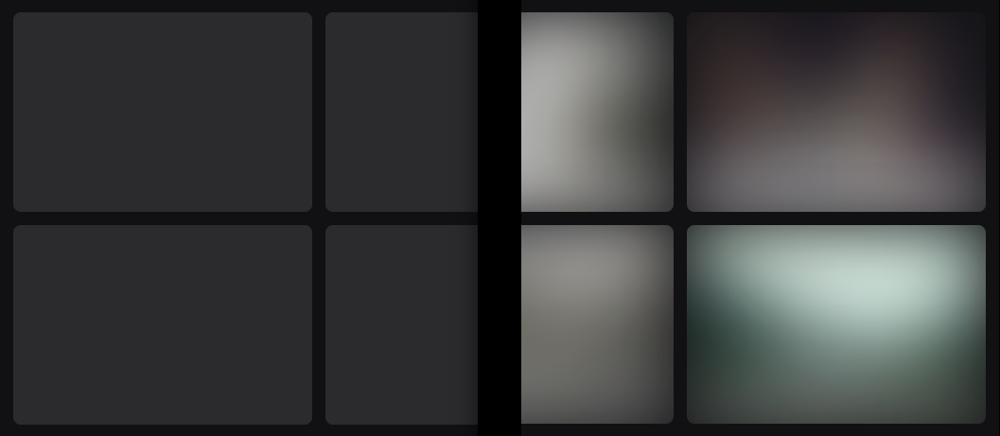
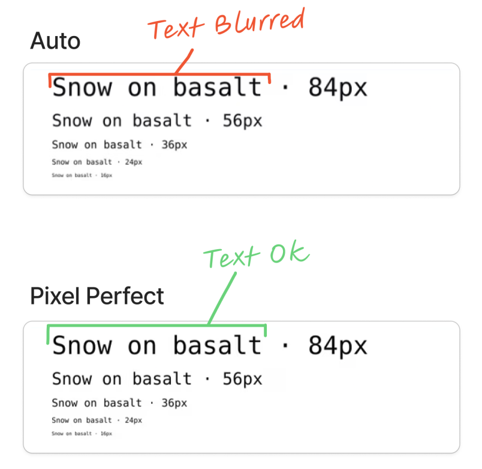
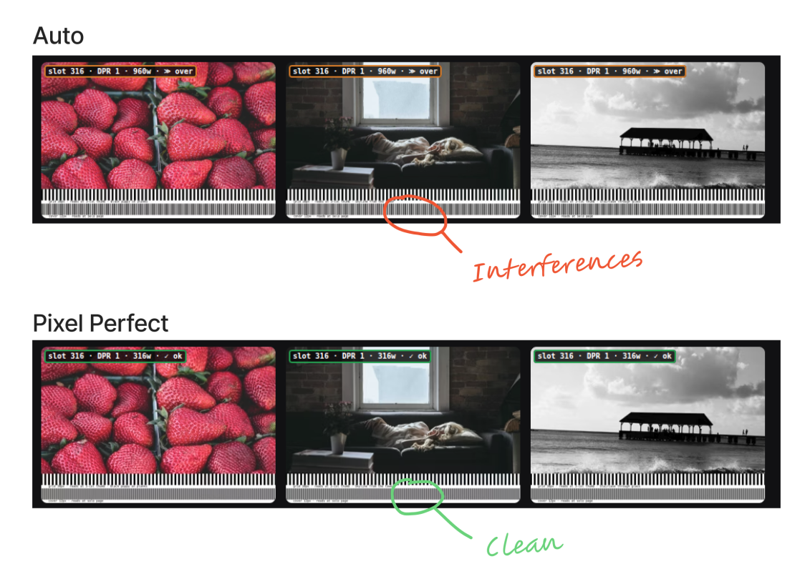
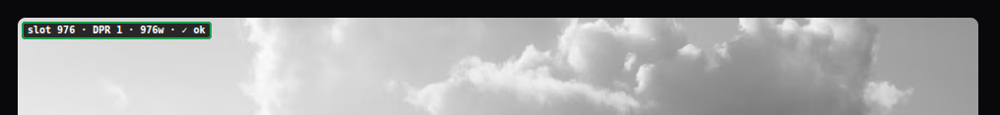

[Part 1](/blog/web-performance/04-images-part-1) landed on a baseline: Astro's `auto` `<Picture>` wins on both mobile and desktop with zero config. But its image sizes aren't optimal — it under-sizes the big slots and over-sizes the small ones. Four levers stack on top of that baseline: priority hints, a placeholder for perceived performance, exact sizing, and the combined stack.

As in Part 1, the [optimg](https://astro-jeromeabel.netlify.app/optimg) project is the companion demo for every strategy below — each `?debug` link points at a live page you can inspect.

## Above the fold: eager, lazy, fetchpriority

The first lever for improving `auto` is dialing in the `loading` and `fetchpriority` attributes, as covered in the [tactics cheatsheet](/blog/web-performance/01-tactics-cheatsheet).

Astro defaults every image to `loading="lazy"`, which is right for everything _except_ the image that is the LCP element. The clearest case is a "hero" image (`cover`). It should load eager and high-priority; everything else can stay lazy:

```ts
loading={type === "cover" ? "eager" : "lazy"}
fetchpriority={type === "cover" ? "high" : "auto"}
```

`fetchpriority="high"` tells the browser to fetch the hero image before the lazy images further down. In the `naive` strategy, twenty-one images fight over bandwidth because none has a defined priority, which explains the **28.9 s mobile LCP** (against 3.8–4.5 s for the others, with `manual` the exception at 6.5 s).

For "list" or "grid" layouts, which show several thumbnails on the page, it's less obvious — the author decides the priorities.

The approach I use here — **split above-fold** — is to derive both attributes from each cell's position. Since the viewport is unknown at build, the best compromise is to give `eager` to a fixed number of images that are always in the visible part of the viewport, and set `fetchpriority="high"` on the first element only. If the LCP is lazy, Lighthouse 13 penalizes it (`lcp-discovery`).

```ts
// covers mobile 1-col (3 above-fold) and md/lg 2–3-col (2 rows = 6)
const EAGER_AHEAD = 6;

// index omitted → below-fold
const isAboveFold = (i?: number) => (i ?? Infinity) < EAGER_AHEAD;

const isCover = type === "cover";
const isLCP = !isCover && index === 0;

// eager covers the whole visible area; fetchpriority flags a single element
const loading = isCover || isAboveFold(index) ? "eager" : "lazy";
const fetchpriority = isCover || isLCP ? "high" : "auto";
```

## Where auto falls short: two more paths

Two axes are worth exploring:

- improve **perceived performance** — fill the empty space while the image loads (LQIP);
- improve **the sizes loaded** — serve exactly the slot's size (pixel-perfect).

## LQIP: filling the empty space

A "hero" image arrives fast, but not instantly. On a slow connection, a few seconds can pass between "the page appeared" and "the images loaded", and without a placeholder each slot is an empty box — the page looks broken. This is _perceived_ performance.



The options form a spectrum, from simplest to most polished. At one end, the **skeleton**: a solid block of color (zero bytes, zero decoding). At the other, the **LQIP**: a blurred thumbnail that hints at the final image. In between sit the LQIP variants — a few-pixel image stretched so it blurs "for free", blur baked in at build or generated on demand, inline SVG or `data:uri`. I stick to the two ends here, `skeleton` and `LQIP`: they're enough to measure what a placeholder costs.

Server-side, the LQIP is generated at build time. The goal I picked drives the whole implementation: **inline the placeholder as a base64 `data:` URI**, so it ships inside the page's HTML and paints on the very first frame — zero network requests, no round-trip before the slot is filled.

That goal rules out `getImage()`. `getImage()` returns a **URL** to a file that Astro writes in a _later_ build pass — so at the moment my component renders, the file doesn't exist on disk yet, and a URL is the wrong shape for inlining anyway (I need the actual bytes). So I go straight to `sharp` over the source file's real path, exposed by `astro:assets` as `fsPath` on the imported image, resize it in memory, and base64-encode the buffer:

```ts
const LQIP_SIZE = 32;

async function buildLqip(image: ImageMetadata, plan: RenderPlan) {
  const [aw, ah] = plan.aspect;
  const srcBuffer = await readFile(image.fsPath);
  const lqBuffer = await sharp(srcBuffer)
    .resize(
      LQIP_SIZE,
      Math.round((LQIP_SIZE * ah) / aw),
      plan.fit === "cover" ? { fit: "cover" } : undefined,
    )
    .webp()
    .toBuffer();
  return `data:image/webp;base64,${lqBuffer.toString("base64")}`;
}
```

`sharp` is free here — it's already a dependency, the same library Astro's own image service uses under the hood. The trade-off is that this runs as a blocking step during each page's render.

Only the `data:` URI forces this. If you don't need the placeholder inline — if a separate small file that costs one extra request is fine — then `getImage()` is the simpler path: let Astro emit a tiny blurred file and point the placeholder `` at its URL. Same for the CSS-blur variant below (a real 32px `` blurred with `blur-2xl`): that's a URL too, so `getImage()` covers it. I chose the inline route because filling the slot _before_ the first paint, with no request at all, is the whole point of the LQIP.

The placeholder sits behind the real image (`position: absolute`, negative `z-index`), blurred; the real `<Picture>` starts invisible thanks to `pictureAttributes`, which pass props from the Astro component down to the inner `` element.

```astro
<div class="reveal-img relative overflow-hidden">
  
  <Picture
    src={img}
    formats={["avif", "webp"]}
    sizes={sizes}
    alt={alt}
    pictureAttributes={{ style: "opacity: 0" }}
  />
</div>
```

There are several ways to render the blur. At build time with ImageMagick's `-blur 0x8` (or the Sharp equivalent), or on demand — or you deliver a sharp 32px image and **blur it in CSS** (`blur-2xl`). Performance-wise, the CSS blur runs on the GPU, off the main thread, and is enough in most cases — except maybe a very large image, where delivering an already-transformed file is more efficient.

### Adding a transition

To improve the experience, you can add a transition between the placeholder and the real image. It comes down to swapping the opacities of the placeholder and the image once the latter has loaded. But one detail makes the behavior smart: a **cache-guard** condition.

```ts
const showImage = () => {
  picture.style.opacity = "1";
  if (placeholder) placeholder.style.opacity = "0";
};

// cached → snap, no animation
if (imgElement.complete && imgElement.naturalHeight !== 0) showImage();
else {
  // network → transition
  picture.style.transition = "opacity 1200ms ease";
  imgElement.addEventListener("load", showImage);
}
```

Animate unconditionally and every back/forward navigation replays a 1.2 s fade on images the browser already has, and the page flickers. Checking `imgElement.complete` means the animation only plays on a real network load. Astro also offers the `astro:page-load` event so it survives View Transitions.

And one non-negotiable rule I discovered here: **don't animate the LCP element.** A fade is an `element render delay`: the pixel is painted at opacity 0 then raised to 1 over 1.2 s, and Lighthouse dates the LCP at the _end_ of the animation, not when the bytes arrive. My first version faded the hero like everything else; the `final` run's `element render delay` dropped to **29 ms** once the LCP was exempted, against ~1236 ms before.

So the component exposes an `ABOVE_FOLD_FADE = false` flag. Since the viewport is unknown at build, we don't know _which_ of the visible images will be the LCP element: the fade is therefore disabled for **the whole above-the-fold area** (the `cover` image and the first grid cells), not just the first. Above the fold, images _snap_; only the lazy images below keep their fade.

### The LQIP benchmark

| Strategy           | Mobile — bytes (KB) / LCP | Desktop — bytes (KB) / LCP |
| ------------------ | ------------------------- | -------------------------- |
| auto (`<Picture>`) | 597 / 3789 ms             | 716 / 348 ms               |
| skeleton           | 597 / 3803 ms             | 716 / 398 ms               |
| lqip               | 597 / 3816 ms             | 716 / 404 ms               |

On **mobile**, `skeleton` adds +14 ms to `auto` (negligible) and `lqip` +27 ms (decoding the blurred preview). On **desktop**, the three become equivalent: `auto` lands at 339–385 ms, `skeleton` 337–466 ms and `lqip` 387–488 ms. The +50 / +56 ms in the medians are inseparable from measurement noise. A placeholder weighs almost nothing here. And choosing between a skeleton or a blurred image is a UX decision.

I wrote this fade script twice, and the two versions disagree on the details — which is the useful part:

| Aspect      | This site                         | A comics site I also maintain                       |
| ----------- | --------------------------------- | --------------------------------------------------- |
| Placeholder | separate 32px blur `` behind | none — the real `` blurs over itself           |
| Transition  | opacity, 1200ms                   | opacity + `filter: blur(10px)→0`, 400ms             |
| Cache guard | `img.complete`                    | `img.complete && naturalHeight !== 0` (more robust) |

The guard in the second column is the better one: a cached-but-broken image reports `complete: true` with `naturalHeight: 0`, and only the stricter check correctly skips the fade. Same idea, learned twice.

## Pixel-perfect: the exact size

The other path is serving exactly the right image size, down to the pixel. It's fair to ask why bother, when Astro's `auto` layout already generates a perfectly reasonable `srcset` on its own.

This is the one criterion no number can settle: **the user's need**, decided by what's inside the image. Every benchmark below measures bytes and LCP, but whether pixel-perfect is worth it comes down to a question the LCP can't answer — can this image survive resampling?

For a **photograph**, no need. The browser picks the nearest `srcset` step, scales it by a few percent, and that scaling is invisible — a very slightly blurred tree still looks like a tree.

But there's one case where the exact size is required: images with fairly small text inside, and maybe images with very fine lines too. I noticed it while working on my humorous comics site https://leconceptdelapreuve.jeromeabel.net. There, if the image isn't the right size, the browser resamples it: the text turns slightly blurry and harder to read, and thin lines shimmer.



### Avoiding resampling

On a periodic grid of lines, the effect turns extreme: the bars shift phase and you get _moiré_, interference bands that signal a sampling mismatch ([Wikipedia: Moiré pattern](https://en.wikipedia.org/wiki/Moir%C3%A9_pattern)).



To avoid resampling, `CustomImage` computes `sizes` from the real layout CSS tokens — page max-width, padding, gap, the grid:

```ts
const sizesAttr = [
  `(min-width: 768px) calc((min(100vw, ${pageMaxPx}px) -
${chromePx + gapPx}px) / 2)`,
  `calc(100vw - ${mobileChromePx}px)`,
].join(", ");
```

The effect depends entirely on the **slot size**, and that's where the benchmark surprises:

| Strategy      | Mobile — bytes (KB) / LCP | Desktop — bytes (KB) / LCP |
| ------------- | ------------------------- | -------------------------- |
| auto          | 597 / 3789 ms             | 716 / 348 ms               |
| pixel-perfect | 913 / 4523 ms             | 222 / 305 ms               |

**The inversion.** On desktop, the LCP element is a 316px thumbnail in the 3-column grid: `pixel-perfect` serves _exactly_ that size and transfers **222 KB**, against **716 KB** for `auto` — a factor of three, for the _same_ AVIF transformation. `auto`'s generic `sizes` over-sizes the image with a `w=640` for a 316px slot. Here, sizing right is the biggest byte gain in the whole article.

On mobile, the order flips. The LCP element is a _full-width_ image at DPR 1.75, not a thumbnail: `pixel-perfect` sizes that big slot honestly and transfers **913 KB**, where `auto` shows only **597 KB** — but because it _under-sizes_, serving a file too small for the slot. Lighter doesn't mean better-sized. The same code produces two opposite rankings, because "well-sized" depends on the slot, not the strategy.

### Seeing the gap

To check the `sizes` contract actually works, every URL in the project accepts a `?debug` parameter that attaches a badge per card, showing what the browser really loaded against what the slot required:

[](https://astro-jeromeabel.netlify.app/optimg/pixel-perfect?debug)

**verdict**: `✓ ok` (the file covers the slot at this density), `✗ short` (upscaling — a real bug), `≫ over` (over-fetch by more than 25%). For `naive`, the badge shows the full source width with no `srcset` annotation — the over-fetch is explicit. This is how you verify pixel-perfect works: not by reading the `srcset`, but by looking at what the browser chose at _your_ viewport and DPR. The overlay requires `?debug` in the URL, never present in a clean Lighthouse run.

One variant deserves a note: `cropped` gets the **best mobile LCP** (3611 ms). Cropping moves fewer pixels for the same slot width — but it's a framing choice (`crop: true` per item in `gallery.json`), not a standard performance lever, and it's off by default.

## Combining: the final stack

`final` stacks the four levers: the split above-fold, the LQIP placeholder, the fade exempted on the LCP, and the pixel-perfect widths derived from tokens.

```astro
<div class="reveal-img relative overflow-hidden">
  <!-- 32px blur placeholder, at the real image's aspect ratio -->
  

  <!-- pixel-perfect <Picture> -->
  <Picture
    src={image}
    layout="constrained"
    width={ppWidth}
    widths={ppWidths}
    sizes={ppSizes}
    height={finalHeight}
    pictureAttributes={{ style: "opacity:0" }}
    alt={alt}
  />
</div>
```

| Strategy      | Mobile — bytes (KB) / LCP | Desktop — bytes (KB) / LCP |
| ------------- | ------------------------- | -------------------------- |
| pixel-perfect | 913 / 4523 ms             | 222 / 305 ms               |
| final         | 913 / 4534 ms             | 222 / 403 ms               |

On desktop, `final` transfers **222 KB** — exactly `pixel-perfect`'s bytes — and its 403 ms LCP layers the LQIP on top of `pixel-perfect`'s 305 ms, a gap that stays within desktop measurement noise. On mobile, `final` (4534 ms) is within 0.2% of `pixel-perfect` (4523 ms): the placeholder and fade weigh nothing measurable once the LCP element is exempt from animation. You get the byte precision of pixel-perfect sizing _and_ the perceived performance of LQIP — the options stack without compounding into a penalty.

## What I Learned

- Measure **mobile and desktop separately** — the results invert. The same `pixel-perfect` is the lightest on desktop (222 KB) and among the heaviest on mobile (913 KB), without changing a line. On a single mode, the real lever stays invisible.
- The most important criterion is the **`sizes` contract**, not the format — and it cuts both ways depending on slot size. For a desktop thumbnail → sizing right saves 3× the bytes (222 vs 716 KB for the same AVIF transformation). Conversely, for a large mobile image → sizing honestly demands _more_ bytes. `auto` only looks lighter because it under-sizes.
- Choosing the **manual** or **automatic** strategy is decided by the image's **content**. Photos tolerate the `srcset` steps and slight resampling. Text doesn't: in my case it blurs as soon as it's resampled, and then you have to compute the exact widths. A periodic grid of lines makes the mismatch visible as moiré.
- The **eager** and **lazy** attributes are effective, simple levers: `naive` (twenty-one eager images with no priority) gets 28.9 s mobile LCP. And native lazy doesn't promote an above-fold image on its own — on a thumbnail grid, the LCP stays lazy (`lcp-discovery` at 0) until the author prioritizes it.
- **Don't animate the LCP element.** A fade is an `element render delay`: Lighthouse dates the LCP at the end of the animation. Exempting the whole above-fold area drops the render delay to 29 ms (against ~1236 ms), and `final` rejoins `pixel-perfect` within 0.2%. Without it, I was measuring the fade's duration!
- **Don't animate a cached image** either, or back/forward navigation flickers. Use a robust cache guard with `complete && naturalHeight !== 0`.
- Placeholder and fade are **perceived performance**, not a byte gain. On mobile, `skeleton` and `lqip` match `auto` within +14 / +27 ms (at constant image bytes); on desktop they blur together. They won't move a Lighthouse score, and that's fine — it's a different axis. The skeleton is free; the blur costs a few milliseconds, and only on mobile.
