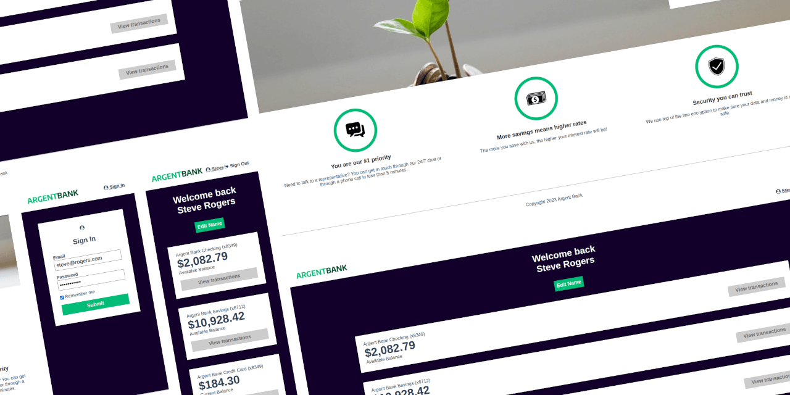
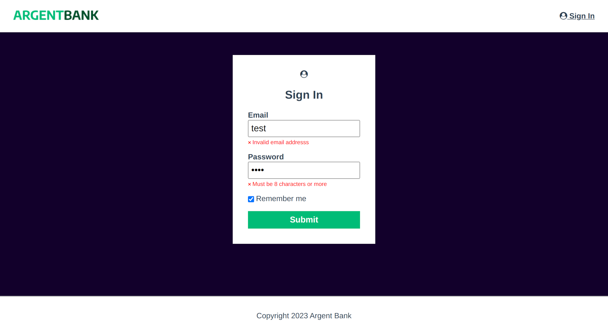
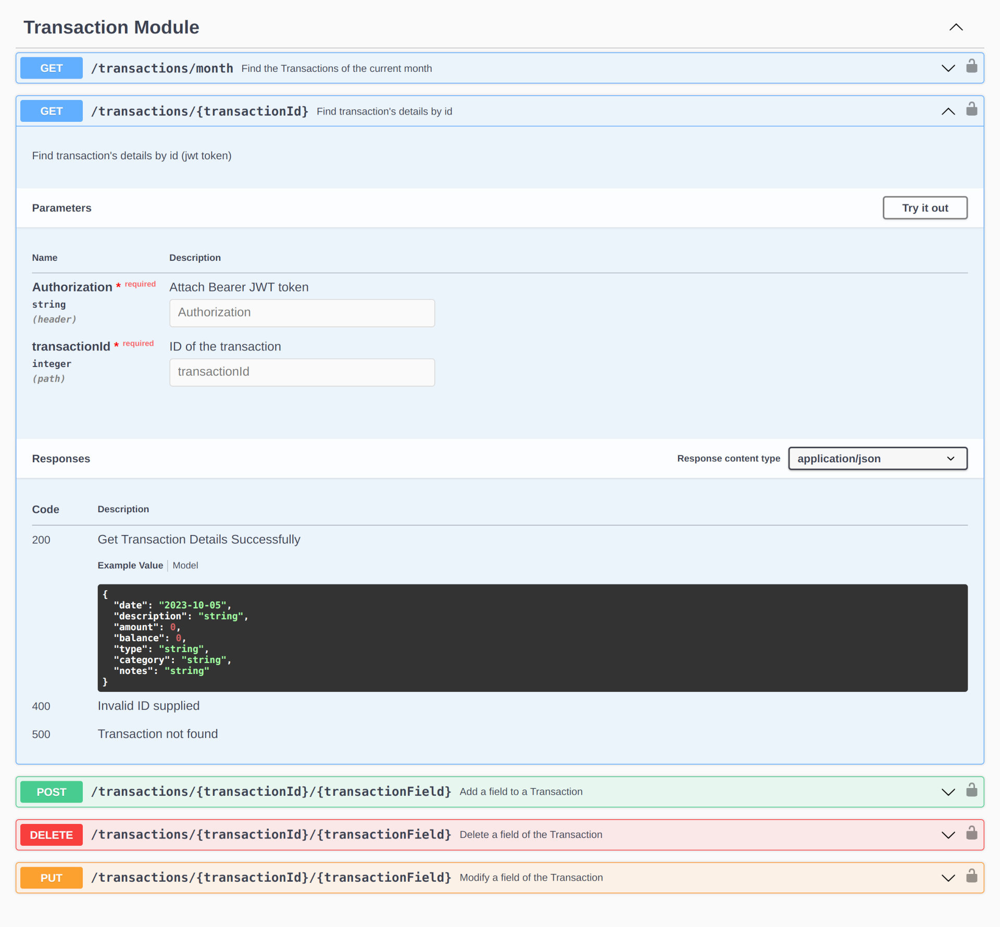

This project is the n°13 of the [OpenClassrooms Front-End learning path](https://openclassrooms.com/fr/paths/516-developpeur-dapplication-javascript-react).

## The problem

Argent Bank is a new bank that is starting up. She's trying to break into the industry and needs help setting up her app. It needs a web application that allows customers to log in and manage their accounts and profile.

## The solution

- Build a **responsive** React App
- Add an **authentication system** with Redux, according to User Stories.
- **Document the new endpoints of the API** with Swagger

### 1. Responsive Web App




### 2. Authentication system

#### Vertical Architecture

Using Redux ToolKit, I followed some vertical architecture's principles : a slice per feature. 

```bash
├── 📂 app
│   ├── apiSlice.js
│   ├── App.jsx
│   └── store.js
├── 📂 features
│   ├── authSlice.js
│   └── userSlice.js
├── 📂 pages
│   ├── 📂 Error404
│   ├── 📂 Home
│   ├── 📂 Layout
│   ├── 📂 Login
│   └── 📂 Profile
└── 📂 styles
    └── *.scss
```

#### Private Route

The first step of authentication was to add a private route with `React-Router`. The idea is to provide a conditional routing system which renders the Profile page if the user is logged or the Login page instead.

```jsx
const PrivateRoute = ({ element }) => {
  const token = useSelector(selectCurrentToken);
  return token ? element : <Navigate to="/login" replace={true} />;
};

const App = createBrowserRouter([
  {
    path: '/',
    element: <Layout />,
    children: [
      { index: true, element: <Home /> },
      { path: 'login', element: <Login /> },
      { path: 'profile', element: <PrivateRoute element={<Profile />} /> },
      { path: '*', element: <Error404 /> },
    ],
  },
]);
```

#### Form Validation


The form validation was handled by `Formik` and `Yup`. A visual feedback from `Toastify` was added to provide a great user experience.

```jsx
  const validationSchema = Yup.object({
    email: Yup.string().email('Invalid email addresss').required('Required'),
    password: Yup.string()
      .min(8, 'Must be 8 characters or more')
      .max(20, 'Must be 20 characters or less')
      .required('Required'),
    rememberMe: Yup.boolean().default(false),
  });

  const initialValues = { email: '', password: '', rememberMe: false };

  return (
    <Formik initialValues={initialValues} 
            validationSchema={validationSchema} 
            onSubmit={handleSubmit}>
      <Form>
        <TextInput label="Email" name="email" type="email"/>
        <TextInput label="Password" name="password" type="password" />
        <Checkbox name="rememberMe">Remember me</Checkbox>
        <button className={styles.button} type="submit">Submit</button>
      </Form>
    </Formik> )
```

#### RTK

When the form was successfully submitted, RTK stores a token from the server and use it in the Header of every API requests.

```jsx
export const api = createApi({
  reducerPath: 'api',
  baseQuery: fetchBaseQuery({
    baseUrl: 'http://localhost:3001/api/v1',
    prepareHeaders: (headers, { getState }) => {
      const token = getState().auth.token || localStorage.getItem('token');
      if (!headers.has('Authorization') && token) {
        headers.set('Authorization', `Bearer ${token}`);
      }
      return headers;
    },
  }),
});
```

### 3. Documentation of the API

We used Swagger to add API endpoints in the documentation



```yaml
  /transactions/{transactionId}:
    get:
      security:
        - Bearer: []
      tags:
        - Transaction Module
      summary: Find transaction's details by id
      description: Find transaction's details by id (jwt token)
      parameters:
        - in: header
          name: Authorization
          description: Attach Bearer JWT token
          required: true
          type: string
```


## Things I've Learned

- Authenticate to an API
- Model an API
- Interact with an API
- Implement a state manager in a React application

👉 I've written also two articles on LinkedIn and Github/gists about RTK:

- [Redux Toolkit Primer #2 - Cart 🛒](https://gist.github.com/jeromeabel/0c558273e5a59b6cc61dcfcab1c75099)
- [RTK Query Primer](https://gist.github.com/jeromeabel/06aa57782012fe22be215f64dc0834b1)
