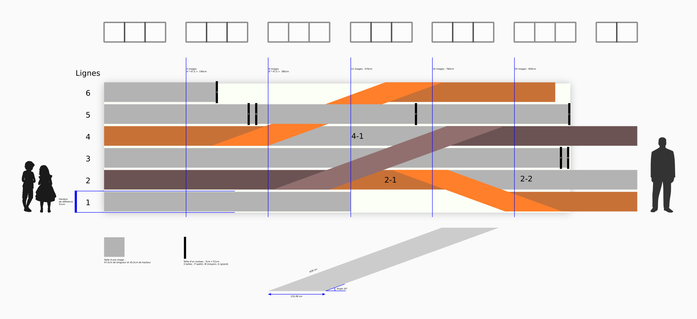
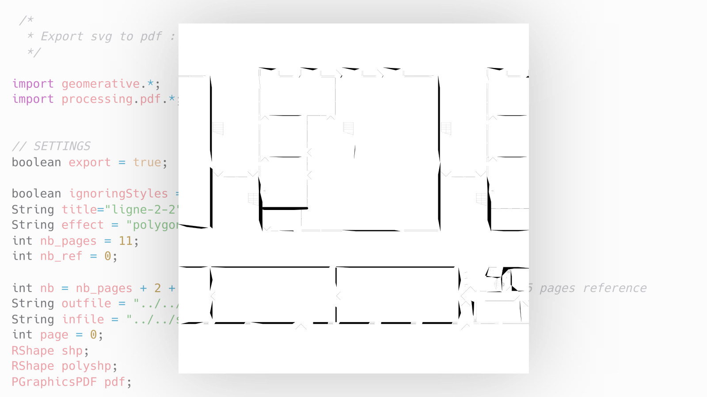

> The idea was born from an Arts/Sciences dialogue with a doctoral student, Anaïs Machard from the LaSIE Laboratory at the University of La Rochelle (France). The project is inspired by the divergences in global warming predictions, ranging from +2°C to +7°C. A timeline made up of large scrolls of paper, depicts different timelines, like multiple futures.
>
> The title comes from a word used in the Git program, which manages the history of computer projects. A computer program is, neither more nor less than a collaborative text. However, our societies are regulated, and controlled by texts: laws, agreements, contracts, decrees, reports, conventions... By applying these methods to areas other than IT, we could see the basis of a democratic tool to take care of our futures.

With the help of Virginie Pouliquen, École d’art et de design TALM-Angers, France.

## The problem



- Export 10 PDF files, with a number of pages defined above
- Generate 7 graphical evolutions from a SVG image

## The solution

### 1. Clean input SVG

```bash
scour -i input.svg -o output.svg --enable-viewboxing --enable-id-stripping --enable-comment-stripping --shorten-ids --indent=none
```

### 2. Export PDF with Processing

I used the free and open source software [Processing](https://processing.org/) (Java-like syntax) to handle image processing and export PDF files.

```java
import processing.pdf.*;

PGraphics pdf = createGraphics(300, 300, PDF, "/home/user/Desktop/output.pdf");
pdf.beginDraw();
pdf.background(128, 0, 0);
pdf.line(50, 50, 250, 250);
((PGraphicsPDF) pdf).nextPage(); // Second page
pdf.background(0, 128, 0);
pdf.line(50, 250, 250, 50);
pdf.dispose();
pdf.endDraw();
```

### 3. Graphical variations with geomative

To generate graphical variations, I used the [geomative](https://github.com/rikrd/geomerative) library.



## What I Learned

- Clean SVG files
- Export PDF files with custom dimensions and pages
- Use of the geomative library
