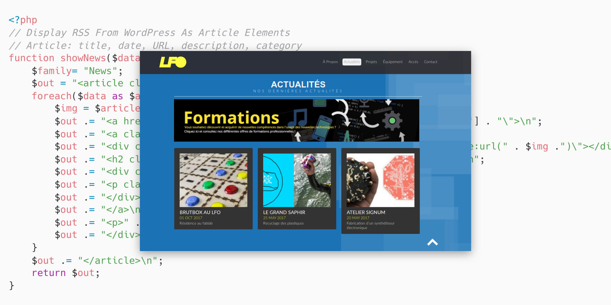
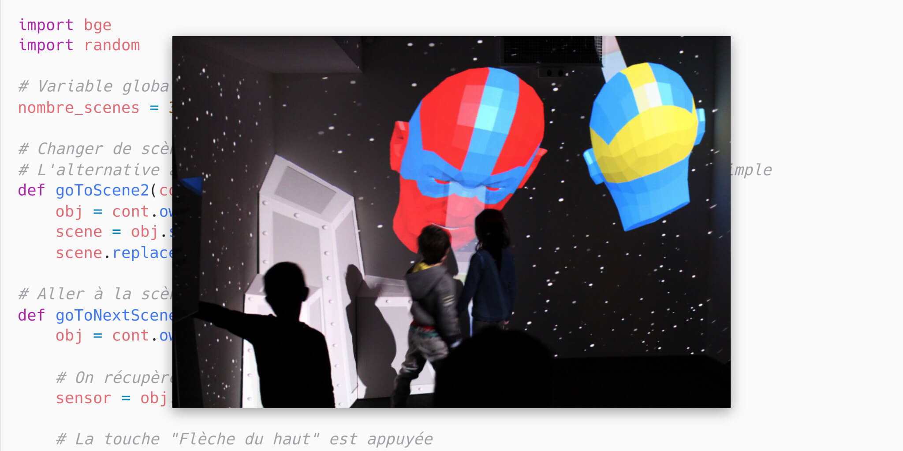
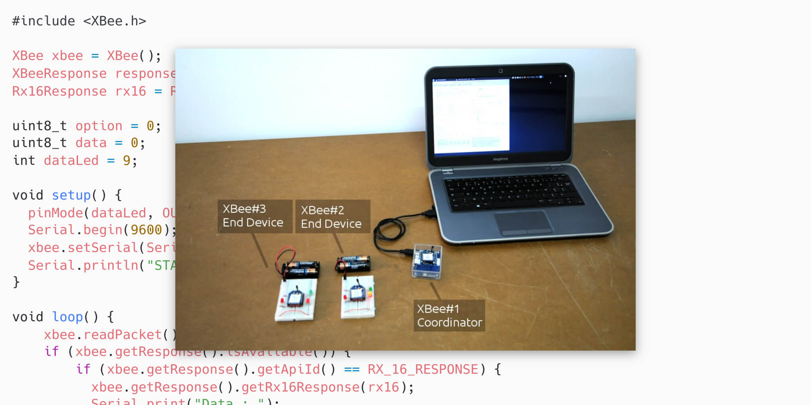
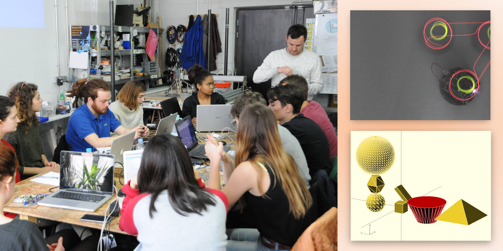

The LFO is the Fablab of Friche Belle de Mai in Marseille. It opened its doors in November 2013. This project gives substance and synthesizes the educational, artistic and socio-cultural mode of action to which we have been attached since the creation of the Reso-nance Numérique association.

## Web features

- PHP: get data from the RSS feed of our wordpress website and display featured projects on another website
- PHP/AJAX/SQLITE/BOOTSTRAP: a webform to manage projects with our community
- HTML/CSS: onepage websites for side projects like http://malinette.info

## Python with Blender

“[Méta Cristal](https://reso-nance.org/meta-cristal/)” is an interactive and immersive installation inviting spectators to play with the codes and aesthetics of Marvel and DC Comics comics. Several scenes are offered around a magic crystal. The crystal physically emerges from the screen as an interface between the imaginary world of superheroes and the real world. A story emerges between the spectators and the crystal. This gives them a superpower, that of acting on elements of the decor with their movements.

- I've developed a scene manager in Python for Blender
- I wrote a technical article about it: [Python with Blender Game Engine](https://reso-nance.org/wiki/logiciels/blender/bge-python/accueil)

## XBee

XBee modules are a solution for transmitting data wirelessly, by radio waves. We were trying to use it on wireless projects.

- I wrote a technical article on XBee: [XBee - wiki](http://reso-nance.org/wiki/materiel/xbee/accueil)

## Workshops

- We created a lot of funny [workshops](https://reso-nance.org/wiki/ateliers/accueil) for children, students and professionals in order to learn open source interactive technologies
  - [DrawBot](https://reso-nance.org/drawbot/)
  - [AnimaBot](https://reso-nance.org/wiki/ateliers/animabot/accueil)
  - ...
- We organized events:
  - [Festival Machines](https://reso-nance.org/wiki/projets/machines/accueil)
  - [What the Flok?](https://reso-nance.org/whattheflok_/)
  - ...
