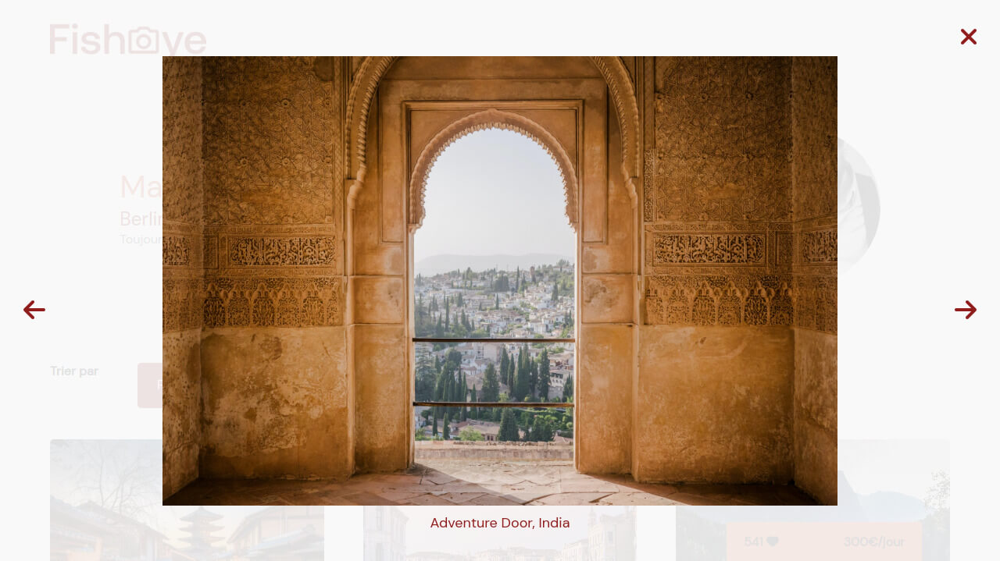
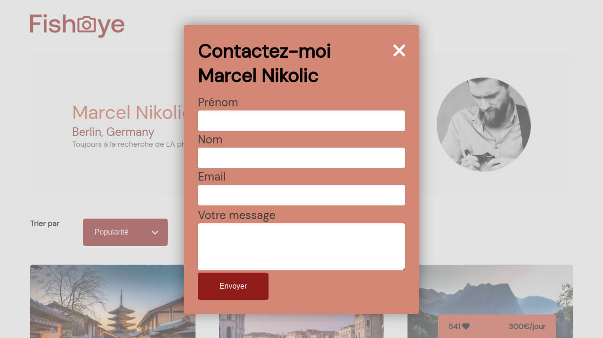

This project is the n°6 in the [OpenClassrooms Front-End learning path](https://openclassrooms.com/fr/paths/516-developpeur-dapplication-javascript-react).

## The problem

FishEye is a platform of photographers. It needs to be modernized:

- In this project, no needs to be responsive
- Dynamic content: data from a json file and query from URL
- UI features: likes, sort, lightbox, modal
- Accessibility features for screenreaders and keyboard navigation

## The solution

- Sass with BEM naming convention to gain on modularity
- WebApp with Vanilla JS: templates & models
- O.O.P principles: classes
- JS Design Patterns: factory, state, observer



### Factory Pattern

```js
// Return a Media object depending on the type
class MediaFactory {
    constructor (media) {
        if (media.image) {
            return new MediaImage (media);
        } else if (media.video) {
            return new MediaVideo (media);
        } else {
            throw "MediaFactory Error : Unkown type" ;
        }
    }
}
```

### Sort Data

```js
class MediaSort {

   setListeners() {
     const elements = this.$wrapper.querySelectorAll('[data-sortBy]');
     elements.forEach((elt) => {
       elt.addEventListener('click', () => {
         this.sort(elt.getAttribute('data-sortBy'));
       })
     })
   }

    sort(type) {
     if (type === "title") {
       this.media.sort(function (a, b) {
         return a.title.localeCompare(b.title);
       })
     } else if (type === "date") {
       this.media.sort(function (a, b) {
         return new Date(b.date) - new Date(a.date);
       })
     } else if (type === "pop") {
       this.media.sort(function (a, b) {
         return b.likes - a.likes; // du plus grand au plus petit
       })
     }
      this.updateGallery();
   }
 }
```

### Oberver Pattern

Use the Observer pattern to implement the likes feature

```js
class MediaCard {

   setListener() {
     const that = this;
     const likesWrapper = this.$wrapper.querySelector('.likes');
    
     this.$wrapper
       .querySelector('.btn-likes')
       .addEventListener('click', function() {
         if (this.classList.contains('liked')) {
           this.classList.remove('liked')
           that.likesSubject.fire('ADD', -1);
           likesWrapper.innerHTML = that.likes;
         } else {
           …
         }
       })
   }
 }
```

```js
class LikesCounter {
 constructor() { this.count = 0; }
 update(action, value) {
   if (action === 'ADD') { this.count += value;} 
//…
```

## Things I've learned



- JS Fetch and query params
- JS Array methods
- JS Design patterns
- Accessibility: keyboard navigation & focus, screenreader visibility, accessibility reports (achecker, axe, wave)
- I wrote a gist about this tricky part: [ARIA & modal](https://gist.github.com/jeromeabel/941da71f8d0bacf191fc2b8a845b886b
)