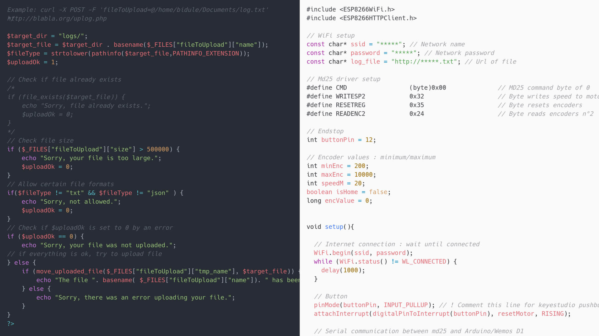

The artistic installation is present in two different rooms: “From X” and “To X”. The first room features a laboratory, where a microscope projects images of a microscopic form. The microscope is controllable with a joystick. The latter's movements are sent to another room, which stages a robotic landscape of sand projection on cathode ray screens.

## The problem

- Send data between two devices 1 km apart

## The solution

1. A computer sends a file with `curl` command
2. On a website, a PHP script handles the file upload
3. An Arduino program for the ESP8266 chip requests this file from the server and extract data

## What I Learned

- Simplify the idea! No real-time or two-way communication
- PHP script to secure incoming file
- ESP8266 program to get data from the web
