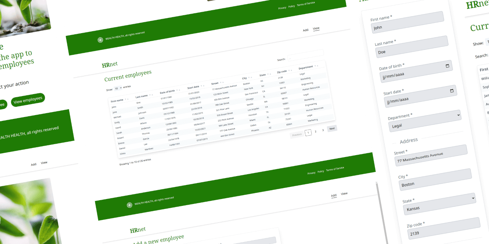
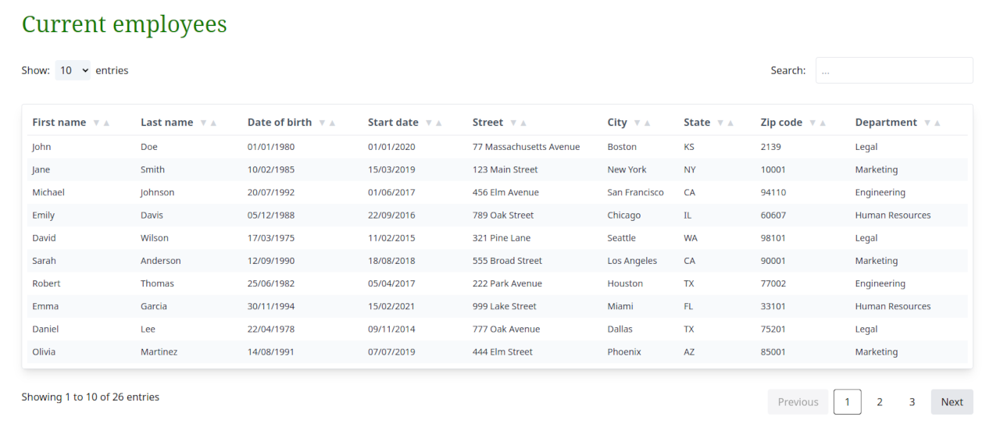
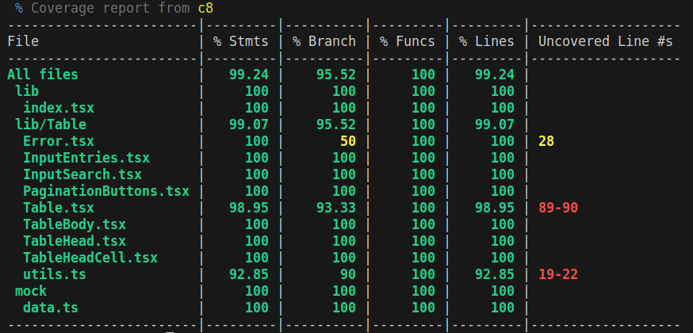

This project is the n°14 of the [OpenClassrooms Front-End learning path](https://openclassrooms.com/fr/paths/516-developpeur-dapplication-javascript-react).

## The problem

- Convert the project to React
- Add a state management system
- Publish a React plugin to NPM
- Performance report between old and new version

## The solution

### Responsive Web App with Tailwind



### State Management with React Context

The application needs to provide a way to add employees to the data shared by all pages. As it is a small project, the React Context API should be enough.

To handle the form validation, I've used the combination of Zod and React Hook Form. With Zod we can sharply custom rules validations and it provides a very convenient way to share types for its schema.

### Publish A Package On NPM



The [ja-react-table](https://www.npmjs.com/package/ja-react-table) is a component which display data into a table and provide features as sort, search and pagination.

The component is published on npm registry using vite

```sh
pnpm install ja-react-table
```

I've worked to make it handle generic types, like this

```jsx
<Table<UserType> headers={headers} items={users} sortBy="dateOfBirth" />
```

### Tests

Integrations tests are made using Vitest. The component is well tested before any publication:


### Performance Report

The Lighthouse dev tool is used to show differences between the old and newest version. I've deployed the project on Github Page, but also on an [Apache server](https://jeromeabel.net/oc-p14-hrnet/) to handle correct routing with Lightouse and enable cache and compression in order to get more realistic results.


## What I Learned

- Redesign an application to reduce technical debt
- Deploy a front-end application
- Analyze the performance of a web application
- Produce technical documentation for an application

Few methods used to get great results:

- Vite configuration and compression (vite-plugin-compression)
- Code splitting with lazy loading and suspense
- Increasing contrast colors and text sizes to provide better readibility
- Responsive images with fallbacks
- SVG optimization

I've written also three articles on LinkedIn and Github/gists about what I learned:

- [Using React Context with Typescript](https://gist.github.com/jeromeabel/4bdd305a39e5b14a26f971ddc36b3b2a)
- [Create A React Form With React-Hook-Form & TypeScript](https://www.linkedin.com/posts/jerome-abel_mini-guide-about-react-hook-form-activity-7074256576894644224-U4jw)
- [How to publish a React Typescript component on NPM with Vite](https://www.linkedin.com/posts/jerome-abel_create-a-react-library-with-vite-activity-7071727463571054592-EjNu)
