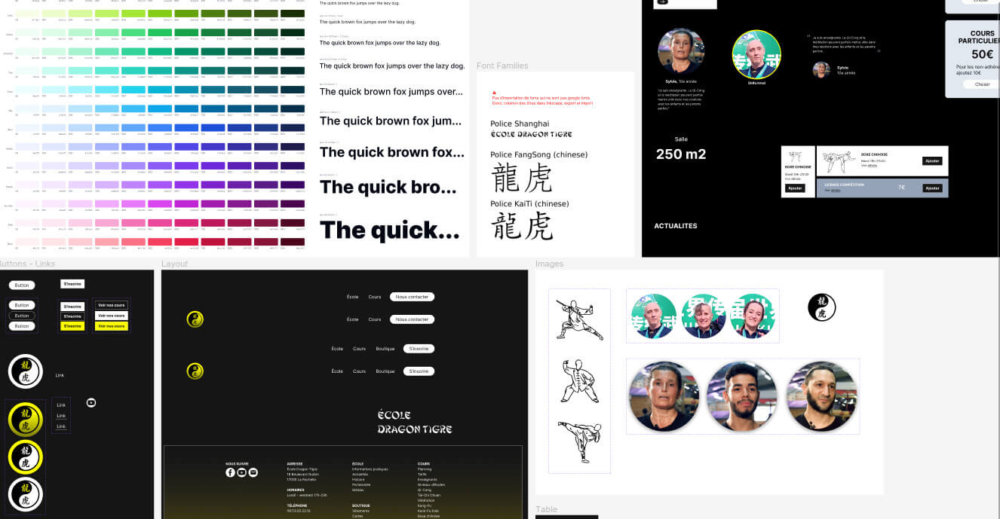
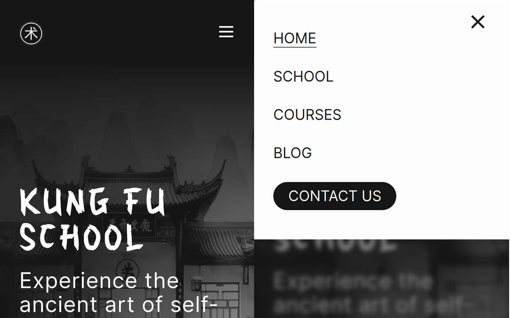
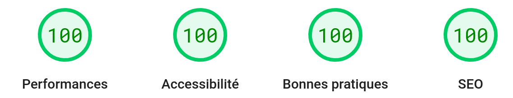
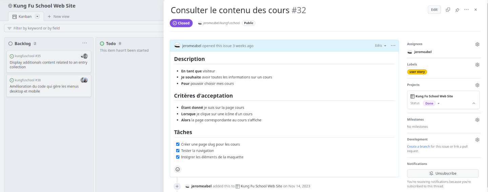
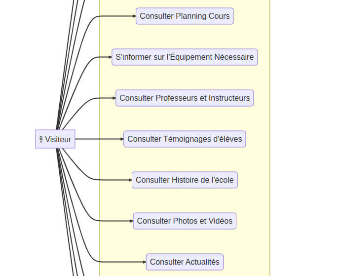

## The problem

The global quality and user experience of the old website are not satisfactory. Visitors can't find information easily and can't view the website easily on small screens.

The old Lighthouse scores were: 82% 82% 68% 69%

## The solution

- Reorganize all the content to provide a great user journey
- Make it responsive to support small screens
- Enhance visitor engagement with call-to-action elements, social links, and animations.
- The old website was built with an old version of WordPress. I propose to rebuild it into a modern and versatile stack thanks to the Astro framework, focused on performance and SEO scores.

### Mockup & Design System

I built a mini design system in Figma with Tailwind font sizes and colors, and with components and variants for icons, cards, menu, buttons.



### Responsive

The website is now responsive thanks to media queries from Tailwind. I designed it with a mobile-first strategy.



I designed a mobile menu with some custom animations inside the Tailwind config:

```js
export default {
  //...
  theme: {
    extend: {
      animation: {
        openmenu: 'openmenu 0.5s ease-in both',
        closemenu: 'closemenu 0.5s ease-in both',
      },
      keyframes: {
        openmenu: {
          '0%': { top: '-400px' },
          '100%': { top: '0px' },
        },
        closemenu: {
          '0%': { top: '0px' },
          '100%': { top: '-400px' },
        },
      },
    },
  },
};
```

### Performance Report

The new scores are 99% 100% 100% 100% (mobile) and 100% 100% 100% 100% (desktop)



I took care of assets loading such as fonts and images. To have a good first content paint metric, the first image in the viewport has the loading:"eager" attribute.

To display as soon as possible the most original font for titles "Houji," I used a combination of preloading and display: swap.

```html
<html>
  <head>
    <link
      rel="preload"
      href="/kungfuschool/fonts/houji.woff2"
      as="font"
      type="font/woff2"
      crossorigin
    />
  </head>
  <body>
    <style is:global>
      @font-face {
        font-family: 'Houji';
        src:
          url('/kungfuschool/fonts/houji.woff2') format('woff2'),
          url('/kungfuschool/fonts/houji.woff2') format('woff');
        font-weight: normal;
        font-style: normal;
        font-display: swap;
      }
    </style>
  </body>
</html>
```

An example of the <SEO /> component, with custom social images for each page and Open Graph specifications:

```jsx
<meta http-equiv="Cache-control" content="public" />
<meta http-equiv="Expires" content="259200" />
<meta name="revisit-after" content="5 days" />
<meta name="robots" content="index, follow" />
<meta name="keywords" content="Kung Fu, School, ..."/>
<meta property="article:published_time" content={publishedDateString} />

<meta name="twitter:card" content="summary_large_image" />
<meta name="twitter:site" content={canonicalWebsiteURL} />
<meta name="twitter:creator" content="@jeromeabeldev" />

<meta property="og:site_name" content="Kung Fu School" />
<meta property="og:type" content="website" />
<meta property="og:url" content={canonicalWebsiteURL} />
<meta property="og:title" content={title} />
<meta property="og:description" content={description} />
<meta property="og:image" content={socialImageURL} />
<meta property="og:image:alt" content={title} />
<meta property="og:image:width" content={image.width.toString()} />
<meta property="og:image:height" content={image.height.toString()} />
```

### Workflow

This project's aim was also to practice more modeling, user stories, Git actions, conventional & small Git commits.

The user story template in GitHub issues:



The uses cases of the first release:



### Display Images From A Folder In Astro

Well, displaying images in Astro is sometimes counter-intuitive. We have to manage between static building and specific `import` behaviors from Vite.

The hard part is to overcome the fact that `import` can't build variable file paths. I found a solution to display images automatically from the folder of a blog post, instead of writing an array with the filenames.

```jsx
---
// File: src/pages/blog/[slug].astro
// Filter out images from the news folder
const images = Object.keys(
    import.meta.glob(
		'/src/content/blog/*/*.{jpg,JPG,jpeg,JPEG,png,PNG}',
		{ eager: true }))
		.filter((src) => !src.includes(coverName) && src.includes(entry.slug));
---
{
  images.length > 0 ? (
    <div class="grid grid-cols-2 gap-8">
      { images.map((path) => ( <CustomImage imagePath={path} width={700} /> )) }
    </div>
  ) : null
}
```

```jsx
---
// File: src/components/CustomImage.astro

import type { ImageMetadata } from 'astro';
import { Image } from 'astro:assets';

interface Props {
    imagePath: string;
    alt?: string;
    width?: number;
}

const { imagePath, alt = '', width = 1440 } = Astro.props;
const images = import.meta.glob<{ default: ImageMetadata }>(
    '/src/content/*/*/*.{jpg,JPG,jpeg,JPEG,png,PNG}',
);
if (!images[imagePath])
    throw new Error(`"${imagePath}" does not exist in glob: "/src/content/*/*/"`);
---

<Image src={images[imagePath]()} {alt} {width} />
```

## What I've learned

- Properly preparing the project with use cases
- Improving my skills in writing user stories
- Enhancing my Figma skills with a mockup and a design system
- Advancing my Astro skills
- Enhancing my Tailwind skills in animations, shadows, ...

### Articles

I wrote some notes about Astro on LinkedIn:

- [Astro Overview](https://www.linkedin.com/posts/jerome-abel_astro-overview-getting-started-activity-7130441805086498816-CFS0)
- [Astro Tips: Navigation](https://www.linkedin.com/posts/jerome-abel_astro-tips-navigation-activity-7133703320380006400-iKm8)
- [Astro Tips: Split Markdown Content](https://www.linkedin.com/posts/jerome-abel_astro-tips-split-markdown-content-activity-7134790451575824384-aRgZ)
- [Astro Tips: Customize Markdown](https://www.linkedin.com/posts/jerome-abel_astro-tips-customize-markdown-links-activity-7137689581881114624-bhmM)
- [Astro Tips: Display Images From A Post Folder](https://www.linkedin.com/posts/jerome-abel_astro-tips-display-images-from-a-post-folder-activity-7143487776691257345-lrsP)
- [Astro Tips: Fix View Transition With Custom Scripts](https://www.linkedin.com/posts/jerome-abel_astro-tips-fix-view-transitions-custom-activity-7140226286521610240-3dkE)
