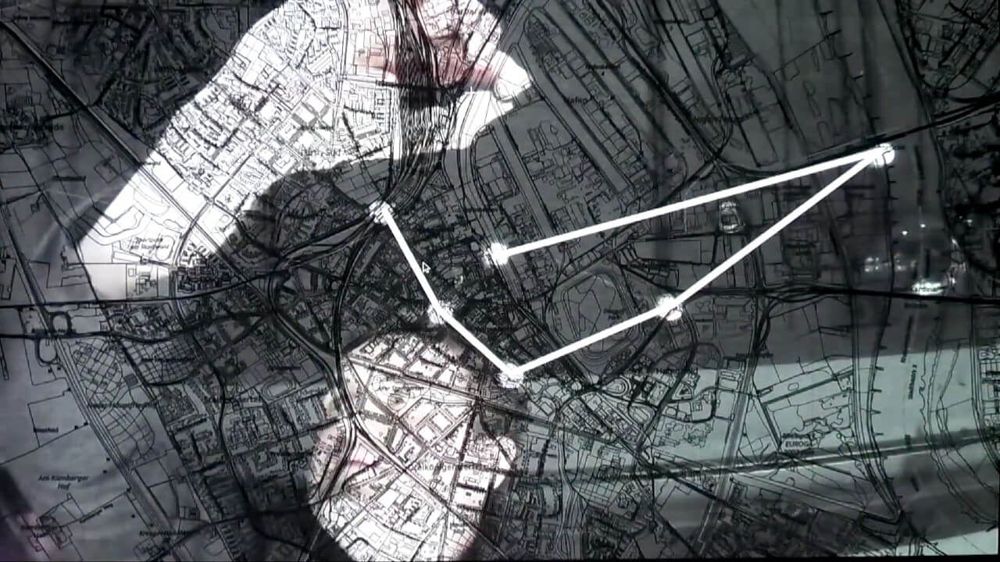
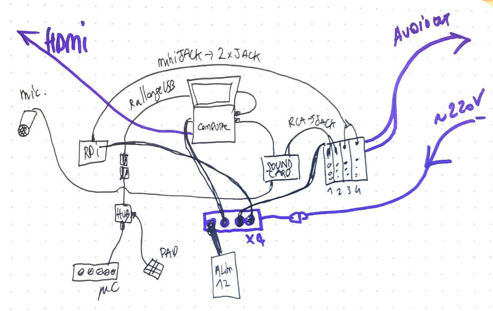

## The problem

- Track points in a dark room
- Real time
- Generate graphic shapes

## The solution

- Manage the lighting problem with white objects and controlled light additions
- Adjust lights and contrasts live with a mini serial controller
- Create a real-time application with the C++ OpenFrameworks framework
- Analyze camera pixels with the OpenCV library
- Send the data to the sound program written in Pure Data, via OSC.

## What I Learned

- Video tracking with OpenCV
- Video filters with OpenCV (so hard!)
- Noise generators with Pure Data

