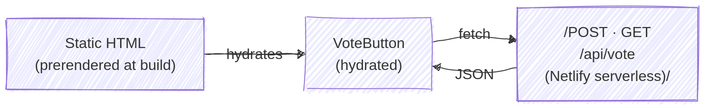

I've wanted to make **humorous** strips for a long time — something outside work where I could be freely ironic and dark. A couple and their kid navigate the absurdity of everyday life.

I didn't want to feed Instagram's data machine, so I built my own site and share on Bluesky. The system had one constraint: publishing must be dead simple — draw the vector illustrations, run one command, done. That little constraint is what makes me actually create more regularly.

## A visual language for deadpan humor

The visual style matches the tone: thin black strokes, flat vector shapes, and a muted, naturalistic palette. No screaming colors, no manga speed lines, no exaggerated expressions. The characters look like they could be in an architecture rendering — composed images make the punchline land harder.

The site follows the same language. Inconsolata gives a steady, almost clinical rhythm. Each comic sits inside a thin-bordered card with generous padding, like a sheet of paper pinned to a wall. The illustrations provide the visual weight; the interface stays out of the way.

## The challenge

Serve vector illustrations fast in modern formats without quality loss or unnecessary downloads; add a voting system while keeping pages prerendered (retaining CDN speed and low cost); and make publishing a single-command workflow with no manual image resizing or frontmatter boilerplate.

## Static shell, one dynamic island

Every page is prerendered at build time — pure HTML on the CDN. The only server-rendered part is a single API endpoint: `/api/vote`.



Astro calls this the "islands" architecture — here it's literally one island: the vote UI. The vote button renders in static HTML in a disabled state, then hydrates client-side. Netlify Functions have cold starts, though: if a user clicks and waits 800ms for the function to wake, it feels broken.

A minimal fix is an early prefetch. The Layout injects an inline script into `<head>` — before any module script loads — that starts the API call during HTML parse:

```javascript
// Layout.astro — in <head>, before DOMContentLoaded
window.__votePromise = fetch('/api/vote?comic=' + earlyVoteParam);
```

Vote scripts check `window.__votePromise` first and fall back to their own fetch if it's missing. The server batch-queries all comic IDs in one request and runs two parallel DB queries — total counts and whether this visitor already voted — so it's always two queries, not 2×N:

```typescript
// /api/vote.ts — GET handler
const [comicsCounts, userVotes] = await Promise.all([
  // Query 1
  db.select({ comicId: Vote.comicId, value: count() })
    .from(Vote)
    .where(inArray(Vote.comicId, comicIds))
    .groupBy(Vote.comicId),
    
  // Query 2
  db.select({ comicId: Vote.comicId })
    .from(Vote)
    .where(and(
      inArray(Vote.comicId, comicIds),
      eq(Vote.visitorId, visitorId)
    )),
]);
```

The UI uses optimistic updates: the heart fills immediately on click, a `pending` Set prevents double-clicks, state is exposed with `aria-pressed`, and the icon swap (outline ↔ filled heart) is pure CSS.

## Pixel-accurate image sizing

Vector art exported to PNG looks crisp — until the browser picks the wrong resolution. Initially the `<picture>` had no `sizes` attribute, so browsers assumed `100vw` and fetched needlessly large images. On retina displays, fractional pixel widths caused sub-pixel antialiasing blur.

The pragmatic workaround: compute *exact* pixel widths from a shared `layoutTokens.ts` file and feed the same numbers to CSS and the image pipeline. `sizes` must use concrete pixel math (not CSS `var()`), so we compute breakpoints at build time.

```typescript
// layoutTokens.ts
export const layoutTokens = {
  remBase: 16,
  // twoCol = (pageMax - 2*pagePad - 2*cardPadDesktop
  //           - 2*cardBorderPx - comicGap) / 2
  pageMaxRem: 81,
  pagePadRem: 1,
  comicGapRem: 1,
  cardPadDesktopRem: 3,
  cardBorderPx: 1,
};
```

`ComicImage.astro` derives exact widths and a `sizes` string using pixel values (not `var()`), then Astro generates `avif` and `webp` variants at those widths. No over-fetching, no blur.

## One-command publishing

Publishing is `pnpm new 006` — one command that does everything:

```bash
$ pnpm new 006

Title: Anniversaire
Alt text completion: Dessin d'un homme, une femme et un enfant
  dans l'entrée d'une maison.
  Une bulle de texte indique : '▌

✓ Copied page images to src/assets/comics/006/
✓ Created src/content/comics/006.md
✓ Generated cover (1200×630 OG image)
✓ Optimized all PNGs (saved 42%)
```

The script reads exported PNGs, prompts for title and alt text (prefilled template for recurring characters), writes the Markdown with frontmatter, generates the OG cover via Sharp compositing (SVG text + thumbnails), and compresses images. One command — zero manual steps.

## Reading rhythm — design decisions and tradeoffs

How the feed reads matters. The index is a single vertical feed (newest first) with no pagination. Dumping everything at full opacity becomes a wall — five strips stacked at full opacity are a visual block, not a reading experience.

Current approach: all comics except the first start at 10% opacity. An `IntersectionObserver` fades each card to full opacity once ~45% is visible, then unobserves it:

```typescript
const observer = new IntersectionObserver(
  (entries) => {
    for (const entry of entries) {
      if (entry.isIntersecting) {
        entry.target.classList.remove('opacity-10');
        entry.target.classList.add('opacity-100');
        observer.unobserve(entry.target);
      }
    }
  },
  { threshold: 0.45 },
);
```

Between comics, a small down-arrow (`ScrollHelper`) anchors to the next strip's `id`; tapping it smooth-scrolls the reader to the next card (`scroll-behavior: smooth`) — a gentle nudge, not a hard pagination.

Each `<picture>` also reveals itself: if `img.complete` the image appears instantly; otherwise a 400ms blur-to-sharp animation plays on `load`. No layout shifts, no blank rectangles, no jarring pop-in.

This solution works well for dozens of comics, but if the feed grows much larger we can consider pacing strategies (CSS `scroll-snap`, a lightweight slider, or soft pagination) — tradeoffs between discoverability and focused reading.

## Shaving bytes everywhere

A comic site is mostly images; everything else should be negligible.

**Images.** Vector exports are PNGs. Sharp removes alpha (the art has no transparency), flattens to white, and re-compresses at aggressive lossless settings. At build time, Astro's `<Picture>` generates `avif`/`webp` at the exact widths from layout tokens. The top comic uses `fetchpriority="high"` and `loading="eager"`, others lazy-load.

```typescript
// optimize-images.js — max lossless compression
pipeline = sharp(imagePath)
  .removeAlpha()
  .flatten({ background: "#ffffff" })
  .png({ compressionLevel: 9, effort: 10 });
```

**Fonts.** Inconsolata loads with a non-blocking pattern: `<link rel="preload" as="style">` then `media="print" onload="this.media='all'"`. The page renders immediately with the system monospace stack, swapping to Inconsolata on arrival — no Flash Of Invisible Text (FOIT), minimal Flash Of Unstyled Text (FOUT).

**Styles.** `build.inlineStylesheets: 'always'` in Astro inlines CSS into the HTML so there's one fewer network request.

**Scripts.** Analytics (Umami) loads via `requestIdleCallback`. The vote prefetch runs only when `earlyVoteIds` are present. Client code is vanilla TypeScript — no extra runtime.

The result: CDN response time dominates static pages; the only variable latency is the vote API cold start, and the early-prefetch pattern effectively masks most of that.

## What I learned

* **Astro DB's local/remote split is delightful.** SQLite in dev, Turso in production; same ORM and queries with a `--remote` flag swap.
* **Cookie attributes matter**
* **Early prefetching masks serverless cold starts.** Starting the API call during HTML parse buys 200–500ms the user doesn't notice.
* **The `sizes` attribute matters.** Without pixel-accurate breakpoints, you can easily fetch images twice as large as needed; furthermore, if the rendered size deviates from the actual image dimensions, any text within the illustrations becomes blurry due to sub-pixel antialiasing. Computing exact breakpoints from the same layout constants that drive the CSS fixed this, ensuring a perfect pixel match that keeps both the art and the dialogue crisp.