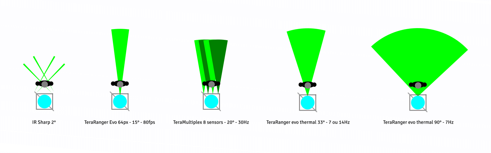
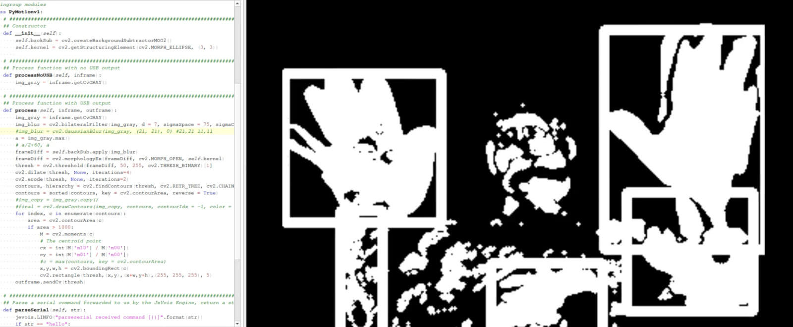
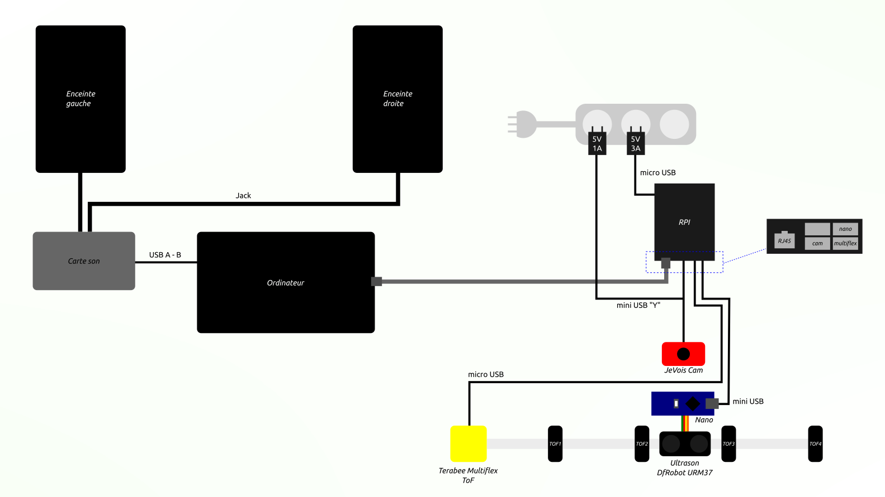
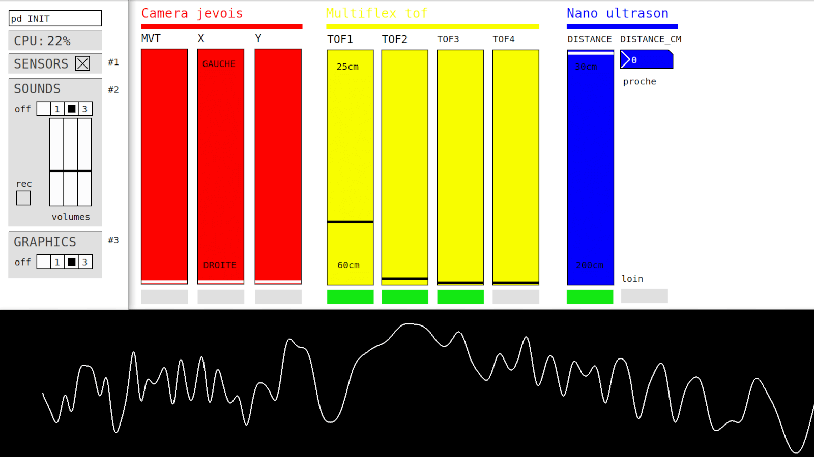

> LITHICA is an interactive sound sculpture. It is the instrument of a performance intended for deaf and hearing audiences.

A project created by [LazerQuest](https://lazerquestgalerie.tumblr.com/ABOUT), explained in this [video](https://tube.futuretic.fr/w/h2cFD2GSQbLCnhAPyyry46).

## The problem

- Performance mode: an artist must move with different movements around the sculpture to generate sounds
- Exhibition mode: the public must hear sound variations as it moves around the sculpture

## The solution

- A combination of three different capture techniques: Time Of Flight (ToF), Tracking Video, Ultrasound
- A mini-computer that retrieves this data and sends it via a LAN network
- Software to manage all incoming data and link it to sound generators

### Sensors

### Python & OpenCV

### Wiring

### Software

## What I Learned

- Experiment a dozen of different sensors
- JeVois Camera programming
- OpenCV with Python
