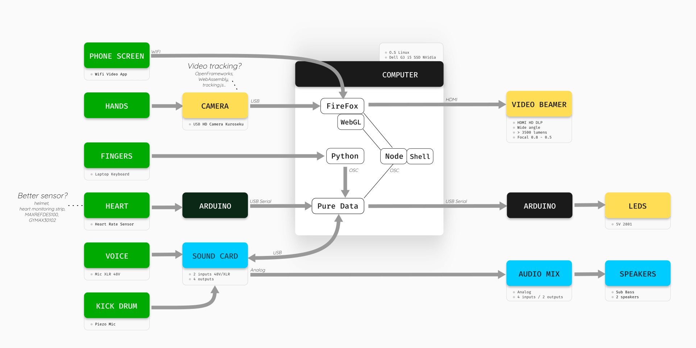
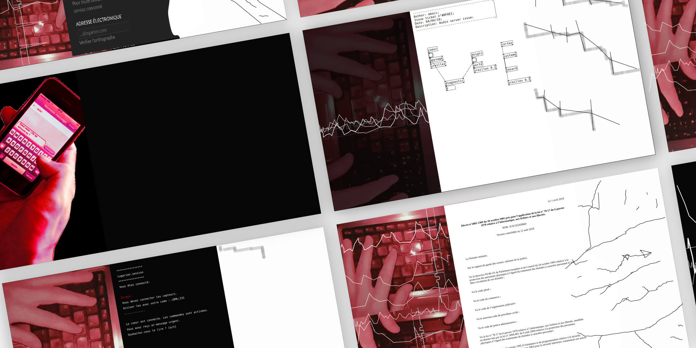

Logariat is the desire to explore the relationships between computer work (automations, data), the body (biological time, sitting position) and different forms of writing (commands, programs, laws)

## The problem

- Real time interactions
- Generative graphics & sounds
- Get data from the body
- Get video from a mobile phonte

## The solution

- Browser and Node as the heart of the program, it allows me to connect all the elements together, such as receiving data from biological sensors, the camera, the keyboard.
- P5JS for WebGL
- SocketIO for real time communications between the server and the client
- Serial communications between Node and Arduino
- OSC communications between Node, Pure Data an Python
- Pure Data for the sounds
- Python sends Keyboard Events to all softwares via OSC

## What I Learned

The challenge was to connect all these technologies together. All show monitoring is written in Bash and all sensors communicate to all open programs. Node is ultimately the heart of the program, it allows me to connect all the elements together, such as receiving data from biological sensors, the camera, the keyboard.
