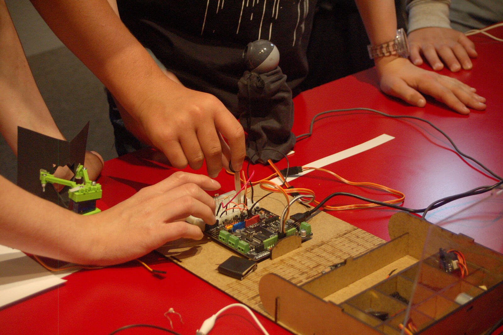
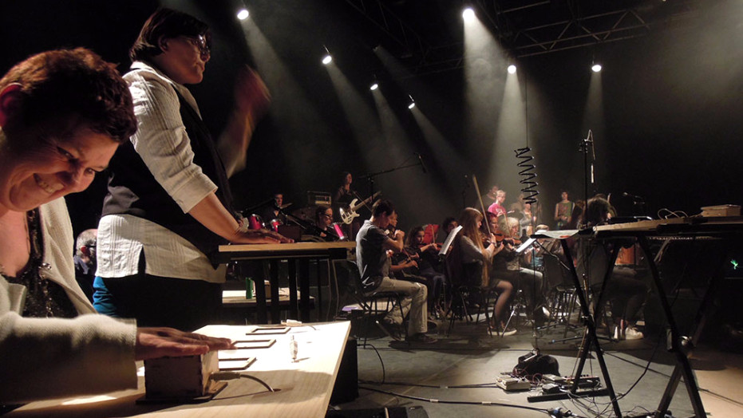
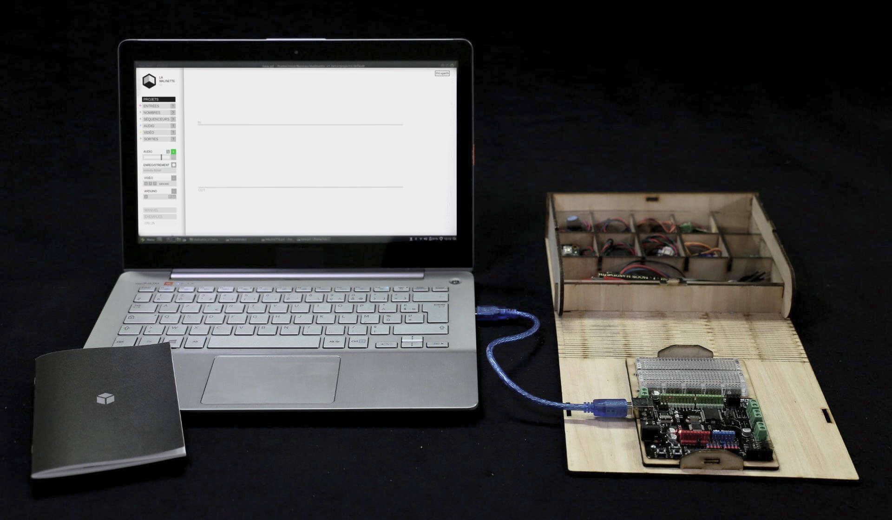
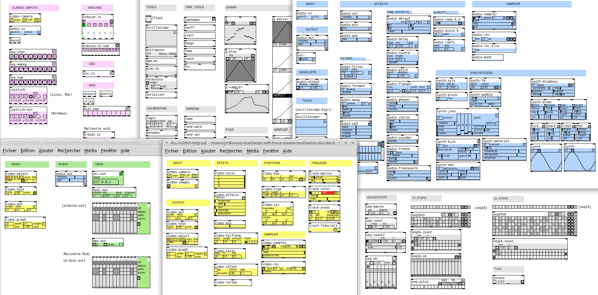
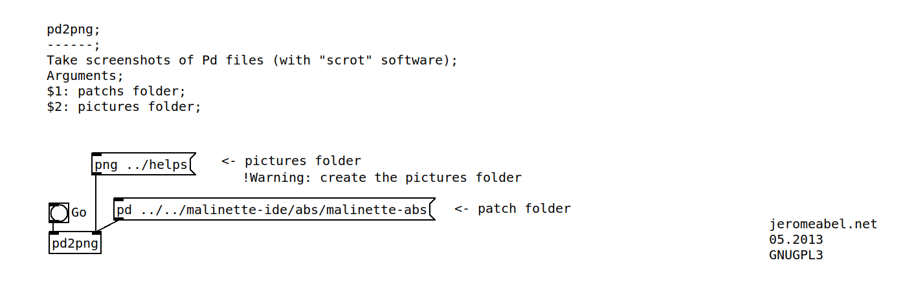
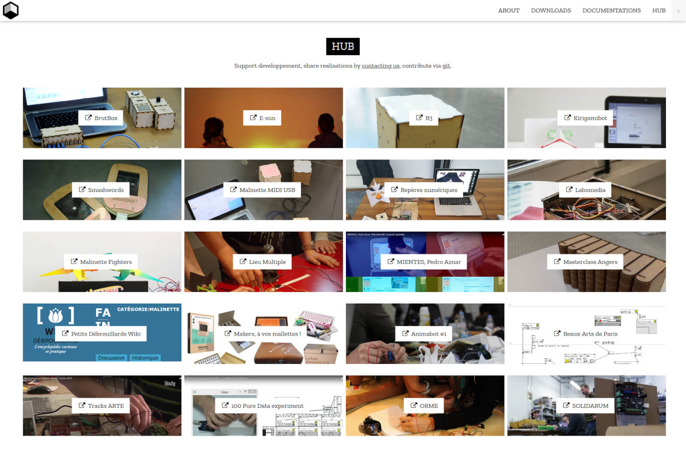

This project was developped and produced by the [Reso-nance Numérique](https://reso-nance.org) collective from 2012 to 2018. Other projects continue to use the Malinette, as the [BrutBox](https://brutlab.org/brutbox) project.

## The problem

- Give a free and accessible solution for learning interactive chain, Pure Data and Arduino more easily.
- Replace proprietary solutions (Lego, Picaxe, …) in schools (!) which are more expensive, less pedagogicals (a simple sensor can be hidden in a box) and non evolutive because intended for age groups. We can make an opposite bet : allow students from 6th Grade to start on tools which can progress until PHD
- Promote an active way by using these common technics, creating, experimenting ideas and mini projects with two or three with the teacher.
- Promote a transdiciplinary approach by cross-reference art, science, litterature, sport fields.

## The solution

- Hardware kit
- Software
- One-click, cross-platform downloadable software
- Website
- Documentation
- Community

### Use Cases

Workshops, training & live

### Hardware

We designed a book-shaped wooden box to make the kit portable. It contains an Arduino electronic card and a coherent set of five sensors and five actuators. You can make the box in a Fablab near you.

### Software

Around 150 objects divided into 6 categories: input, output, audio, video, numbers and sequencers

Some utilities have been developed, such as "pd2png". It allows taking png screenshots of a Pure Data file folder.

### Website & Community

I've built also a minimal website in french and english, using HTML and W3CSS library, and a click counter in AJAX/PHP.

## What I Learned

- Maintain and develop a community project, with personas, user interviews and debug
- Apply OOP principles in the refactoring of the version 2
- This project shows me the big issue with high coupling. We need around 20 libraries.
- Cross-platform development is a nightmare!
