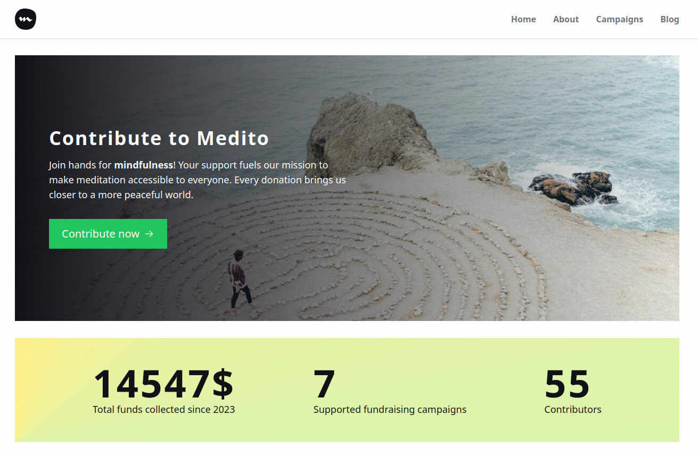
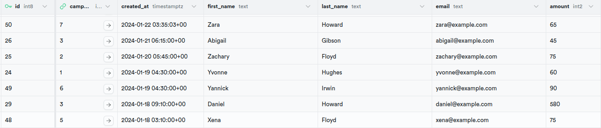
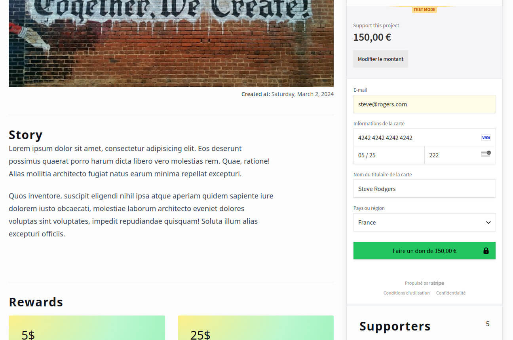
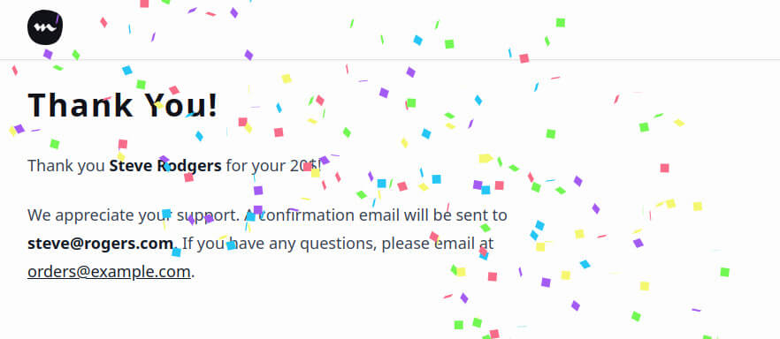

Medito foundation needs a versatile single web page that can be adapted for various fundraising initiatives, such as hiring personnel, creating ad campaigns, or developing new features. 

## Objectives

- Responsive and clear design
- Encourage donations with an interactive and user-friendly interface.
- Structure allows for easy content updates for different campaigns
- Optimized for hosting on Cloudflare Pages


## Solution




### Versatile project

**Astro** is an agnostic framework, it offers a great choice for build a versatile website. Some pages might be static, server side or client side. You can use all great UI libs as React, Svelte or Vue.


### Setup

```js
import { defineConfig, passthroughImageService } from 'astro/config';
import tailwind from '@astrojs/tailwind';
import cloudflare from '@astrojs/cloudflare';
import react from '@astrojs/react';
import icon from 'astro-icon';

export default defineConfig({
  image: {
    service: passthroughImageService(),
    domains: ['images.unsplash.com'], // allow optimizations of remote images
    remotePatterns: [{protocol: 'https'}],
  },
  output: 'server', // server side rendering
  adapter: cloudflare(), // server adapter
  integrations: [ tailwind(), react(),
    icon({ iconDir: 'src/assets/icons'}) // change the icons directory
  ],
});
```

### Add data easily

You can choose to add data in markdown or json and build them in a static way or add data in Supabase tables and retrieve them with `fetch()` and API endpoints.

Global settings of the website are stored in `src/config/site.ts` file:

```ts
export const SITE: SiteType = {
  name: 'Medito Fundraising',
  description: 'Support Medito Foundation by building a more mindful world',
  keywords: 'meditation, fundraising, mindfull, medito, medito app',
  icon: '/favicon.png',
  ogImage: {
    src: '/og.jpg',
    width: 1200,
    height: 628,
    format: 'jpg',
  },
  themeColor: '#ffffff',
  author: 'Jérôme Abel',
  twitterAcount: '@jeromeabeldev',
  socials: {
    twitter: 'https://twitter.com/meditohq',
    facebook: 'https://www.facebook.com/meditohq',
    instagram: 'https://www.instagram.com/meditohq',
    linkedin: 'https://www.linkedin.com/in//company/meditofoundation',
  },
  nav: [
    { label: 'Home', href: '/' },
    { label: 'About', href: '/about' },
    { label: 'Campaigns', href: '/campaign' },
    { label: 'Blog', href: '/blog' },
  ],
};
```

In Supabase, you can add tables with differents types of data. The idea is to link tables with foreign Key ("campaign_id" here)



### API endpoints

With Astro and server side rendering, it is very convenient to add API endpoints to our application:
- `/api/campaigns`: Get all campaigns
- `/api/campaign/:id`: Get one campaign with its id
- `/api/campaign/:id/donors`: Get all donors for the campaign
- `/api/campaign/:id/questions`: Get all questions for the campaign
- `/api/campaign/:id/donate`: Send a request to Stripe
- `/api/session/:id/`: Get the session data from the validated


**Example**: `/api/campaign/:id/donors`: Get all donors for the campaign

```js
import type { APIRoute } from 'astro';
import { supabase } from '@config/supabase';

export const GET: APIRoute = async ({ params }) => {
  const campaignId = params.id;

  const { data } = await supabase
    .from('donors')
    .select('*')
    .eq('campaign_id', Number(campaignId))
    .order('created_at', { ascending: false });

  if (!data) {
    return new Response(null, { status: 404, statusText: 'Not found', });
  }

  return new Response(JSON.stringify(data), {
    status: 200,
    headers: {'Content-Type': 'application/json',},
  });
};
``` 


### Fetch Data

**Fetch utility function**
```js
export const getJson = async (url: string) => {
  const response = await fetch(url);
  if (!response.ok) {
    throw new Error('Unexpected HTTP Response');
  }
  return await response.json();
};
```

**Fetch API In Astro**
```js
import { getJson } from '@services/fetchAPI';
import type { Tables } from '@config/supabase.types.ts';

const campaign: Tables<'campaigns'> = await getJson(
  `${Astro.url.origin}/api/campaign/${id}`
);
```

### Stripe 💳

Payment is made possible because of the Stripe Checkout Form integration. You have to fill in "4242 4242 4242 4242" as a test card number to test the transaction. You will be redirected to the "thanks" page when the transaction is fulfilled.




### Contact Form With Resend

```ts
import type { APIRoute } from 'astro';

export const POST: APIRoute = async ({ request }) => {
  const body = await request.json();
  const { to, from, html, subject, text, reply_to } = body;

  if (!to || !from || !html || !subject || !text) {
    return new Response(null, {
      status: 404,
      statusText: 'Did not provide the right data',
    });
  }

  const res = await fetch("https://api.resend.com/emails", {
    method: "POST",
    headers: {
      "Content-Type": "application/json",
      Authorization: `Bearer ${import.meta.env.RESEND_API_KEY}`,
    },
    body: JSON.stringify({ to, from, html, subject, text, reply_to }),    
  });

  const data = await res.json();

  return new Response(JSON.stringify(data), {
    status: 200,
    headers: {
      "Content-Type": "application/json",
    },
  });
};
```

### User friendly

Interactivity and animations are used to enhance the user experience. Here is an example of confetti animation made with `react-rewards` package.




## Things I've Learned

- Astro with server side rendering & API endpoints
- Astro with React
- Supabase integration
- Stripe with React
- Resend integration


