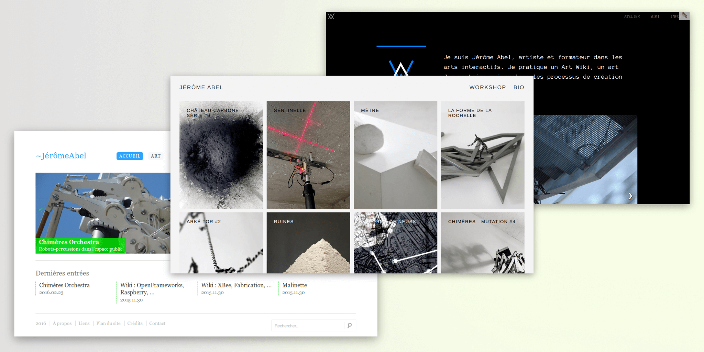
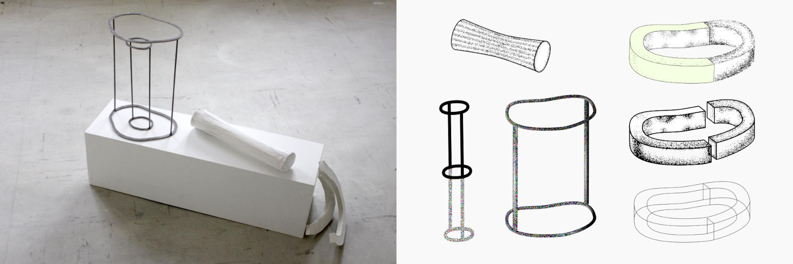
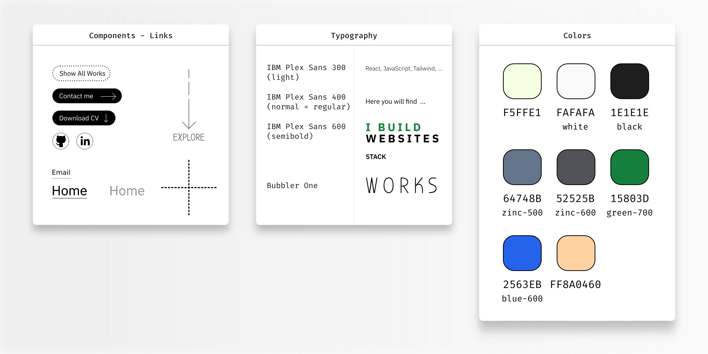
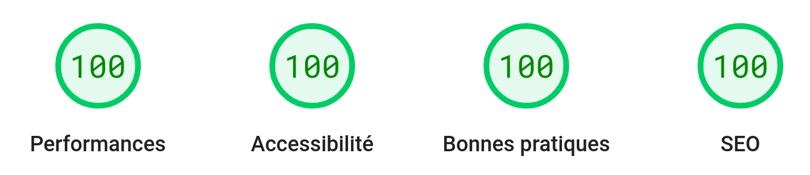

## History

Since 2004, I have shared my work on the Web. A portfolio site is always an opportunity to test new techniques:

- 2004 - abel.jerome.free.fr: Flash Action Script
- 2012 - jeromeabel.net v1: PHP Ionize CMS, Blueprint CSS framework
- 2018 - jeromeabel.net v2: Lektor SSG, Jinja template, W3CSS framework, JS slider
- 2021 - jeromeabel.net v3: Hugo SSG, Tachyons CSS, JS lazy and scroll
- 2023 - dev.jeromeabel.net v1: Astro SSG, Tailwind CSS, JS intersection observer

## The problem

As part of my job search, I need a showcase site focused on web development:

- The github account doesn't seem to be enough to stand out from other candidates
- My art website doesn't reflect my new journey into the web development. It could be confusing.
- This should make employers want to meet me
- This should convince other developers to work with me or make interesting connections

## The solution

- Create a unique visual identity with Inkscape
- Provide a great user experience with CSS animations and assets loading
- Build a high quality website: performance, SEO, Accessibility
- Share useful content about my works
- Experiment the Astro Framework

### Unique visual identity

The research on visual identity came from an [artistic experience](https://jeromeabel.net/workshop/metre/) where I took the dimension of my body 1 meter from the ground to construct objects. In real life, these shapes honestly aren't very interesting, but I still thought it might be a good start for creating visuals for my site.

From there was also born the idea of showing material in a vector drawing: shadows, noises, dotted lines. I wanted to show the idea that my developer profile is not "flat", that it brings you relief in projects and connections between different points of view

### High quality

A lot of optimizations have been made to get those great results:

- Font loading
- Responsive images, LQIP placeholder
- Reduce motion
- .htaccess file on Apache server
- Semantic HTML
- ...

## Things I've learned

- Build a website with Astro
- Work on visual content with Inkscape
- Tailwind tricks
- Optimizations principles

## Articles

I wrote some notes about this work on LinkedIn:

- [Web Development Portfolio: Getting Started](https://www.linkedin.com/posts/jerome-abel_building-an-effective-dev-portfolio-activity-7122454190747971584-jZWc)
- [Web Development Portfolio: Getting Inspirations](https://www.linkedin.com/posts/jerome-abel_webdevelopment-portfolio-activity-7123541343129251840-gxhf)
- [Web Development Portfolio: How To Create Mockups](https://www.linkedin.com/posts/jerome-abel_webdevelopment-portfolio-webdesign-activity-7125005976696430593-zJVe)
- [Web Development Portfolio: Why I Prefer SSG](https://www.linkedin.com/posts/jerome-abel_webdevelopment-portfolio-ssg-activity-7125730768110120963-b7nD)
- [Web Development Portfolio: Why I Chose Astro](https://www.linkedin.com/posts/jerome-abel_webdevelopment-portfolio-astro-activity-7127180334017699840-A9cC)
- [Web Development Portfolio: Optimize Font Loading](https://www.linkedin.com/posts/jerome-abel_webperformance-fontloading-preload-activity-7150735510913630208-p0vG)
