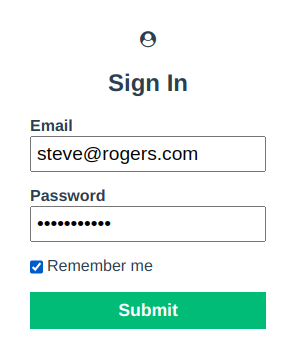
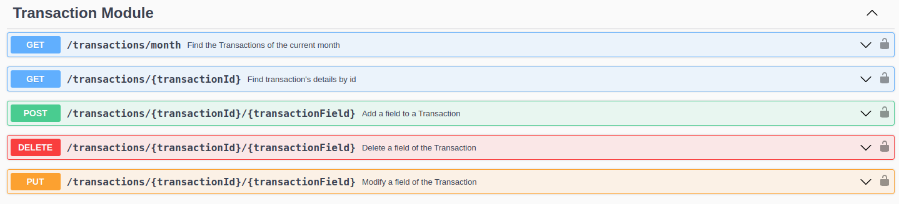
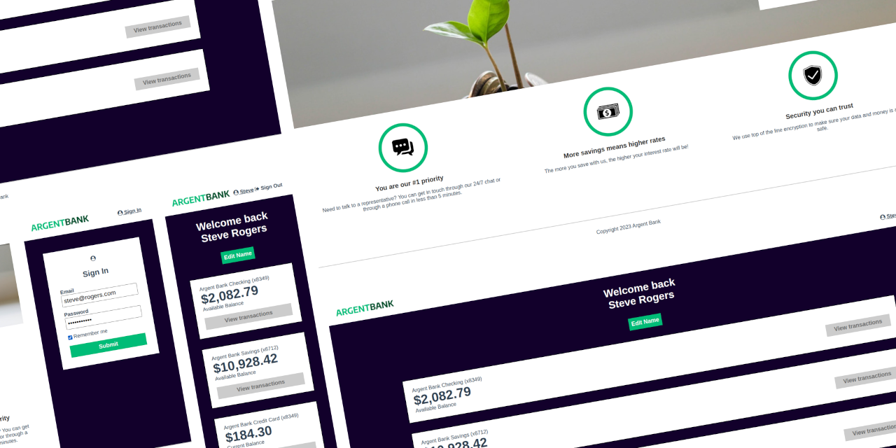

This project is the n°13 of the [OpenClassrooms Front-End learning path](https://openclassrooms.com/fr/paths/516-developpeur-dapplication-javascript-react).

Main goals:
- **Responsive** React App
- **Phase 1** : Add an authentication system with Redux
- **Phase 2** : Document the API with Swagger

## Authentication process

Using Redux ToolKit, I followed some vertical architecture's principles : a slice per feature. 

The first step of authentication was to add a private route with `React-Router`. The idea is to provide a conditional routing system which renders the Profile page if the user is logged or the Login page instead.

The form validation was handled by `Formik` and `Yup`. A visual feedback from `Toastify` was added to provide a great user experience.

When the form was successfully submitted, RTK stores a token from the server and use it in the Header of every API requests.

## Documentation the API
We used Swagger to add API endpoints in the documentation

## Things I've Learned

- Authenticate to an API
- Model an API
- Interact with an API
- Implement a state manager in a React application

I've written also two articles on LinkedIn and Github/gists to write down things I learned about RTK:

- [Redux Toolkit Primer #2 - Cart 🛒](https://gist.github.com/jeromeabel/0c558273e5a59b6cc61dcfcab1c75099)
- [RTK Query Primer](https://gist.github.com/jeromeabel/06aa57782012fe22be215f64dc0834b1)

