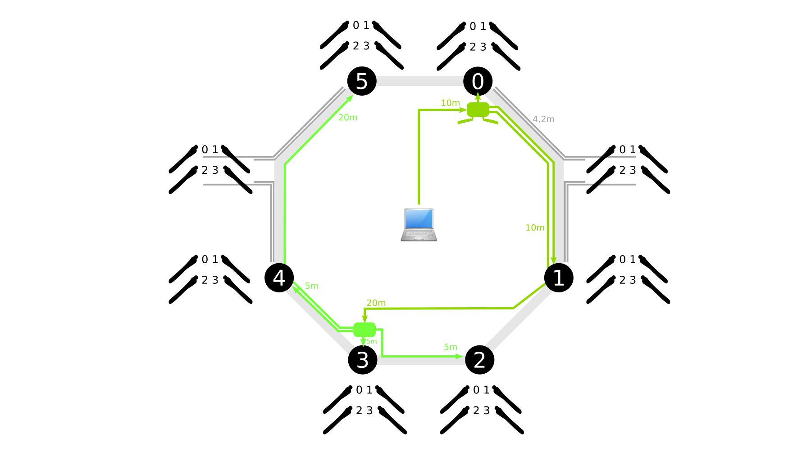
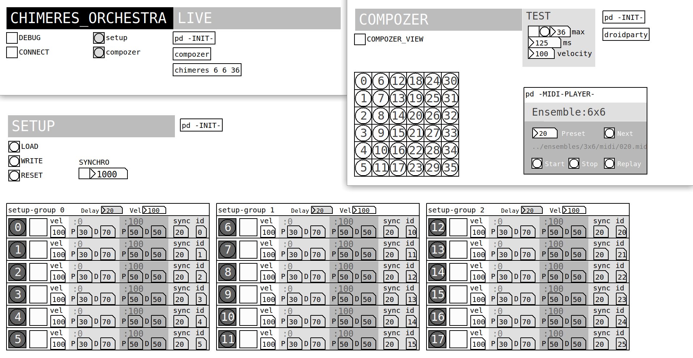
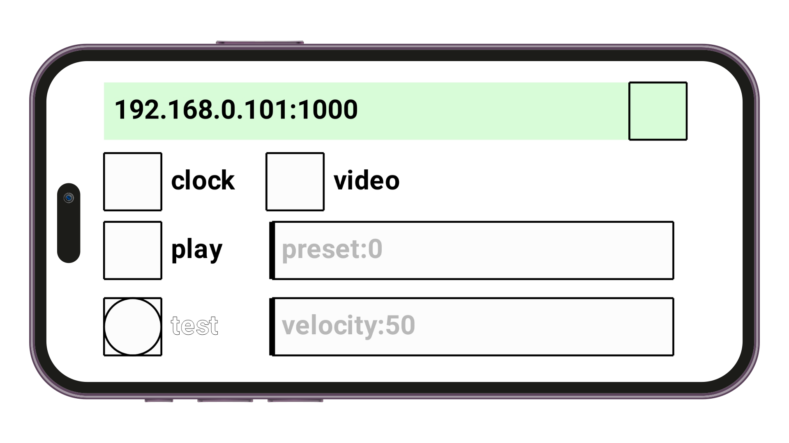
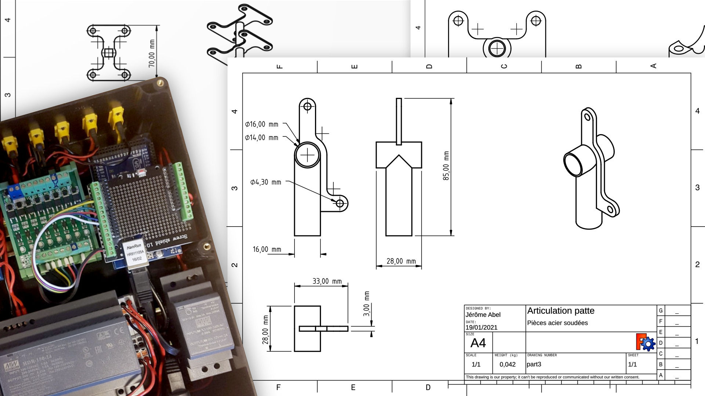

The project is maintained by [Reso-nance numérique](https://reso-nance.org/chimeres-orchestra/). It has been exhibited around twenty times in Europe.

> An echo of human activites in primitive rhythms.

## The problem

- The robots could have 2 or more arms
- The number of robots could be 3 or more
- As a musical instrument, the rhythms must be synchronized
- Rhythms should be fast enough to have variety and loud enough to be heard
- The project could be exhibited outdoors during days

## The solution

- Operate powerful motors
- Software to control and setup robots
- Mobile app to add a wireless remote

### 1. Secure the triggering of electric motors

To be heard, motors must have sufficient power. The first attempts damaged them and made them unusable! It took a while to find the solution, which involves securing the on/off time to allow the engine to not be turned on for a certain amount of time before it can be reactivated.

I've developed "PwmMotor", a minimal Arduino library with these on/off methods:

```c
// Motor Class to control PWM of DC motors
#include "PwmMotor.h"

// ...

void PwmMotor::on(unsigned long _current, int _pwm, int _time){
    if( _current - last >= (time_on + 10) ) {
        state = true;
        last = _current;
        time_on = constrain(_time, 0, time_on_max);
        analogWrite(pin, _pwm);
        if (debug) Serial.println("ON ");
    }
}

void PwmMotor::off(unsigned long _current) {
    if( _current - last >= time_on ) { 
        state = false;
        analogWrite(pin, 0);
        if (debug) Serial.println("OFF");
    }
}
```

This saved us a lot of motors!

### 2. Software to control and setup robots

The software must reflect these two use cases:

- the installation mode where the robots are playing alone according to a global clock
- the live mode where they are triggering by a musician with a remote laptop



Also, the software must handle a variety of configuration:

- 3 robots with 6 motors each
- 5 robots with 6 motors each
- 4 robots with 6 motors and 2 robots with 4 arms, as you could see above
- ...

The software was written in Pure Data and could be used by the main robot controller in installation mode or by a remote laptop. It allows to create any number of robots and arms and associate them with an ID.



The setup process was quite complex to tune. It took years. The two main concerns was:

- the electric power of the trigger (PWM) and its duration in order to get the maximum range of musical expression: from pianississimo to fortississimo!
- the synchronization of the arms to hear clear rhythmic patterns: tutti!

### 3. Wireless remote with a mobile app

As robots are often placed quite high from the ground, I've built a mobile app with [PdDroidParty](https://droidparty.net/). It allows easy access to robots during exhibition.



### 4. Hardware design

The hardware design reflects aesthetics of insects and waterproof concerns.



## Things I've learned

- Maintain and develop a project over 10 years! A formative journey towards quality and simplicity in fact.
- Set up a LAN network with computers, Raspberry, Arduino and mobile application
- Use FreeCAD 3D software to build metal parts
- Build waterproof electronic boxes
