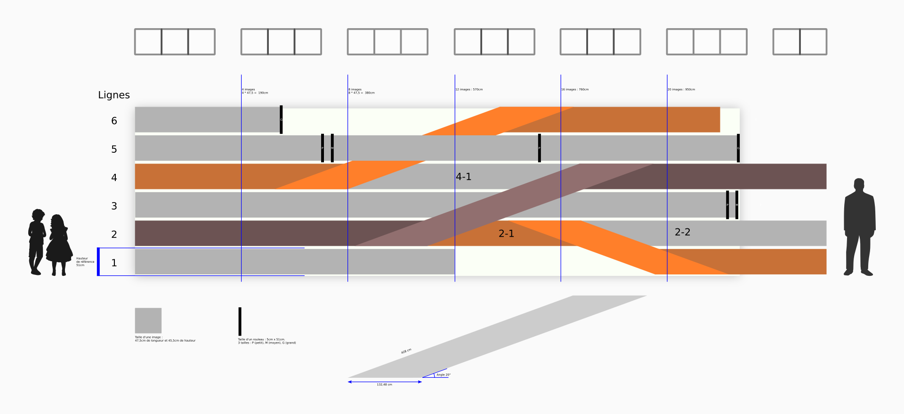

L'idée est née d’un dialogue Arts/Sciences avec une doctorante, Anaïs Machard du Laboratoire LaSIE de l'université de La Rochelle. Dans sa thèse "Contribution à la Conception des Bâtiments sous la Contrainte du Changement Climatique" est notamment question des modèles de prévisions scientifiques des changements climatiques jusqu'en 2100. La divergence ces modèles est telle que les plus optimistes envisagent une augmentation de 2°C alors que les plus pessimistes une augmentation de 7°C. C'est cette divergence de projection qui a inspiré la pièce.

Commitcraty est une frise temporelle, chronologique qui met en scène de multiples futurs. Elle est composée de grands rouleaux de papier, sorte de pellicules déroulées qui représentent des lignes de temps. Ces lignes débutent aujourd’hui, de façon parallèle, et se prolongent vers le futur en se croisant, se superposant par des pliages et sur des rouleaux, comme ceux que l’on retrouve en imprimerie. Certains futurs s'enroulent, disparaissent, ou se retournent, pour évoquer les différentes projections possibles - comme de multiples dimensions - et notre incapacité à les appréhender, à les voir, à les comprendre.

Le titre vient d'un mot que l'on utilise dans le programme Git, qui gère l'historique de projets informatiques. On y emploie le terme "commit " quand il s'agit d'archiver une modification du code et de propager cette modification à l'ensemble des développeurs. On peut ainsi voir tout le processus de création, de concertation, les différents chemins de l'histoire du projet. Dans ce contexte, un programme informatique n’est, ni plus ni moins, qu’un texte collaboratif. Or, nos sociétés sont régulées, contrôlées par des textes : lois, accords, contrats, décrets, rapports, conventions ... En déclinant ces méthodes à d'autres domaines que l'informatique, on pourrait y voir les bases d'un outil démocratique très intéressant. 

**Aide technique** : Virginie Pouliquen

**Partenariat** : Université d'Angers, École d’art et de design TALM-Angers

