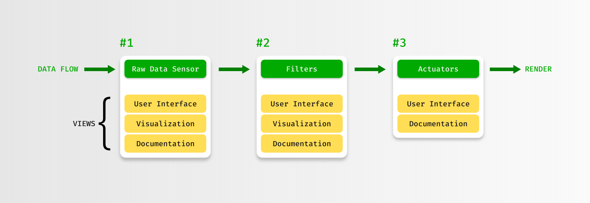
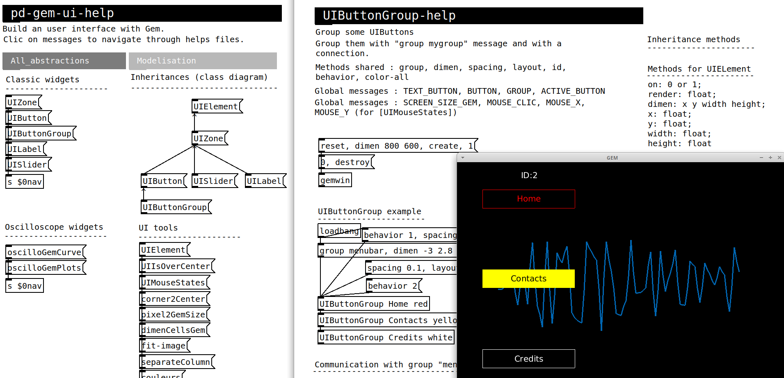
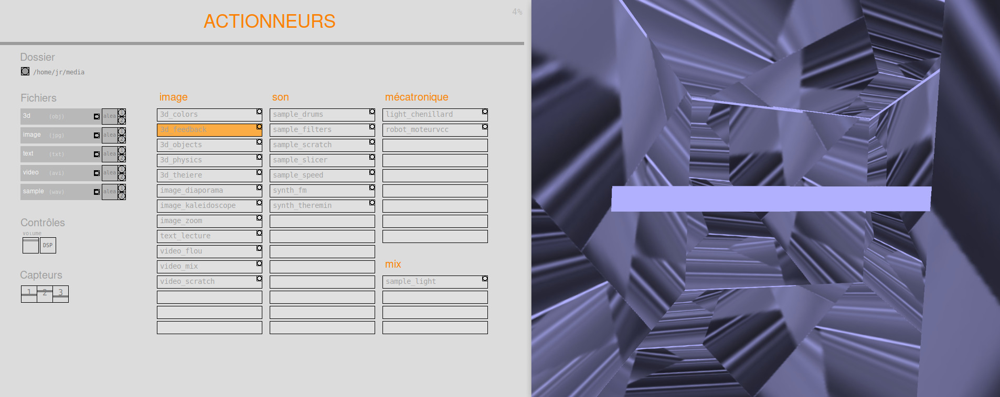
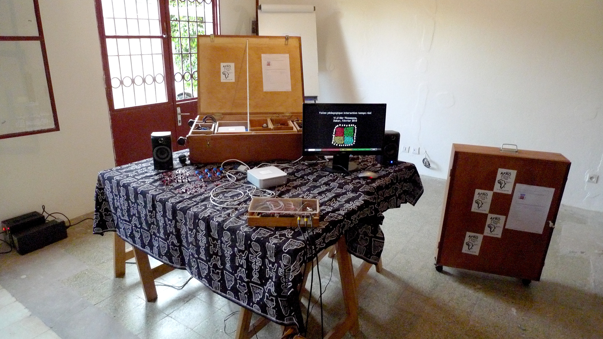
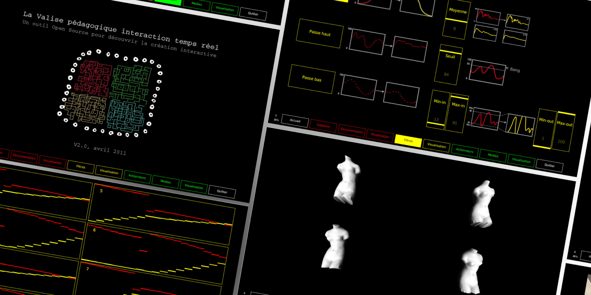

**History**:

- 2006: CRASlab Software v1, Mains d’Œuvres, Saint-Ouen
- 2010: CRASlab Software v2, Kawenga, Montpellier
- 2011: Valise pédagogique interactive, Kër-Thiossane, Dakar & Bamako
- 2012: CRASlab Software v3, Mains d’Œuvres, Saint-Ouen

## 1. CRASlab Software

> The Sensitive Art Resource Center (CRASlab) is dedicated to understanding all digital cultures... The
> place specializes in real-time interactive digital creation, and in free cultures. The heart of this
> project?
> 
> • Educational tools that are easy to use, which allow us to establish a common vocabulary and
> structuring benchmarks to understand our technological worlds.
> 
> • A transmission around digital artistic practices: to open up possibilities, decipher preconceptions,
> take a technical look, and think about our relationships between technologies and societies.

This project was created in 2006, according to the original idea of Jean-Noël Montagné, artist and president of the Art Sensitif association.

### 1.1. The problem

The **scenario**:

1. The user selects a sensor
2. He personalizes the filters
3. He finally selects an output among different processings: sound, images, 3D, light or motors.

- Connect 4 computers in a LAN network
- Every computer has an interchangeable role: display raw data, filters, documentation and actuators
- View raw data as graphs
- User interface for filtering step
- User interface for actuators step
- Render different types of actuators

### 1.2. The solution

Link: [Code](https://framagit.org/craslab/espace-sensitif)

The software was written in [Pure Data](https://puredata.info/). Is is well-know language to create multimedia projects. The network features are also very convenient. 

The only missing point was the User Interface. So, I've developed **[pd-gem-ui](https://framagit.org/craslab/pd-gem-ui)**, a Pure Data library to handle all user interactions and display features needed as the graph oscilloscope.

To select an actuator, the user interface displays a set of buttons, then render them.

## 2. Valise pédagogique interactive

La Valise pédagogique création interactive was developed from 2010 to 2011 for the association [Kër Thiossane](https://www.ker-thiossane.org/pn/La_Valise_p_dagogique) in Dakar and Bamako, as part of the Rose des Vents Numériques project.

It is a hardware, software and documentary package for learning real-time interaction technologies in artistic creation. It serves as a learning platform for a discovery workshop, as well as a tool for simulating and prototyping a work.

It allows artists but also all audiences, including children, to discover the techniques & aesthetics of interactive Art.

### 2.1. The problem

- Develop an open source tool accessible to all audiences
- Facilitate the process of understanding the interactivity chain
- Experience interactive scenes alone or with others

### 2.2. The solution

Links: [Code](https://framagit.org/craslab/valise-pedagogique-interactive), [Video](https://vimeo.com/871774295)

The project is also about a "mobile" hardware set, avaiblable in Dakar and Bamako. 

- The graphical interface displays 9 pages following the order of the interactive chain
- As in the previous project, I continued to develop the **pd-gem-ui** library to create views and graphical components
- Particular attention was paid to the consistency of the experience on the three main platforms: Linux, Max OS, Windows.

## 3. Things I've learned

- As my first real-world project, I gained experiences with network settings
- The project evolved during my computer science training. I was a playground to use P.O.O concepts learned in school: abstraction, inheritance, common interface
- I used Git for the first time through Gitorious, a deadly code hosting website.
- I worked on maintaining and improving the four versions of the software
- I gained experiences in Pure Data and deprecated things like "Pd-extended"
- I developed some funny media actuators like this 3D feedback effect :

