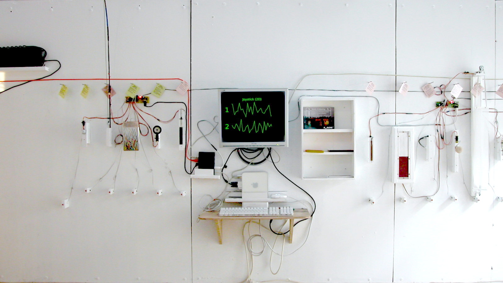

https://vimeo.com/871774295  VALISE SOFT
https://vimeo.com/871971072 CRASLAB SOFT

## Valise

## Craslab

## Pd-gem-ui

Versions
Craslab, Saint-Ouen (v1) - 2006
Kawenga, Montpellier (v2) - 2010
Craslab, Saint-Ouen (v3) - 2012

Production : Rose des Vents Numériques

Résidences
Festival AfroPixel #2, Kër Thiossane, Dakar, 02/2010
Centre soleil d’Afrique, Bamako, 11 - 21/10/2010

https://vimeo.com/871774295?share=copy

https://www.mainsdoeuvres.org/Centre-de-ressources-art-sensitif.html
https://www.ker-thiossane.org/pn/La_Valise_p_dagogique

