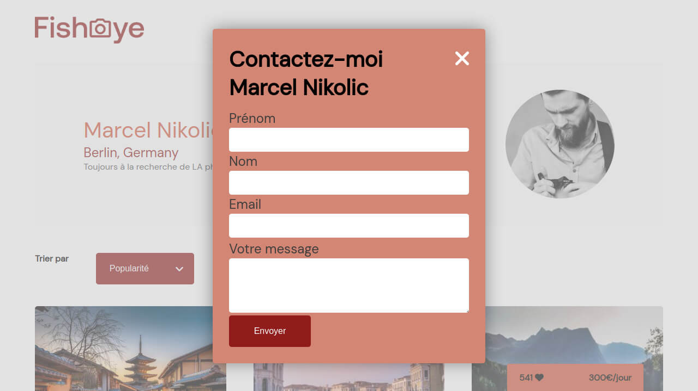

This project is the n°6 in the OpenClassrooms Front-End learning path.

## Tasks

Create an accessible site for a platform of photographers :

- Modernize the FishEye photographers website into a dynamic site with Javascript: design patterns, json, modal, gallery, sorting
- Make it accessible: focus, keyboard navigation, ARIA

