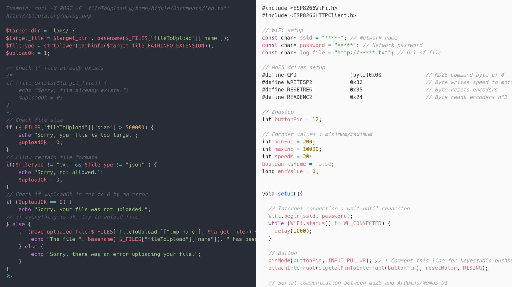

Installation en deux tableaux - From X et To X - dans deux salles de la ville de Niort, le Pilori et l'espace Grappeli.

S'inspirant de l'histoire du Phylloxéra, un puceron ramené dans les malles des explorateurs européens et qui a causé une maladie dévastant les vignes françaises, **From X** est un laboratoire dédié à l'observation de scènes microscopiques. À travers un microscope inventé pour l'occasion, le visiteur pourra se plonger dans un milieu organique singulier. Il aura ainsi entre ses mains la possibilité de pousser sa curiosité. Mais plus les visiteurs s'adonneront à ce jeu, plus intense sera alors l'activité au pavillon Grappelli.

**To X** met en scène un paysage apocalyptique dans lequel un virus de sable recouvre lentement des images analogiques, de vieux téléviseurs cathodiques disposés en ligne au sol. Le long d'un rail, des machines épanderont une pluie de matières fines. Les archives audiovisuelles de la ville de Niort, diffusées en boucle sur les écrans seront progressivement recouvertes et déteriorées par l'activité des visiteurs tout au long de l'exposition.

L'exposition a été présentée dans le cadre du festival du polar [Regards noirs](http://regardsnoirs.niort.fr/) 2019 à [Niort](http://www.niortagglo.fr/fr/sortir-visiter/agenda/exposition-installation-from-x-to-x-15585/index.html).

**Production** : Aide à la création de la Ville de Niort, association QZN

**Remerciements** : Un immense merci au fablab ENO pour son accueil !

