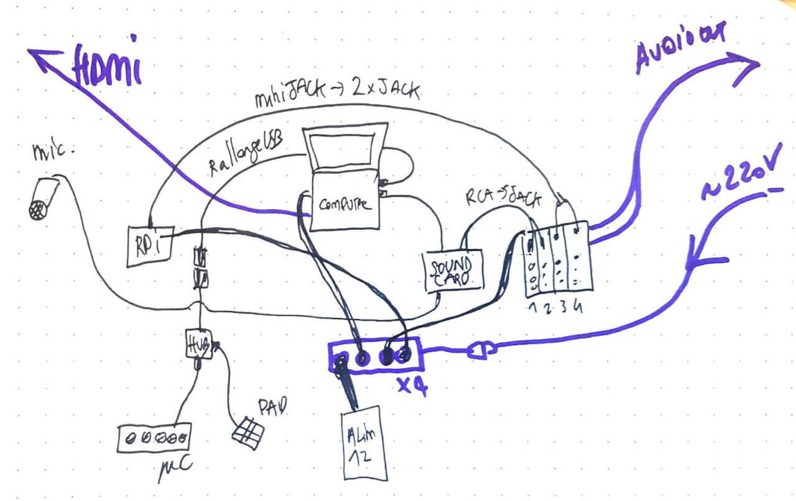

> "Jérôme Abel mapped his route through the city on a superimposed map by marking the individual points with small transmitters. These points connected on the projection, creating a »shape of Neuss«.  On his tour through the city, the artist had collected a wide variety of fragments, such as stones, sand, plants, branches and also some Rhine water, put these things into previously constructed plexiglass tubes and now placed the materials piece by piece on thepanel.Gradually, a new image emerged, which began to interact with the previously found abstract, digital »shape of Neuss«. Every movement on the tabletop, every change in the constellation of materials and trans-mitters producedvisualand auditory efects. The interaction of the projection, the individual transmitters and the digital image and sound efects required special, newly created soft-ware that Jérôme Abel had programmed in preparation for [HANSEartWORKS](https://www.hanse.org/en/union-of-cities-the-hansa/working-groups/hanseartworks)."

On a technical level, the OpenFrameworks C++ toolbox allows me to create applications that meet real-time needs, using C++ libraries. In addition to having a powerful executable for video display, I can analyze camera pixels with the popular OpenCV tracking library.

The data from the white points is analyzed then sent in OSC to the sound software written in Pure Data.

## Things I've Learned

- Video Tracking with OpenCV
- Video filters with OpenCV (sick...)
- Noise generators with Pure Data

