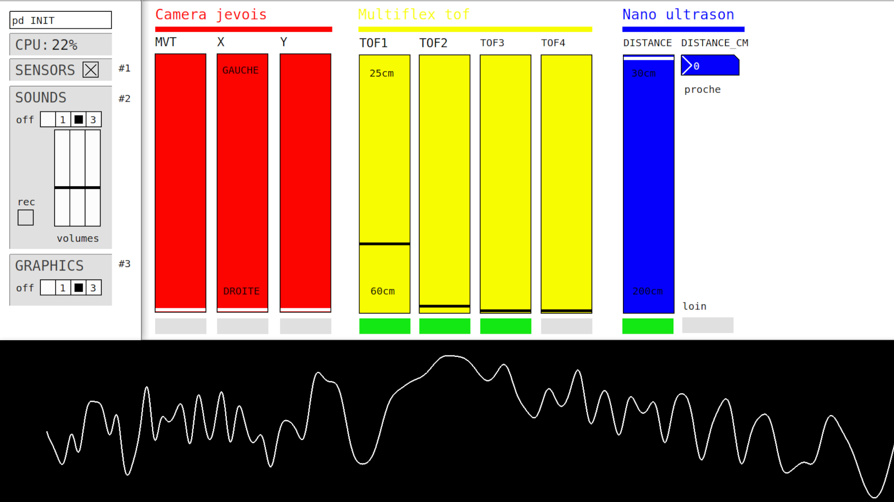
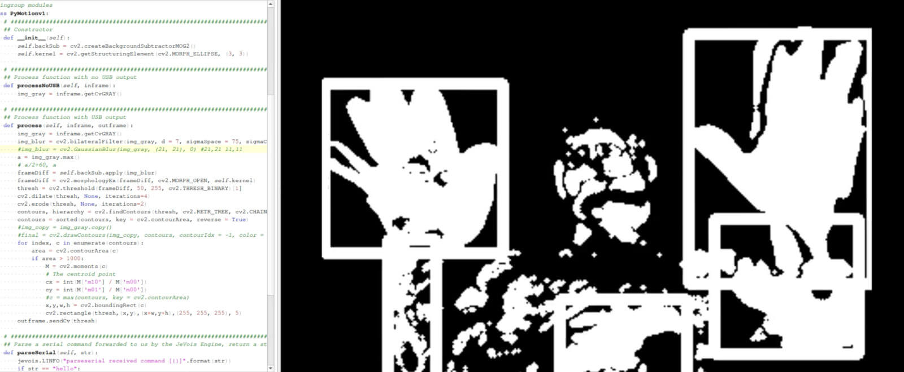
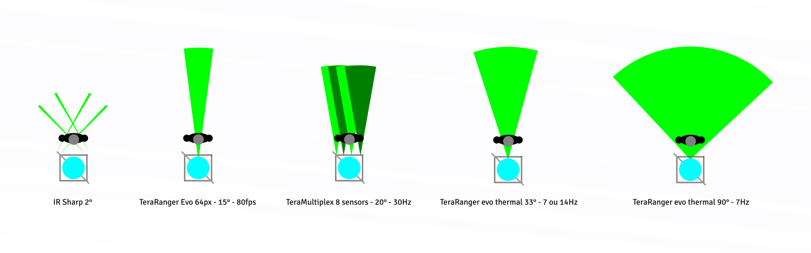
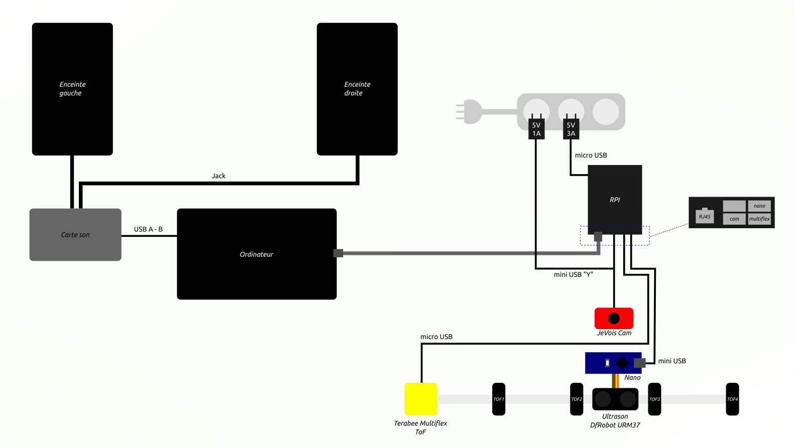

https://labomedia.org/du-7-au-11-juin-2021-residence-pour-le-projet-lithica-collectif-lazer-quest/
https://framagit.org/lithica/lithica-tech
FRYDERYK EXPERT
https://tube.futuretic.fr/w/h2cFD2GSQbLCnhAPyyry46
https://lazerquestgalerie.tumblr.com/ABOUT

Un socle de type indéniablement végétal semble avoir muté vers une
forme minérale chaotique. Ce Crystal qui le surplombe est coloré mais
translucide, et son mitan diffuse une faible lueur perceptible à travers
ses facettes. Curieux, le visiteur s’approche. Sa proximité modifie la
lumière brillante au sein du Crystal, comme conscient d’une présence
étrangère. En se rapprochant encore et en passant sa main au dessus
ou autour du cristal, le visiteur découvre qu’il peut le faire “chanter” :
la pierre, sensible aux mouvements, résonne d’un son fluide et clair,
alors que les lumières qui l’habitent s’animent de teintes changeantes.
Alors le chant de la roche ravive une mémoire séculaire tapie dans
l’inconscient. Le visiteur reconnaît l’artefact fantastique qui scintille au
fond de son imaginaire. L’objet est magnétique, fascinant. Il évoque
toutes les légendes, les récits de science-fiction, les films de genre où le
minéral est habité par un pouvoir surnaturel. Son esthétique emprunte
aux gravures verniennes, aux réflexions de Roger Caillois, aux contes
qui chantent la magie d’un règne oublié, celui de la pierre, où le langage
n’était qu’instinct.

LITHICA ?
LITHICA est une sculpture sonore interactive.
LITHICA est l’instrument d’une performance à destination des publics sourds et entendants.
LITHICA se place dans un contexte d’exposition où le public expérimente son interactivité visuelle et sonore.

Ses matériaux sont pensés pour une écoute auditive et kinésthésique.
Cette pièce transmédia convoque l’installation contemporaine avec les arts scéniques et révèle un univers imaginaire où la culture sourde et entendante se rejoignent.

Collectif Laser Quest
Plateforme créative, module d’exposition hybride et mobile, LAZER QUEST propose une interaction entre les scènes alternatives et contemporaines. Créé en septembre 2013 par deux artistes mutants, dans le sillage de leurs précédents projets collectifs, inspiré par le mouvement Neo Pop, Cobra, la figuration libre, le transmedia, la science-fiction, LAZER QUEST se dirige hors des courants conventionnels et se démarque des postulats traditionnels avec des thématiques curieuses et raffinées.

LAZER QUEST a produit, exposé et collaboré avec plus de 150 artistes toutes pratiques confondues. LAZER QUEST offre une enclave de liberté créatrice dans des environnements indépendants tout en soutenant une ligne éditoriale exigeante et transversale. Un projet qui privilégie l’exploration, l’excavation, telle une terrasse en faux marbre auto-portée par les envies d’expériences spatiales.

Le collectif travaille actuellement à la mise en ligne de ses archives, en attendant, un Tumblr