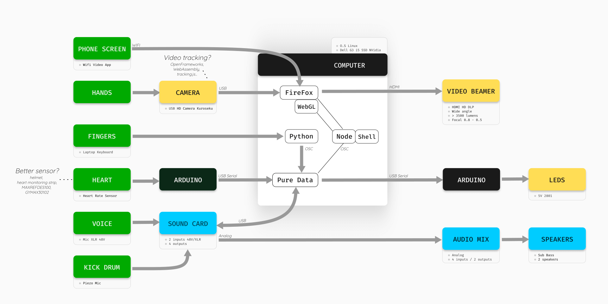

Logariat is the desire to explore relationships:
- between computer work (automations, data) and the body (biological time, sitting position)
- between writing (of commands, programs, laws) and physical reality (signals).

A black human figure sits on an unpleasant chair. Bright lines outline its skeleton. A keyboard is placed in front, a light screen represents that of a computer. The only physical action is that he writes on a keyboard.

The video projection is divided into three zones, a triptych of writing, body and images. The writing area is rather austere, in the form of a terminal or forms. The body is represented by real-time physical signals coming from sensors on the performer's body. The third zone leaves room for the generation of organic forms between camouflage, scar and artificial forms of physical modeling of trajectories, density, microscopic worlds, etc.

## What I've learned

The challenge was to connect all these technologies together. All show monitoring is written in Bash and all sensors communicate to all open programs. Node is ultimately the heart of the program, it allows you to connect all the elements together, such as receiving data from biological sensors, the camera, the keyboard.

