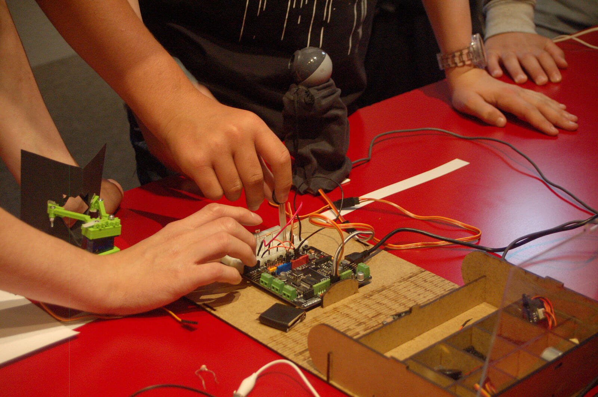
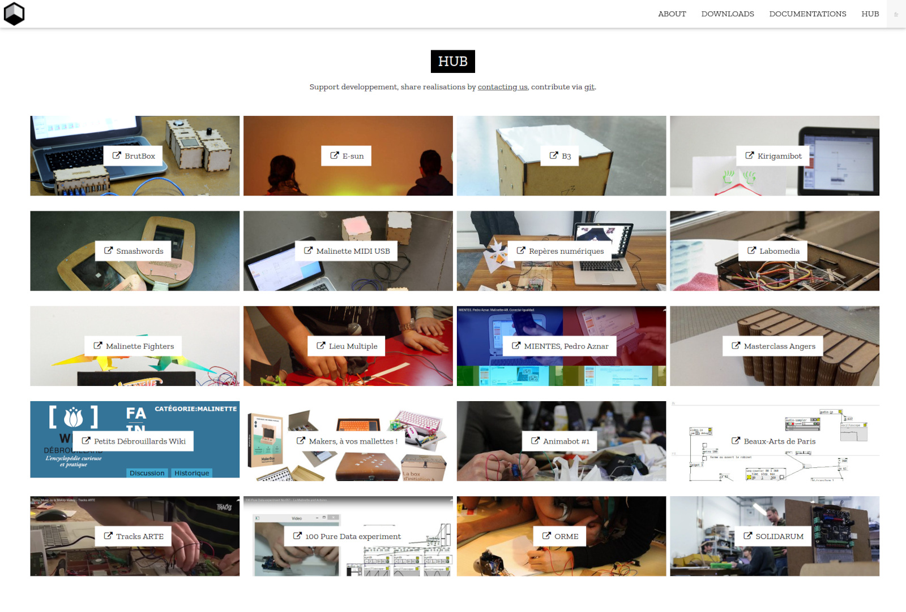
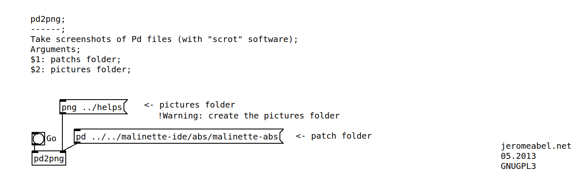

The graphical interface is based on the fantastic Pure Data language and the work of its community. It is released under three different flavors, from newbies to experts.

We design a wood box shaped like a book to make it portable. It contains an electronic board Arduino and a coherent set of five sensors and five actuators. You can be build the box in a Fablab near you.

La Malinette is a pedagogical tool under free license to discover and learn to build interactive systems. Inside, there are a software and electronic devices, an Arduino board and a set of sensors and actuators.

This project is developped and produced by the Reso-nance numérique collective since 2012. It is used in education (schools, colleges, faculties), and also as a tool to make artistic pieces. The learning way is experimental, transdisciplinary and fun. Since 2016, we are sustained by Carasso Fundation.

The principle is to split an interactive chain in three parts : the inputs, the processings and the outputs. We use the analogy with the human perception to understand how work interactive systems and create newest.

<h2>Aims</h2>
<ul>
<li>Give a free and accessible solution for learning interactive chain, Pure Data and Arduino more easily.</li>
<li>Replace proprietary solutions (Lego, Picaxe, …) in schools (!) which are more expensive, less pedagogicals (a simple sensor can be hidden in a box) and non evolutive because intended for age groups. We can make an opposite bet : allow students from 6th Grade to start on tools which can progress until PHD.</li>
<li>Develop a modular tool to allow teachers to create their owns Practical Works.</li>
<li>Promote an active way by using these common technics, creating, experimenting ideas and mini projects with two or three with the teacher.</li>
<li>Promote a transdiciplinary approach by cross-reference art, science, litterature, sport fields.</li>
<li>Select a coherent set of sensors, actuators and software bricks to offer a large range of combinations, and prototype rapidly. Some future extensions could be made on educational themes.</li>
</ul>

## Hardware

## Website

## Pd2png

**Authors** : Jérôme Abel, Eric Dode, Anthony Pillette from Reso-nance numérique

200 objets

spectacles

brutbox
https://reso-nance.org/brutbox/

fablab open source

wikifab

site web +Hub + compteur de clics

documentation

pd2png

makers-a-vos-mallettes.png
https://www.makery.info/2017/02/28/makers-a-vos-mallettes/

tracks arte
https://www.youtube.com/watch?v=fmLMZHIsTQk&t=134s

