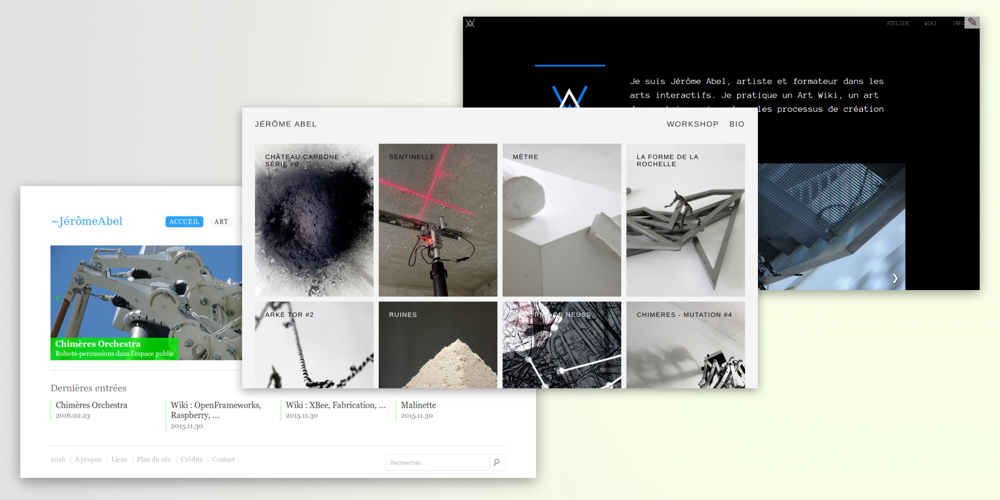
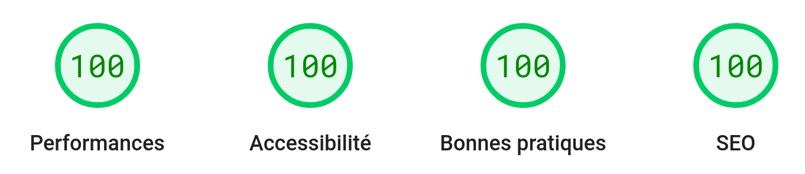
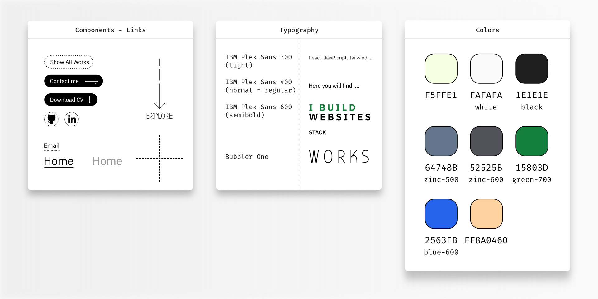

- abel.jerome.free.fr (2004, out of date) : Flash
- a href="http://impala.utopia.free.fr">http://impala.utopia.free.fr</a> (2009) : php/mysql, HTML, CSS, JS (tooltip), jquery/slideshow
- <a href="http://jeromeabel.net">http://jeromeabel.net</a> (v1 2012) : CMS ionize / codeigniter PHP framework, HTML, CSS
- <a href="http://jeromeabel.net">http://jeromeabel.net</a> (v2 2018) : Lektor Static Web Site Generator, Jinja template, W3CSS framework, HTML, JS (objet slider)

